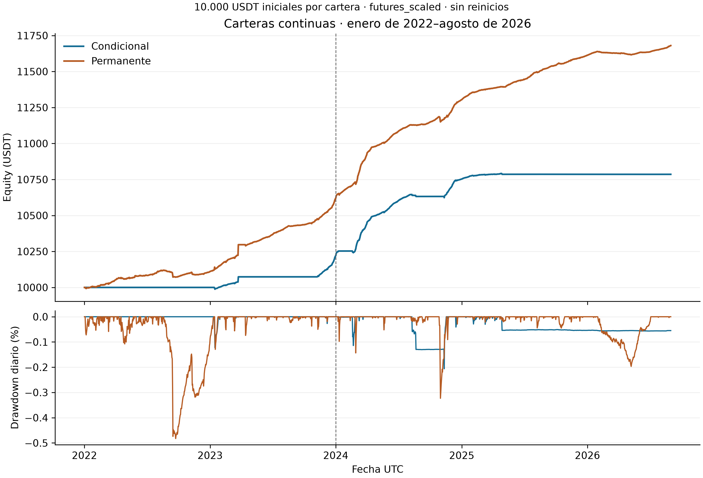

# Crypto carry: backtesting de la tesina

Comparación de dos carteras de carry en **BTCUSDT y ETHUSDT**: compra spot y
venta de perpetuos USD-M. La cartera **condicional** exige un pronóstico de
funding suficiente para entrar o renovar; la **permanente** omite ese filtro y
conserva las mismas reglas de basis, ejecución, capital y riesgo.

El estudio vigente abarca **01/01/2022–31/08/2026 UTC**, con 10.000 USDT iniciales
por cartera y sin reinicios anuales. Usa velas de un minuto, ejecución
`next_minute_vwap`, sizing conjunto y `futures_scaled` para los 15 marks ausentes.
Los cortes 2022–2023 y 2024–agosto de 2026 son tramos de esas mismas carteras.

## Resultados actuales

| Cartera | Equity final (USDT) | Retorno neto | CAGR | Sharpe | Drawdown diario |
|---|---:|---:|---:|---:|---:|
| Condicional | 10.785,76 | 7,8576 % | 1,6335 % | 4,9624 | −0,2062 % |
| Permanente | 11.680,07 | 16,8007 % | 3,3825 % | 6,5336 | −0,4827 % |



[Tablas, figuras y cortes completos](entregas/entrega_3/continua/README.md) ·
[Paquete vigente de la Entrega 3](entregas/entrega_3/README.md).

H1: MAE de 6,299 bps para EWMA frente a 8,703 bps para no-change, con 10.180
observaciones válidas y 44 exclusiones. La condicional no supera el Sharpe de
la permanente. H3 muestra mayor oportunidad y CAGR condicional en el segundo
tramo; es evidencia descriptiva contraria a su caída, sin atribución causal.

Son resultados de investigación con reglas y tarifas prescritas, ejecución por
minuto y aproximaciones explícitas de funding y marks; no una reconstrucción
exacta de ejecución real. La [metodología](docs/methodology.md) define los
supuestos y la [evidencia vigente](docs/progress.md) reúne las verificaciones.

## Reproducción

Desde la raíz del repositorio, con Python 3.14 y `uv`:

```powershell
uv sync --frozen
& '.\.venv\Scripts\python.exe' -m scripts.publish_thesis --verify
& '.\.venv\Scripts\python.exe' -m scripts.publish_thesis --output '.\.superpowers\presentacion_repro'
```

Usar un destino nuevo para regenerar las tablas y figuras. Estos comandos leen
el ZIP guardado y funcionan **sin datos masivos ni nuevos backtests**. Para
verificar el paquete completo, extraer el
[ZIP vigente](entregas/entrega_3/paquete_actualizacion_entrega_3_continua.zip)
y ejecutar `python verificar.py` dentro de la carpeta extraída.

Pruebas y controles del repositorio:

```powershell
& '.\.venv\Scripts\python.exe' -m pytest -q
& '.\.venv\Scripts\python.exe' -m ruff check src tests scripts
& '.\.venv\Scripts\python.exe' -m scripts.verify_repository_evidence
```

Los recálculos que requieren las fuentes locales están documentados en
[sensibilidad de marks](docs/continuous_mark_gaps.md) y
[análisis del precio de funding](data/research/funding-price-sensitivity-20260920/README.md).
La [guía de datos](docs/descarga_d.md) describe el almacenamiento en D:.

## Evidencia y organización

- [Entrega 3 continua](entregas/entrega_3/continua/README.md): resultados, P&L,
  actividad, tiempo invertido, filtros, episodio del 24/03/2023, H1 y H3.
- [15 marks faltantes](data/research/continuous-marks-20260919/README.md) y
  [sensibilidad del funding](data/research/funding-price-sensitivity-20260920/README.md):
  evidencia compacta, supuestos y hashes conservados.
- [Índice de investigación](data/research/README.md): separa evidencia vigente,
  auditorías anteriores y exploraciones de fuentes.
- [Archivo de Entrega 3](entregas/entrega_3/archivo/README.md): las ventanas
  independientes 01/09/2022–31/08/2023 y 01/09/2025–31/08/2026 son antecedentes.
- [Manifiestos del piloto](data/manifests/README.md): muestra del 01/01/2024;
  no son el diagnóstico de las carteras actuales.

`src/crypto_carry/` contiene el motor y `configs/` sus parámetros. Las fuentes
masivas, Parquet operativos, corridas completas, entornos y cachés permanecen
locales y excluidos por `.gitignore`. Los cambios de presentación y archivo se
registran en [limpieza y validaciones](docs/repository_cleanup.md).
