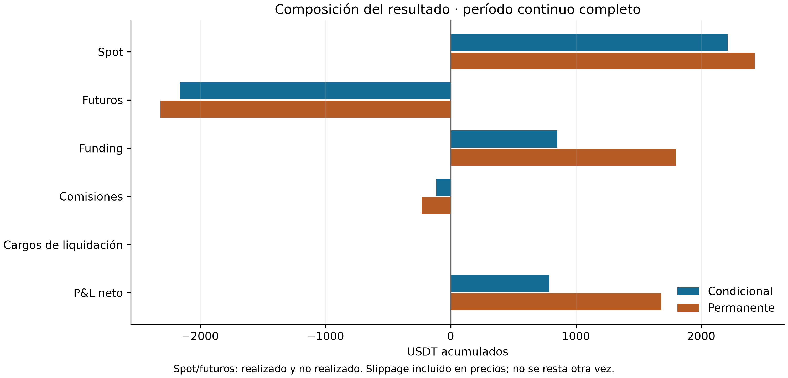
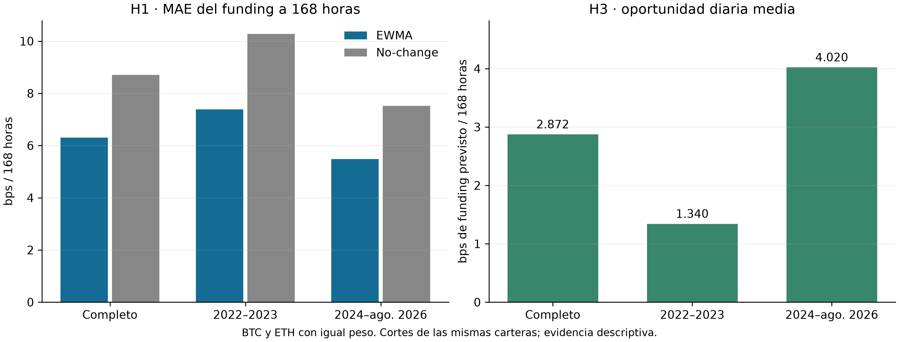

# Resultados continuos de la Entrega 3

**01/01/2022–31/08/2026 UTC**, ambas carteras con `futures_scaled`. Los cortes
2022–2023 y 2024–agosto de 2026 pertenecen a las mismas trayectorias: sus saldos
y posiciones se arrastran, sin reinicios. [Índice de la entrega](../README.md).

## Rentabilidad y riesgo

| Período | Cartera | Equity inicial (USDT) | Equity final (USDT) | Retorno neto | CAGR | Sharpe | DD diario |
|---|---|---:|---:|---:|---:|---:|---:|
| full | Condicional | 10000.00 | 10785.76 | 7.8576% | 1.6335% | 4.9624 | -0.2062% |
| 2022-2023 | Condicional | 10000.00 | 10217.44 | 2.1744% | 1.0814% | 3.3374 | -0.1224% |
| 2024-2026-08 | Condicional | 10217.44 | 10785.76 | 5.5623% | 2.0492% | 6.1811 | -0.2062% |
| full | Permanente | 10000.00 | 11680.07 | 16.8007% | 3.3825% | 6.5336 | -0.4827% |
| 2022-2023 | Permanente | 10000.00 | 10616.66 | 6.1666% | 3.0372% | 4.6165 | -0.4827% |
| 2024-2026-08 | Permanente | 10616.66 | 11680.07 | 10.0165% | 3.6420% | 9.6135 | -0.3232% |




Los retornos de cada corte usan su equity de entrada; no son sumables. Drawdown
y utilización se calculan con observaciones diarias. El P&L incluye realizado y
no realizado; funding es flujo neto y las comisiones llevan signo negativo.

## H1 y H3

| Período | MAE EWMA (bps/168h) | MAE no-change (bps/168h) | H1 válidas / excluidas | Oportunidad H3 (bps/168h) | H3 días válidos / excluidos |
|---|---:|---:|---:|---:|---:|
| full | 6.298978 | 8.703322 | 10180 / 44 | 2.871869 | 1704 / 0 |
| 2022-2023 | 7.384230 | 10.276483 | 4380 / 0 | 1.340415 | 730 / 0 |
| 2024-2026-08 | 5.479425 | 7.515314 | 5800 / 44 | 4.019674 | 974 / 0 |



H1 usa iguales observaciones por modelo y peso 50/50 entre BTC y ETH. H3 toma
el forecast semanal **completo** cuando pasan funding/costos, basis y operatividad,
cero cuando no pasan con datos conocidos; promedia 1.440 minutos diarios y después
ambos activos por igual. Excluye días incompletos y no usa posiciones de las carteras.
H1 tiene menor MAE descriptivo para EWMA; H2 no muestra superioridad de Sharpe
condicional; H3 es contraria a una caída de oportunidad y CAGR entre estos cortes.

## Tablas y evidencia

- [Resultados y P&L por tramo](tablas/resultados_periodos.csv),
  [equity diario](tablas/equity_diario.csv), [actividad](tablas/actividad.csv),
  [tiempo invertido](tablas/tiempo_invertido.csv) y [ciclos](tablas/ciclos.csv).
- [Filtros de entrada](tablas/filtros_entrada.csv) y
  [eventos por causa](tablas/eventos_por_causa.csv).
- 24/03/2023: [impacto diario](tablas/episodio_2023_03_24_resumen.csv) y
  [exposición sin cobertura](tablas/episodio_2023_03_24_exposicion.csv).
  Ambas carteras tuvieron 121 minutos sin cobertura; P&L diario de 35,908876 USDT
  en la condicional y 73,859494 USDT en la permanente.
- [H1 por activo y período](tablas/h1_resumen.csv),
  [H3 por activo y período](tablas/h3_resumen.csv) y
  [H3 diario conjunto](tablas/h3_diario_conjunto.csv).
- [Sensibilidad de los 15 marks](../../../data/research/continuous-marks-20260919/README.md)
  y [sensibilidad del precio de funding](../../../data/research/funding-price-sensitivity-20260920/README.md).
- [ZIP con evidencia completa](../paquete_actualizacion_entrega_3_continua.zip),
  [metodología](../../../docs/methodology.md) y [manifiesto de esta vista](manifest.json).

Las tablas de resumen conservan los bytes del ZIP. `equity_diario.csv` es una
proyección de cinco columnas sin redondear sus valores. Las tablas Markdown
redondean sólo la presentación. Los retornos CSV son fracciones (0,01 = 1%),
tiempos en segundos y cantidades monetarias en USDT. Los PNG se exportan a
300 dpi; sus versiones SVG están en la misma carpeta.

## Reproducción sin datos masivos

Desde la raíz del repositorio, con el entorno de `uv.lock` instalado:

```powershell
& '.\.venv\Scripts\python.exe' -m scripts.publish_thesis --verify
& '.\.venv\Scripts\python.exe' -m scripts.publish_thesis --output '.\.superpowers\presentacion_repro'
```

El segundo comando requiere un destino nuevo. Ambos leen el ZIP guardado; no
descargan datos ni ejecutan backtests. Su manifiesto registra el hash del ZIP,
de cada miembro fuente y de las tablas/figuras generadas.

Los resultados pertenecen a un escenario de investigación con reglas y tarifas
prescritas, ejecuciones por minuto y aproximaciones explícitas de marks/funding.
No reconstruyen el recorrido intraminuto ni garantizan una ejecución real.
Los escenarios de funding con posiciones fijas no incluyen cambios de margen
o decisiones; extrapolan errores de períodos con precios conocidos a otros períodos.
