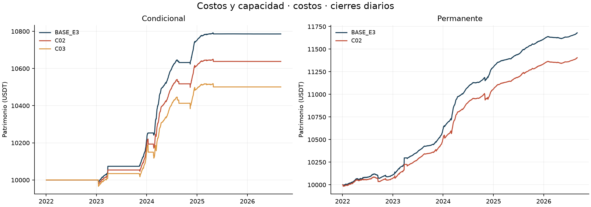
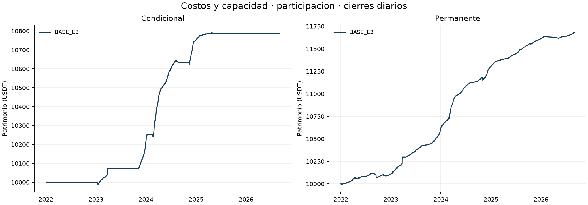
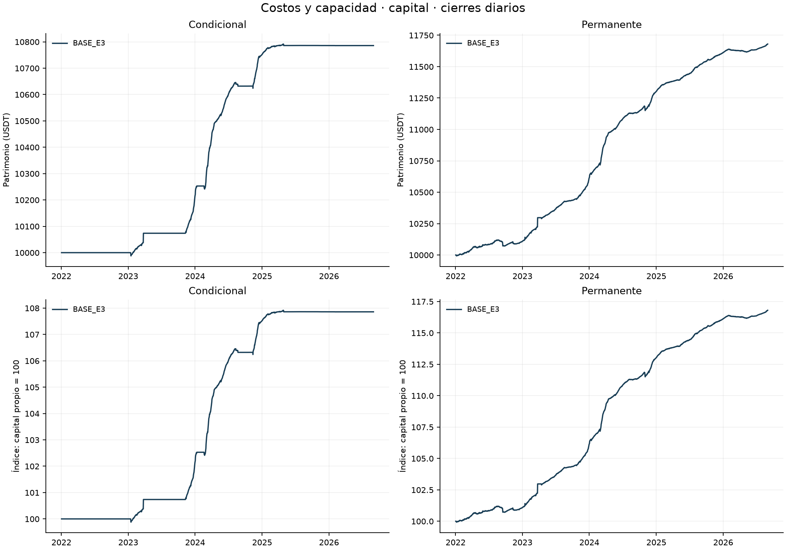

# Síntesis del bloque 3

### Costos

**C02 / conditional:** P&L 637.83 USDT; retorno 6.3783%, diferencia frente a BASE -1.4794 puntos porcentuales. Comisiones 227.71 USDT, funding 845.70 USDT. Capital utilizado medio diario 2058.46 USDT (19.8219%); actividad sin polvo 28.3179%. Órdenes completas/parciales/sin fill: 133/3/120; máxima utilización del cupo 99.9991%.

**C02 / permanent:** P&L 1404.95 USDT; retorno 14.0495%, diferencia frente a BASE -2.7512 puntos porcentuales. Comisiones 447.72 USDT, funding 1772.60 USDT. Capital utilizado medio diario 8855.47 USDT (82.7337%); actividad sin polvo 98.1904%. Órdenes completas/parciales/sin fill: 308/4/403; máxima utilización del cupo 99.9979%.

**C03 / conditional:** P&L 500.58 USDT; retorno 5.0058%, diferencia frente a BASE -2.8518 puntos porcentuales. Comisiones 342.15 USDT, funding 838.81 USDT. Capital utilizado medio diario 2040.22 USDT (19.8000%); actividad sin polvo 28.3179%. Órdenes completas/parciales/sin fill: 137/3/120; máxima utilización del cupo 99.9991%.

### Participacion

### Capital

Los mayores costos pueden cambiar sizing, fills y la trayectoria; no se exige monotonicidad del P&L. Las diferencias absolutas de A050/A100 incluyen su mayor escala. Sus curvas normalizadas usan su propio capital inicial; no se multiplican las cantidades BASE por cinco o diez ni se divide CAGR por utilización.
