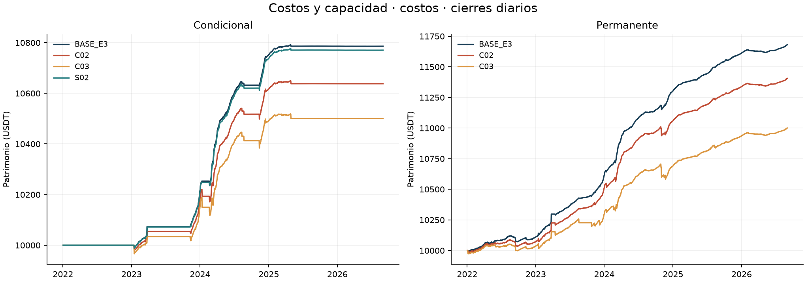
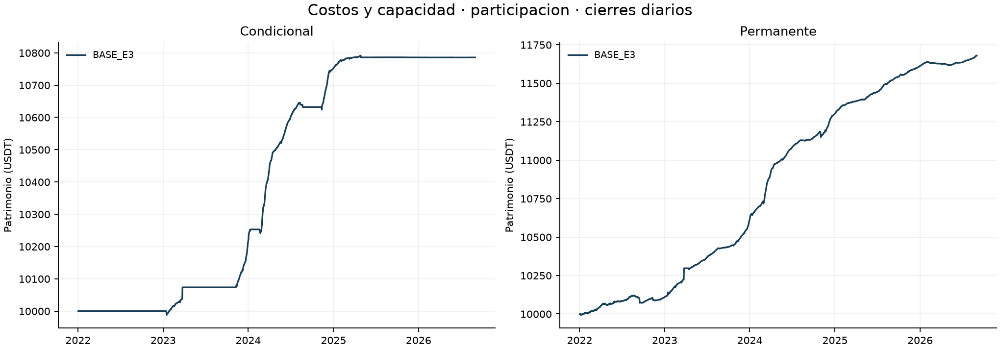
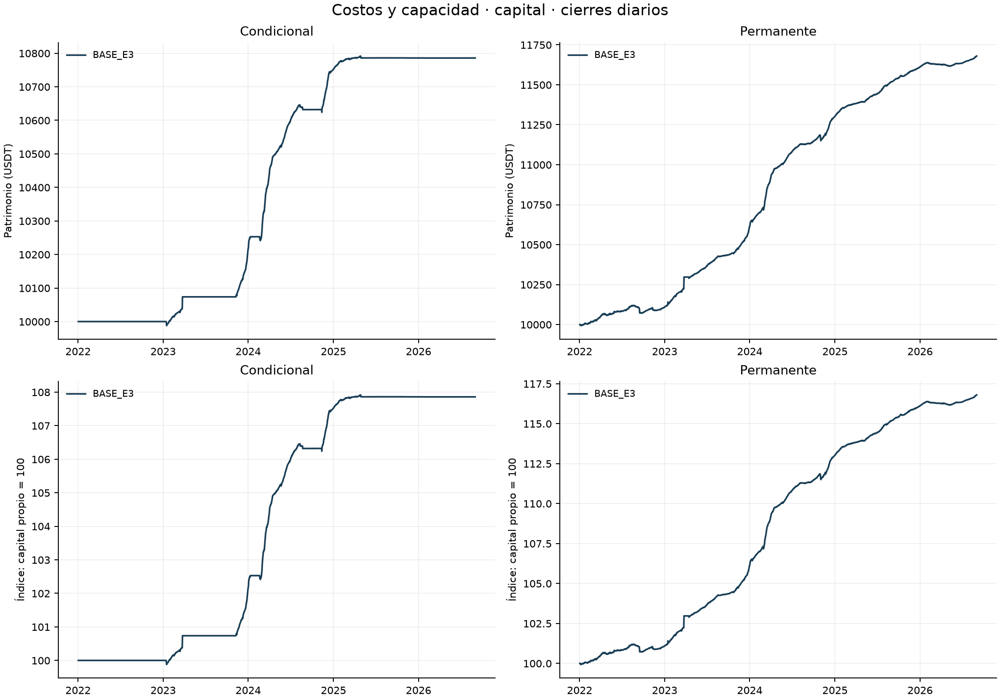
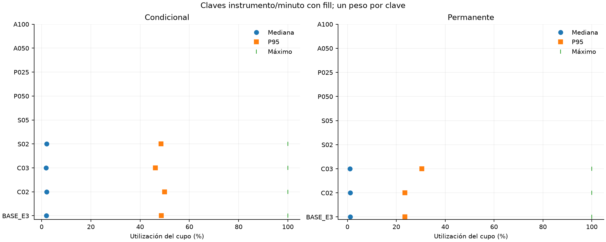

# Bloque 3: costos y capacidad

**Borrador parcial de desarrollo.** Muestra continua UTC [01/01/2022,01/09/2026), BTCUSDT/ETHUSDT spot y perpetuos USD-M. Las ocho variantes se ejecutan separadas, sin parámetros adoptados del bloque 2. Las cifras son locales; este bloque no completa la Entrega 4.

[Protocolo previo](documentos/protocolo.md) · [Encargo](documentos/encargo_usuario.md) · [Registro de corridas](indice_corridas.json) · [Verificación](README.md)

## Selección fija y costos realizados

El modo explícito `base_e3_total` fija **34 pb** sólo para la condición de entrada `forecast > 0.0034`. Se activa en C02/C03/S02/S05. Renovar requiere `forecast > 0`; la permanente omite ambos requisitos de funding, manteniendo los restantes. Los modos previos conservan su semántica y digest. Sizing, presupuesto, comisiones, inventario y garantías usan los costos del escenario: no se fijan decisiones ni cantidades. Es una regla de selección sin recalibrar ante mayores fricciones.

| Escenario | Fee spot | Fee futuros | Slippage/orden | Selección |
|---|---|---|---|---|
| BASE | 0,10% | 0,05% | 1 pb | 34 pb |
| C02 | 0,20% | 0,10% | 2 pb | 34 pb |
| C03 | 0,30% | 0,15% | 3 pb | 34 pb |
| S02 | 0,10% | 0,05% | 2 pb | 34 pb |
| S05 | 0,10% | 0,05% | 5 pb | 34 pb |

C02/C03 son estrés conjunto de comisiones ordinarias y deslizamiento; S02/S05 aíslan deslizamiento. Compras spot pagan comisión en base, con salida de caja igual al importe bruto ejecutado. Slippage y tick están incluidos en precio: su diagnóstico no vuelve a restarse del P&L. La tasa especial de liquidación no se multiplica.

## Muestra completa

| Escenario | Cartera | Capital inicial | Equity final | P&L | Retorno | CAGR365 | Sharpe RF=0 | DD diario |
|---|---|---|---|---|---|---|---|---|
| BASE_E3 | conditional | 10000 | 10785.76 | 785.76 | 7.8576% | 1.6335% | 4.9624 | -0.2062% |
| BASE_E3 | permanent | 10000 | 11680.07 | 1680.07 | 16.8007% | 3.3825% | 6.5336 | -0.4827% |
| C02 | conditional | 10000 | 10637.83 | 637.83 | 6.3783% | 1.3332% | 3.5448 | -0.4798% |
| C02 | permanent | 10000 | 11404.95 | 1404.95 | 14.0495% | 2.8560% | 5.1656 | -0.6572% |
| C03 | conditional | 10000 | 10500.58 | 500.58 | 5.0058% | 1.0518% | 2.3672 | -0.6989% |
| C03 | permanent | 10000 | 10999.84 | 999.84 | 9.9984% | 2.0622% | 3.1213 | -1.1522% |
| S02 | conditional | 10000 | 10770.20 | 770.20 | 7.7020% | 1.6020% | 4.8501 | -0.2275% |

## Lectura por familia

### Costos

**C02 / conditional:** P&L 637.83 USDT; retorno 6.3783%, diferencia frente a BASE -1.4794 puntos porcentuales. Comisiones 227.71 USDT, funding 845.70 USDT. Capital utilizado medio diario 2058.46 USDT (19.8219%); actividad sin polvo 28.3179%. Órdenes completas/parciales/sin fill: 133/3/120; máxima utilización del cupo 99.9991%.

**C02 / permanent:** P&L 1404.95 USDT; retorno 14.0495%, diferencia frente a BASE -2.7512 puntos porcentuales. Comisiones 447.72 USDT, funding 1772.60 USDT. Capital utilizado medio diario 8855.47 USDT (82.7337%); actividad sin polvo 98.1904%. Órdenes completas/parciales/sin fill: 308/4/403; máxima utilización del cupo 99.9979%.

**C03 / conditional:** P&L 500.58 USDT; retorno 5.0058%, diferencia frente a BASE -2.8518 puntos porcentuales. Comisiones 342.15 USDT, funding 838.81 USDT. Capital utilizado medio diario 2040.22 USDT (19.8000%); actividad sin polvo 28.3179%. Órdenes completas/parciales/sin fill: 137/3/120; máxima utilización del cupo 99.9991%.

**C03 / permanent:** P&L 999.84 USDT; retorno 9.9984%, diferencia frente a BASE -6.8023 puntos porcentuales. Comisiones 742.83 USDT, funding 1711.66 USDT. Capital utilizado medio diario 8296.37 USDT (79.1367%); actividad sin polvo 94.3578%. Órdenes completas/parciales/sin fill: 334/7/404; máxima utilización del cupo 100.0000%.

**S02 / conditional:** P&L 770.20 USDT; retorno 7.7020%, diferencia frente a BASE -0.1556 puntos porcentuales. Comisiones 114.82 USDT, funding 850.33 USDT. Capital utilizado medio diario 2072.02 USDT (19.7994%); actividad sin polvo 28.3178%. Órdenes completas/parciales/sin fill: 135/3/120; máxima utilización del cupo 99.9991%.

### Participacion

### Capital

Los mayores costos pueden cambiar sizing, fills y la trayectoria; no se exige monotonicidad del P&L. Las diferencias absolutas de A050/A100 incluyen su mayor escala. Sus curvas normalizadas usan su propio capital inicial; no se multiplican las cantidades BASE por cinco o diez ni se divide CAGR por utilización.

## Capacidad, reglas y exposición

El cupo es agregado por cartera/activo/mercado/minuto. Compras y ventas consumen volumen bruto. Participación realizada = cantidad bruta / volumen base; utilización = cantidad bruta / (límite × volumen). Las distribuciones tienen un peso por clave con fill y volumen positivo; no suman BTC y ETH en una unidad inventada. Estados terminales de órdenes, eventos de fill parcial y reintentos son poblaciones distintas. El volumen elegible posterior se consulta sólo para auditar la ejecución.

[Órdenes completas](tablas/ordenes.csv), [claves de capacidad](tablas/capacidad.csv), [fills/ledger](tablas/fills_conciliados.csv), [causas de faltantes](tablas/causas_faltantes.csv), [demoras por ciclo](tablas/demoras_ciclos.csv), [tramos](tablas/tramos_margen_estados.csv). El auditor aplica el contrato original a todas las órdenes de este motor, incluidas las que llevan propósito `liquidate`; el código inspeccionado no incorpora una excepción autónoma de volumen para fills forzosos del exchange. No se añadió ninguna excepción.

Volumen cero, cierre documentado, presupuesto agotado, step y filtros de reglas se separan. Cuando los registros no permiten identificar separadamente fondos, inventario o reservas pendientes, la causa conserva `funds_inventory_or_reservations_not_separately_identified`; no se afirma falta de volumen ni se reconstruye una reserva exacta inexistente.

Los [cinco casos de mayor cupo y cinco de mayor duración descubierta por cartera](tablas/casos_extremos.csv) usan el orden y desempates fijados antes de resultados. El [catálogo completo](tablas/episodios_descubiertos.csv) conserva todos los episodios; los vínculos entre ambos grupos evitan sumar casos repetidos. La exposición se clasifica sobre toda la trayectoria antes de cortar años; la cartera integra la unión BTC/ETH. El polvo sigue valorado en equity. Las [explicaciones caso por caso](casos_extremos.md) vinculan órdenes, estados y fuentes; los estados de margen persistidos no constituyen una nueva serie intradía.

| Escenario | Cartera | Activo | Tramos observados (pisos USDT) | Cambios observados | Nocional máximo observado | ND |
|---|---|---|---|---|---|---|
| BASE_E3 | conditional | BTCUSDT | sin corto | 0 | ND | 352 |
| BASE_E3 | conditional | ETHUSDT | sin corto | 0 | ND | 615 |
| BASE_E3 | permanent | BTCUSDT | 0 | 0 | 2512.90 | 1931 |
| BASE_E3 | permanent | ETHUSDT | 0 | 0 | 2648.50 | 1912 |
| C02 | conditional | BTCUSDT | sin corto | 0 | ND | 348 |
| C02 | conditional | ETHUSDT | sin corto | 0 | ND | 615 |
| C02 | permanent | BTCUSDT | 0 | 0 | 2512.90 | 1902 |
| C02 | permanent | ETHUSDT | 0 | 0 | 2522.74 | 1900 |
| C03 | conditional | BTCUSDT | sin corto | 0 | ND | 356 |
| C03 | conditional | ETHUSDT | sin corto | 0 | ND | 615 |
| C03 | permanent | BTCUSDT | 0 | 0 | 2355.84 | 1862 |
| C03 | permanent | ETHUSDT | 0 | 0 | 2510.41 | 1843 |
| S02 | conditional | BTCUSDT | sin corto | 0 | ND | 352 |
| S02 | conditional | ETHUSDT | sin corto | 0 | ND | 615 |

Los cruces se cuentan entre estados persistidos de un corto abierto; una reapertura después de quedar sin corto no se cuenta como cruce. Mínimos, máximos, importe y step se comprueban en cada fill con las reglas prescritas. Los faltantes por filtros conservan una categoría distinta de capacidad.

## H1, H2 y H3

H1 conserva una única población BASE autenticada de 10.224 observaciones (10.180 válidas y 44 excluidas), con MAE EWMA 6,298978 frente a no-change 8,703322 pb/168 h, peso BTC/ETH 50/50. Se verifica igualdad de forecast/targets por cartera; reutilizarla no añade observaciones independientes. La [auditoría de invariancias](tablas/invariancias.csv) separa forecast, inputs de oportunidad y agregado H3.

La oportunidad de mercado conserva 34 pb y los mismos inputs. La lectura completa de H3 usa, sin embargo, los nuevos CAGR. H2 exige CAGR condicional positivo y Sharpe superior a la permanente del mismo escenario/período; SOFR no participa.

| Escenario | H2 full | Motivo | H3 entre cortes | Oportunidad 2022–23 | Oportunidad 2024–ago26 |
|---|---|---|---|---|---|
| BASE_E3 | no_favorable | sharpe_not_superior | contraria | 1.3404 | 4.0197 |
| C02 | no_favorable | sharpe_not_superior | contraria | 1.3404 | 4.0197 |
| C03 | no_favorable | sharpe_not_superior | contraria | 1.3404 | 4.0197 |
| S02 | no_concluyente | missing_permanent_portfolio; undefined_or_nonfinite_permanent_sharpe | contraria | 1.3404 | 4.0197 |

H3: si oportunidad y CAGR bajan, favorable; si ambos suben, contraria; demás casos evaluables, mixta. Las métricas faltantes conservan ND y motivo. No se impone la conclusión del bloque 2.

## Años y capital heredado

| Escenario | Cartera | Año | Inicio | P&L | Retorno | Uso medio | Actividad |
|---|---|---|---|---|---|---|---|
| BASE_E3 | conditional | 2022 | 10000.00 | 0.00 | 0.0000% | 0.0000% | 0.0000% |
| BASE_E3 | conditional | 2023 | 10000.00 | 217.44 | 2.1744% | 20.8441% | 32.9448% |
| BASE_E3 | conditional | 2024 | 10217.44 | 535.13 | 5.2374% | 55.9750% | 67.0171% |
| BASE_E3 | conditional | 2025 | 10752.57 | 33.28 | 0.3096% | 15.4917% | 32.0561% |
| BASE_E3 | conditional | 2026 | 10785.85 | -0.09 | -0.0008% | 0.0059% | 0.0000% |
| BASE_E3 | permanent | 2022 | 10000.00 | 109.16 | 1.0916% | 78.4727% | 98.2787% |
| BASE_E3 | permanent | 2023 | 10109.16 | 507.50 | 5.0202% | 84.2354% | 94.3147% |
| BASE_E3 | permanent | 2024 | 10616.66 | 686.80 | 6.4691% | 87.8768% | 99.0449% |
| BASE_E3 | permanent | 2025 | 11303.46 | 308.14 | 2.7261% | 86.4822% | 100.0000% |
| BASE_E3 | permanent | 2026 | 11611.60 | 68.46 | 0.5896% | 72.7804% | 100.0000% |
| C02 | conditional | 2022 | 10000.00 | 0.00 | 0.0000% | 0.0000% | 0.0000% |
| C02 | conditional | 2023 | 10000.00 | 184.66 | 1.8466% | 20.7637% | 32.9448% |
| C02 | conditional | 2024 | 10184.66 | 432.52 | 4.2468% | 56.1324% | 67.0173% |
| C02 | conditional | 2025 | 10617.18 | 20.70 | 0.1950% | 15.4871% | 32.0561% |
| C02 | conditional | 2026 | 10637.87 | -0.05 | -0.0005% | 0.0023% | 0.0000% |
| C02 | permanent | 2022 | 10000.00 | 72.19 | 0.7219% | 78.4612% | 98.2787% |
| C02 | permanent | 2023 | 10072.19 | 440.81 | 4.3765% | 84.2497% | 94.3147% |
| C02 | permanent | 2024 | 10513.00 | 546.36 | 5.1970% | 88.0008% | 98.9614% |
| C02 | permanent | 2025 | 11059.36 | 278.51 | 2.5184% | 86.7765% | 100.0000% |
| C02 | permanent | 2026 | 11337.87 | 67.07 | 0.5916% | 72.8681% | 100.0000% |
| C03 | conditional | 2022 | 10000.00 | 0.00 | 0.0000% | 0.0000% | 0.0000% |
| C03 | conditional | 2023 | 10000.00 | 153.22 | 1.5322% | 20.7584% | 32.9448% |
| C03 | conditional | 2024 | 10153.22 | 339.19 | 3.3407% | 56.0353% | 67.0173% |
| C03 | conditional | 2025 | 10492.40 | 8.20 | 0.0781% | 15.4881% | 32.0561% |
| C03 | conditional | 2026 | 10500.60 | -0.02 | -0.0002% | 0.0013% | 0.0000% |
| C03 | permanent | 2022 | 10000.00 | 35.11 | 0.3511% | 78.5133% | 98.2787% |
| C03 | permanent | 2023 | 10035.11 | 264.58 | 2.6366% | 67.5898% | 76.0512% |
| C03 | permanent | 2024 | 10299.70 | 391.24 | 3.7986% | 87.9093% | 99.3314% |
| C03 | permanent | 2025 | 10690.94 | 244.61 | 2.2881% | 86.6600% | 100.0000% |
| C03 | permanent | 2026 | 10935.55 | 64.28 | 0.5878% | 72.9040% | 100.0000% |
| S02 | conditional | 2022 | 10000.00 | 0.00 | 0.0000% | 0.0000% | 0.0000% |
| S02 | conditional | 2023 | 10000.00 | 213.90 | 2.1390% | 20.8485% | 32.9448% |
| S02 | conditional | 2024 | 10213.90 | 524.55 | 5.1356% | 55.9367% | 67.0171% |
| S02 | conditional | 2025 | 10738.45 | 31.85 | 0.2966% | 15.4907% | 32.0561% |
| S02 | conditional | 2026 | 10770.30 | -0.10 | -0.0009% | 0.0062% | 0.0000% |

2026 abarca enero–agosto (243 días); 2024, 366 días. Retornos de tramos no se suman. Los [ocho períodos](tablas/metricas.csv), [deltas frente a BASE](tablas/deltas.csv), [componentes](tablas/componentes_periodo.csv) y [cierres](tablas/diario.csv) conservan denominadores reales, CAGR365, Sharpe RF=0/ddof=1, volatilidad, drawdown diario y residual contable. Sin volatilidad muestral, Sharpe es ND; garantías no son nocional ni caja libre.

## Alcance de la evidencia

Se recalculan contabilidad y ejecución de las variantes; BASE, H1 y oportunidad de mercado se reutilizan con identidad verificada. Los paquetes previos permanecen sellados. Los drawdowns de este bloque son diarios; no se atribuye a una variante el riesgo intradía BASE. Se conservan las aproximaciones originales de marks/funding y las reglas prescritas, sin afirmar historia certificada del exchange. Las velas de un minuto y sus cupos no estiman empíricamente cola, spread o impacto de mercado. Que funcionen los tamaños probados no demuestra escalabilidad ilimitada, ni permite optimizar un umbral. No hay remuneración de caja/garantías, nuevos cálculos SOFR, inferencia estadística, Word/PDF o publicación remota.
