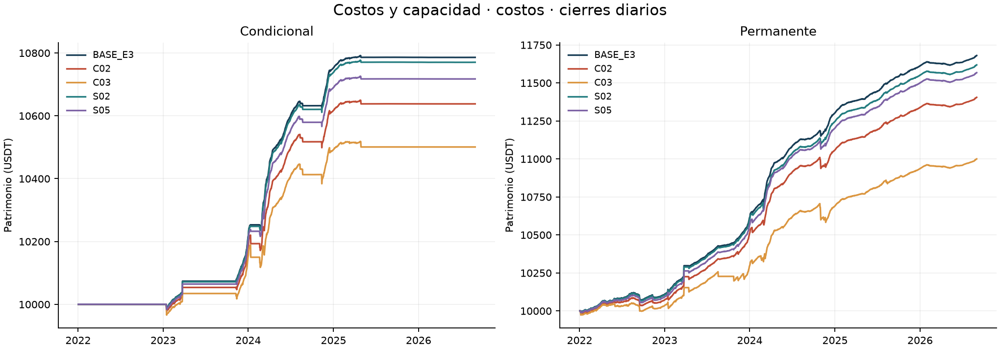
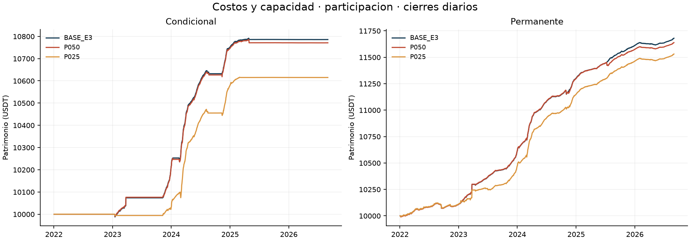
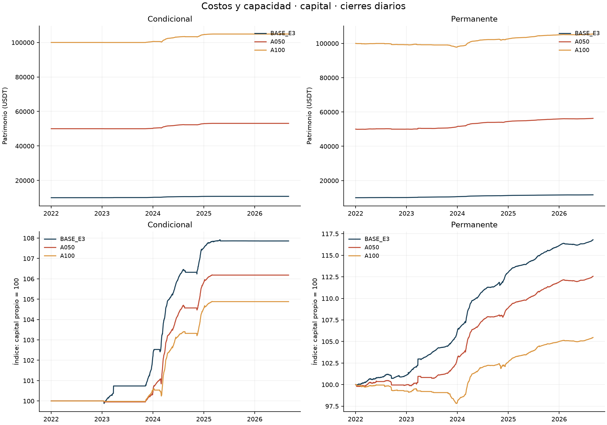
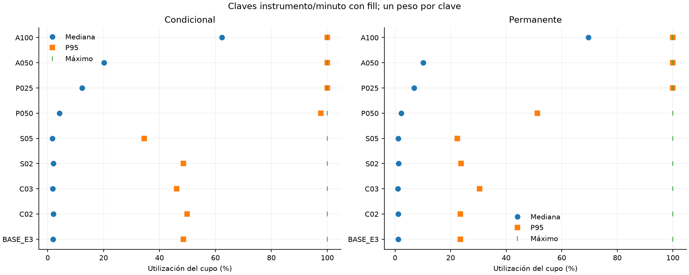

# Bloque 3: costos y capacidad

**Dieciséis carteras nuevas y dos BASE reutilizadas verificadas.** Muestra continua UTC [01/01/2022,01/09/2026), BTCUSDT/ETHUSDT spot y perpetuos USD-M. Las ocho variantes se ejecutan separadas, sin parámetros adoptados del bloque 2. Las cifras son locales; este bloque no completa la Entrega 4.

[Protocolo previo](documentos/protocolo.md) · [Encargo](documentos/encargo_usuario.md) · [Registro de corridas](indice_corridas.json) · [Verificación](README.md)

## Selección fija y costos realizados

El modo explícito `base_e3_total` fija **34 pb** sólo para la condición de entrada `forecast > 0.0034`. Se activa en C02/C03/S02/S05. Renovar requiere `forecast > 0`; la permanente omite ambos requisitos de funding, manteniendo los restantes. Los modos previos conservan su semántica y digest. Sizing, presupuesto, comisiones, inventario y garantías usan los costos del escenario: no se fijan decisiones ni cantidades. Es una regla de selección sin recalibrar ante mayores fricciones.

| Escenario | Fee spot | Fee futuros | Slippage/orden | Selección |
|---|---|---|---|---|
| BASE | 0,10% | 0,05% | 1 pb | 34 pb |
| C02 | 0,20% | 0,10% | 2 pb | 34 pb |
| C03 | 0,30% | 0,15% | 3 pb | 34 pb |
| S02 | 0,10% | 0,05% | 2 pb | 34 pb |
| S05 | 0,10% | 0,05% | 5 pb | 34 pb |

C02/C03 son estrés conjunto de comisiones ordinarias y deslizamiento; S02/S05 aíslan deslizamiento. Compras spot pagan comisión en base, con salida de caja igual al importe bruto ejecutado. Slippage y tick están incluidos en precio: su diagnóstico no vuelve a restarse del P&L. La tasa especial de liquidación no se multiplica.

## Muestra completa

| Escenario | Cartera | Capital inicial | Equity final | P&L | Retorno | CAGR365 | Sharpe RF=0 | DD diario |
|---|---|---|---|---|---|---|---|---|
| BASE_E3 | conditional | 10000 | 10785.76 | 785.76 | 7.8576% | 1.6335% | 4.9624 | -0.2062% |
| BASE_E3 | permanent | 10000 | 11680.07 | 1680.07 | 16.8007% | 3.3825% | 6.5336 | -0.4827% |
| C02 | conditional | 10000 | 10637.83 | 637.83 | 6.3783% | 1.3332% | 3.5448 | -0.4798% |
| C02 | permanent | 10000 | 11404.95 | 1404.95 | 14.0495% | 2.8560% | 5.1656 | -0.6572% |
| C03 | conditional | 10000 | 10500.58 | 500.58 | 5.0058% | 1.0518% | 2.3672 | -0.6989% |
| C03 | permanent | 10000 | 10999.84 | 999.84 | 9.9984% | 2.0622% | 3.1213 | -1.1522% |
| S02 | conditional | 10000 | 10770.20 | 770.20 | 7.7020% | 1.6020% | 4.8501 | -0.2275% |
| S02 | permanent | 10000 | 11618.43 | 1618.43 | 16.1843% | 3.2654% | 6.0386 | -0.4858% |
| S05 | conditional | 10000 | 10717.17 | 717.17 | 7.1717% | 1.4947% | 4.2540 | -0.3057% |
| S05 | permanent | 10000 | 11567.22 | 1567.22 | 15.6722% | 3.1677% | 6.0513 | -0.4947% |
| P050 | conditional | 10000 | 10771.05 | 771.05 | 7.7105% | 1.6038% | 4.8053 | -0.1965% |
| P050 | permanent | 10000 | 11638.71 | 1638.71 | 16.3871% | 3.3039% | 6.1629 | -0.4827% |
| P025 | conditional | 10000 | 10615.10 | 615.10 | 6.1510% | 1.2868% | 4.6387 | -0.2609% |
| P025 | permanent | 10000 | 11530.55 | 1530.55 | 15.3055% | 3.0976% | 5.9087 | -0.4828% |
| A050 | conditional | 50000 | 53090.64 | 3090.64 | 6.1813% | 1.2930% | 4.8327 | -0.2445% |
| A050 | permanent | 50000 | 56281.14 | 6281.14 | 12.5623% | 2.5672% | 4.9840 | -0.6029% |
| A100 | conditional | 100000 | 104878.61 | 4878.61 | 4.8786% | 1.0255% | 4.2093 | -0.3542% |
| A100 | permanent | 100000 | 105463.49 | 5463.49 | 5.4635% | 1.1460% | 2.7626 | -2.1907% |

## Lectura por familia

### Costos

**C02 / conditional:** P&L 637.83 USDT; retorno 6.3783%, diferencia frente a BASE -1.4794 puntos porcentuales. Comisiones 227.71 USDT, funding 845.70 USDT. Capital utilizado medio diario 2058.46 USDT (19.8219%); actividad sin polvo 28.3179%. Órdenes completas/parciales/sin fill: 133/3/120; máxima utilización del cupo 99.9991%.

**C02 / permanent:** P&L 1404.95 USDT; retorno 14.0495%, diferencia frente a BASE -2.7512 puntos porcentuales. Comisiones 447.72 USDT, funding 1772.60 USDT. Capital utilizado medio diario 8855.47 USDT (82.7337%); actividad sin polvo 98.1904%. Órdenes completas/parciales/sin fill: 308/4/403; máxima utilización del cupo 99.9979%.

**C03 / conditional:** P&L 500.58 USDT; retorno 5.0058%, diferencia frente a BASE -2.8518 puntos porcentuales. Comisiones 342.15 USDT, funding 838.81 USDT. Capital utilizado medio diario 2040.22 USDT (19.8000%); actividad sin polvo 28.3179%. Órdenes completas/parciales/sin fill: 137/3/120; máxima utilización del cupo 99.9991%.

**C03 / permanent:** P&L 999.84 USDT; retorno 9.9984%, diferencia frente a BASE -6.8023 puntos porcentuales. Comisiones 742.83 USDT, funding 1711.66 USDT. Capital utilizado medio diario 8296.37 USDT (79.1367%); actividad sin polvo 94.3578%. Órdenes completas/parciales/sin fill: 334/7/404; máxima utilización del cupo 100.0000%.

**S02 / conditional:** P&L 770.20 USDT; retorno 7.7020%, diferencia frente a BASE -0.1556 puntos porcentuales. Comisiones 114.82 USDT, funding 850.33 USDT. Capital utilizado medio diario 2072.02 USDT (19.7994%); actividad sin polvo 28.3178%. Órdenes completas/parciales/sin fill: 135/3/120; máxima utilización del cupo 99.9991%.

**S02 / permanent:** P&L 1618.43 USDT; retorno 16.1843%, diferencia frente a BASE -0.6164 puntos porcentuales. Comisiones 228.86 USDT, funding 1794.97 USDT. Capital utilizado medio diario 8944.91 USDT (82.6371%); actividad sin polvo 98.2377%. Órdenes completas/parciales/sin fill: 324/4/403; máxima utilización del cupo 99.9979%.

**S05 / conditional:** P&L 717.17 USDT; retorno 7.1717%, diferencia frente a BASE -0.6860 puntos porcentuales. Comisiones 113.74 USDT, funding 847.47 USDT. Capital utilizado medio diario 2061.65 USDT (19.7601%); actividad sin polvo 28.3178%. Órdenes completas/parciales/sin fill: 133/2/120; máxima utilización del cupo 99.9991%.

**S05 / permanent:** P&L 1567.22 USDT; retorno 15.6722%, diferencia frente a BASE -1.1285 puntos porcentuales. Comisiones 227.66 USDT, funding 1787.76 USDT. Capital utilizado medio diario 8922.59 USDT (82.6690%); actividad sin polvo 98.2083%. Órdenes completas/parciales/sin fill: 320/4/403; máxima utilización del cupo 99.9979%.

### Participacion

**P050 / conditional:** P&L 771.05 USDT; retorno 7.7105%, diferencia frente a BASE -0.1471 puntos porcentuales. Comisiones 115.49 USDT, funding 846.52 USDT. Capital utilizado medio diario 2062.06 USDT (19.6931%); actividad sin polvo 28.3106%. Órdenes completas/parciales/sin fill: 134/7/120; máxima utilización del cupo 99.9981%.

**P050 / permanent:** P&L 1638.71 USDT; retorno 16.3871%, diferencia frente a BASE -0.4136 puntos porcentuales. Comisiones 264.19 USDT, funding 1783.65 USDT. Capital utilizado medio diario 8912.93 USDT (82.2008%); actividad sin polvo 98.1303%. Órdenes completas/parciales/sin fill: 347/12/402; máxima utilización del cupo 99.9992%.

**P025 / conditional:** P&L 615.10 USDT; retorno 6.1510%, diferencia frente a BASE -1.7066 puntos porcentuales. Comisiones 140.93 USDT, funding 746.42 USDT. Capital utilizado medio diario 1666.63 USDT (16.1130%); actividad sin polvo 22.8784%. Órdenes completas/parciales/sin fill: 120/32/1; máxima utilización del cupo 99.9994%.

**P025 / permanent:** P&L 1530.55 USDT; retorno 15.3055%, diferencia frente a BASE -1.4952 puntos porcentuales. Comisiones 286.28 USDT, funding 1698.62 USDT. Capital utilizado medio diario 8514.26 USDT (79.0298%); actividad sin polvo 97.2228%. Órdenes completas/parciales/sin fill: 354/61/402; máxima utilización del cupo 100.0000%.

### Capital

**A050 / conditional:** P&L 3090.64 USDT; retorno 6.1813%, diferencia frente a BASE -1.6764 puntos porcentuales. Comisiones 670.63 USDT, funding 3693.71 USDT. Capital utilizado medio diario 8350.26 USDT (16.1406%); actividad sin polvo 22.8395%. Órdenes completas/parciales/sin fill: 122/39/0; máxima utilización del cupo 99.9998%.

**A050 / permanent:** P&L 6281.14 USDT; retorno 12.5623%, diferencia frente a BASE -4.2384 puntos porcentuales. Comisiones 1689.38 USDT, funding 7441.12 USDT. Capital utilizado medio diario 34423.26 USDT (64.4432%); actividad sin polvo 83.2936%. Órdenes completas/parciales/sin fill: 382/93/359; máxima utilización del cupo 99.9999%.

**A100 / conditional:** P&L 4878.61 USDT; retorno 4.8786%, diferencia frente a BASE -2.9790 puntos porcentuales. Comisiones 1296.51 USDT, funding 6131.06 USDT. Capital utilizado medio diario 13489.30 USDT (13.1244%); actividad sin polvo 20.2959%. Órdenes completas/parciales/sin fill: 110/63/0; máxima utilización del cupo 99.9999%.

**A100 / permanent:** P&L 5463.49 USDT; retorno 5.4635%, diferencia frente a BASE -11.3372 puntos porcentuales. Comisiones 4603.37 USDT, funding 10420.74 USDT. Capital utilizado medio diario 45187.64 USDT (44.1517%); actividad sin polvo 72.9068%. Órdenes completas/parciales/sin fill: 406/281/116; máxima utilización del cupo 100.0000%.

Los mayores costos pueden cambiar sizing, fills y la trayectoria; no se exige monotonicidad del P&L. Las diferencias absolutas de A050/A100 incluyen su mayor escala. Sus curvas normalizadas usan su propio capital inicial; no se multiplican las cantidades BASE por cinco o diez ni se divide CAGR por utilización.

## Capacidad, reglas y exposición

El cupo es agregado por cartera/activo/mercado/minuto. Compras y ventas consumen volumen bruto. Participación realizada = cantidad bruta / volumen base; utilización = cantidad bruta / (límite × volumen). Las distribuciones tienen un peso por clave con fill y volumen positivo; no suman BTC y ETH en una unidad inventada. Estados terminales de órdenes, eventos de fill parcial y reintentos son poblaciones distintas. El volumen elegible posterior se consulta sólo para auditar la ejecución.

| Escenario | Cartera | Órdenes | Completas | Parciales | Sin fill | Reintentos | Cupo P50 | Cupo P95 | Participación máx. |
|---|---|---|---|---|---|---|---|---|---|
| BASE_E3 | conditional | 258 | 135 | 3 | 120 | 122 | 1.8909% | 48.5702% | 1.0000% |
| BASE_E3 | permanent | 735 | 328 | 4 | 403 | 404 | 1.1421% | 23.5122% | 1.0000% |
| C02 | conditional | 256 | 133 | 3 | 120 | 122 | 2.0202% | 49.9230% | 1.0000% |
| C02 | permanent | 715 | 308 | 4 | 403 | 404 | 1.1561% | 23.5653% | 1.0000% |
| C03 | conditional | 260 | 137 | 3 | 120 | 122 | 1.8428% | 46.1693% | 1.0000% |
| C03 | permanent | 745 | 334 | 7 | 404 | 406 | 1.0821% | 30.3913% | 1.0000% |
| S02 | conditional | 258 | 135 | 3 | 120 | 122 | 2.0045% | 48.5080% | 1.0000% |
| S02 | permanent | 731 | 324 | 4 | 403 | 404 | 1.2175% | 23.8076% | 1.0000% |
| S05 | conditional | 255 | 133 | 2 | 120 | 121 | 1.7288% | 34.5285% | 1.0000% |
| S05 | permanent | 727 | 320 | 4 | 403 | 404 | 1.1367% | 22.3805% | 1.0000% |
| P050 | conditional | 261 | 134 | 7 | 120 | 125 | 4.2348% | 97.7348% | 0.5000% |
| P050 | permanent | 761 | 347 | 12 | 402 | 407 | 2.2858% | 51.2191% | 0.5000% |
| P025 | conditional | 153 | 120 | 32 | 1 | 14 | 12.2885% | 99.9963% | 0.2500% |
| P025 | permanent | 817 | 354 | 61 | 402 | 439 | 6.8142% | 99.9926% | 0.2500% |
| A050 | conditional | 161 | 122 | 39 | 0 | 19 | 20.1913% | 99.9989% | 1.0000% |
| A050 | permanent | 834 | 382 | 93 | 359 | 407 | 10.2035% | 99.9989% | 1.0000% |
| A100 | conditional | 173 | 110 | 63 | 0 | 32 | 62.3139% | 99.9994% | 1.0000% |
| A100 | permanent | 803 | 406 | 281 | 116 | 256 | 69.5770% | 99.9996% | 1.0000% |

Que alguna clave use todo el cupo no significa que la cartera use permanentemente toda su capacidad. La distribución y los faltantes por orden permiten distinguir esos casos. Las ocho ventanas temporales y la desagregación por instrumento están en `ejecucion_resumen.csv`.

[Órdenes completas](tablas/ordenes.csv), [claves de capacidad](tablas/capacidad.csv), [fills/ledger](tablas/fills_conciliados.csv), [causas de faltantes](tablas/causas_faltantes.csv), [demoras por ciclo](tablas/demoras_ciclos.csv), [tramos](tablas/tramos_margen_estados.csv). El auditor aplica el contrato original a todas las órdenes de este motor, incluidas las que llevan propósito `liquidate`; el código inspeccionado no incorpora una excepción autónoma de volumen para fills forzosos del exchange. No se añadió ninguna excepción.

Volumen cero, cierre documentado, presupuesto agotado, step y filtros de reglas se separan. Cuando los registros no permiten identificar separadamente fondos, inventario o reservas pendientes, la causa conserva `funds_inventory_or_reservations_not_separately_identified`; no se afirma falta de volumen ni se reconstruye una reserva exacta inexistente.

Los [cinco casos de mayor cupo y cinco de mayor duración descubierta por cartera](tablas/casos_extremos.csv) usan el orden y desempates fijados antes de resultados. El [catálogo completo](tablas/episodios_descubiertos.csv) conserva todos los episodios; los vínculos entre ambos grupos evitan sumar casos repetidos. La exposición se clasifica sobre toda la trayectoria antes de cortar años; la cartera integra la unión BTC/ETH. El polvo sigue valorado en equity. Las [explicaciones caso por caso](casos_extremos.md) vinculan órdenes, estados y fuentes; los estados de margen persistidos no constituyen una nueva serie intradía.

| Escenario | Cartera | Activo | Tramos observados (pisos USDT) | Cambios observados | Nocional máximo observado | ND |
|---|---|---|---|---|---|---|
| BASE_E3 | conditional | BTCUSDT | sin corto | 0 | ND | 352 |
| BASE_E3 | conditional | ETHUSDT | sin corto | 0 | ND | 615 |
| BASE_E3 | permanent | BTCUSDT | 0 | 0 | 2512.90 | 1931 |
| BASE_E3 | permanent | ETHUSDT | 0 | 0 | 2648.50 | 1912 |
| C02 | conditional | BTCUSDT | sin corto | 0 | ND | 348 |
| C02 | conditional | ETHUSDT | sin corto | 0 | ND | 615 |
| C02 | permanent | BTCUSDT | 0 | 0 | 2512.90 | 1902 |
| C02 | permanent | ETHUSDT | 0 | 0 | 2522.74 | 1900 |
| C03 | conditional | BTCUSDT | sin corto | 0 | ND | 356 |
| C03 | conditional | ETHUSDT | sin corto | 0 | ND | 615 |
| C03 | permanent | BTCUSDT | 0 | 0 | 2355.84 | 1862 |
| C03 | permanent | ETHUSDT | 0 | 0 | 2510.41 | 1843 |
| S02 | conditional | BTCUSDT | sin corto | 0 | ND | 352 |
| S02 | conditional | ETHUSDT | sin corto | 0 | ND | 615 |
| S02 | permanent | BTCUSDT | 0 | 0 | 2512.90 | 1902 |
| S02 | permanent | ETHUSDT | 0 | 0 | 2623.84 | 1933 |
| S05 | conditional | BTCUSDT | sin corto | 0 | ND | 360 |
| S05 | conditional | ETHUSDT | sin corto | 0 | ND | 602 |
| S05 | permanent | BTCUSDT | 0 | 0 | 2512.90 | 1919 |
| S05 | permanent | ETHUSDT | 0 | 0 | 2584.39 | 1908 |
| P050 | conditional | BTCUSDT | sin corto | 0 | ND | 344 |
| P050 | conditional | ETHUSDT | sin corto | 0 | ND | 615 |
| P050 | permanent | BTCUSDT | 0 | 0 | 2512.90 | 1941 |
| P050 | permanent | ETHUSDT | 0 | 0 | 2202.15 | 1915 |
| P025 | conditional | BTCUSDT | sin corto | 0 | ND | 428 |
| P025 | conditional | ETHUSDT | sin corto | 0 | ND | 364 |
| P025 | permanent | BTCUSDT | 0 | 0 | 2512.90 | 1828 |
| P025 | permanent | ETHUSDT | 0 | 0 | 2562.19 | 1888 |
| A050 | conditional | BTCUSDT | sin corto | 0 | ND | 438 |
| A050 | conditional | ETHUSDT | sin corto | 0 | ND | 356 |
| A050 | permanent | BTCUSDT | 0 | 0 | 12407.42 | 1583 |
| A050 | permanent | ETHUSDT | 0 | 0 | 12579.15 | 1579 |
| A100 | conditional | BTCUSDT | sin corto | 0 | ND | 356 |
| A100 | conditional | ETHUSDT | sin corto | 0 | ND | 287 |
| A100 | permanent | BTCUSDT | 0 | 0 | 31254.14 | 1410 |
| A100 | permanent | ETHUSDT | sin corto | 0 | ND | 742 |

Los cruces se cuentan entre estados persistidos de un corto abierto; una reapertura después de quedar sin corto no se cuenta como cruce. Mínimos, máximos, importe y step se comprueban en cada fill con las reglas prescritas. Los faltantes por filtros conservan una categoría distinta de capacidad.

## H1, H2 y H3

H1 conserva una única población BASE autenticada de 10.224 observaciones (10.180 válidas y 44 excluidas), con MAE EWMA 6,298978 frente a no-change 8,703322 pb/168 h, peso BTC/ETH 50/50. Se verifica igualdad de forecast/targets por cartera; reutilizarla no añade observaciones independientes. La [auditoría de invariancias](tablas/invariancias.csv) separa forecast, inputs de oportunidad y agregado H3.

La oportunidad de mercado, expresada en pb/168 h, conserva el umbral de 34 pb y los mismos inputs. La lectura completa de H3 usa, sin embargo, los nuevos CAGR. H2 exige CAGR condicional positivo y Sharpe superior a la permanente del mismo escenario/período; SOFR no participa.

| Escenario | H2 full | Motivo | H3 entre cortes | Oportunidad 2022–23 | Oportunidad 2024–ago26 | CAGR cond. 2022–23 | CAGR cond. 2024–ago26 |
|---|---|---|---|---|---|---|---|
| BASE_E3 | no_favorable | sharpe_not_superior | contraria | 1.3404 | 4.0197 | 1.0814% | 2.0492% |
| C02 | no_favorable | sharpe_not_superior | contraria | 1.3404 | 4.0197 | 0.9191% | 1.6448% |
| C03 | no_favorable | sharpe_not_superior | contraria | 1.3404 | 4.0197 | 0.7632% | 1.2686% |
| S02 | no_favorable | sharpe_not_superior | contraria | 1.3404 | 4.0197 | 1.0639% | 2.0073% |
| S05 | no_favorable | sharpe_not_superior | contraria | 1.3404 | 4.0197 | 1.0076% | 1.8613% |
| P050 | no_favorable | sharpe_not_superior | contraria | 1.3404 | 4.0197 | 1.0661% | 2.0086% |
| P025 | no_favorable | sharpe_not_superior | contraria | 1.3404 | 4.0197 | 0.1618% | 2.1383% |
| A050 | no_favorable | sharpe_not_superior | contraria | 1.3404 | 4.0197 | 0.2045% | 2.1166% |
| A100 | favorable | cagr_positive_and_sharpe_superior | contraria | 1.3404 | 4.0197 | 0.2640% | 1.6001% |

H3: si oportunidad y CAGR bajan, favorable; si ambos suben, contraria; demás casos evaluables, mixta. Las métricas faltantes conservan ND y motivo. No se impone la conclusión del bloque 2.

Frente a BASE del mismo período, cambian 9 lecturas H2 en las variantes disponibles. El contraste H3 entre cortes cambia en 0 variantes.

| Escenario | Período | H2 BASE | H2 variante | Motivo variante |
|---|---|---|---|---|
| A050 | 2024 | no_favorable | favorable | cagr_positive_and_sharpe_superior |
| A100 | 2022-2023 | no_favorable | favorable | cagr_positive_and_sharpe_superior |
| A100 | 2023 | no_favorable | favorable | cagr_positive_and_sharpe_superior |
| A100 | 2024 | no_favorable | favorable | cagr_positive_and_sharpe_superior |
| A100 | full | no_favorable | favorable | cagr_positive_and_sharpe_superior |
| C03 | 2022-2023 | no_favorable | favorable | cagr_positive_and_sharpe_superior |
| C03 | 2023 | no_favorable | favorable | cagr_positive_and_sharpe_superior |
| C03 | 2024 | no_favorable | favorable | cagr_positive_and_sharpe_superior |
| S02 | 2024 | no_favorable | favorable | cagr_positive_and_sharpe_superior |

## Años y capital heredado

| Escenario | Cartera | Año | Inicio | P&L | Retorno | Uso medio | Actividad |
|---|---|---|---|---|---|---|---|
| BASE_E3 | conditional | 2022 | 10000.00 | 0.00 | 0.0000% | 0.0000% | 0.0000% |
| BASE_E3 | conditional | 2023 | 10000.00 | 217.44 | 2.1744% | 20.8441% | 32.9448% |
| BASE_E3 | conditional | 2024 | 10217.44 | 535.13 | 5.2374% | 55.9750% | 67.0171% |
| BASE_E3 | conditional | 2025 | 10752.57 | 33.28 | 0.3096% | 15.4917% | 32.0561% |
| BASE_E3 | conditional | 2026 | 10785.85 | -0.09 | -0.0008% | 0.0059% | 0.0000% |
| BASE_E3 | permanent | 2022 | 10000.00 | 109.16 | 1.0916% | 78.4727% | 98.2787% |
| BASE_E3 | permanent | 2023 | 10109.16 | 507.50 | 5.0202% | 84.2354% | 94.3147% |
| BASE_E3 | permanent | 2024 | 10616.66 | 686.80 | 6.4691% | 87.8768% | 99.0449% |
| BASE_E3 | permanent | 2025 | 11303.46 | 308.14 | 2.7261% | 86.4822% | 100.0000% |
| BASE_E3 | permanent | 2026 | 11611.60 | 68.46 | 0.5896% | 72.7804% | 100.0000% |
| C02 | conditional | 2022 | 10000.00 | 0.00 | 0.0000% | 0.0000% | 0.0000% |
| C02 | conditional | 2023 | 10000.00 | 184.66 | 1.8466% | 20.7637% | 32.9448% |
| C02 | conditional | 2024 | 10184.66 | 432.52 | 4.2468% | 56.1324% | 67.0173% |
| C02 | conditional | 2025 | 10617.18 | 20.70 | 0.1950% | 15.4871% | 32.0561% |
| C02 | conditional | 2026 | 10637.87 | -0.05 | -0.0005% | 0.0023% | 0.0000% |
| C02 | permanent | 2022 | 10000.00 | 72.19 | 0.7219% | 78.4612% | 98.2787% |
| C02 | permanent | 2023 | 10072.19 | 440.81 | 4.3765% | 84.2497% | 94.3147% |
| C02 | permanent | 2024 | 10513.00 | 546.36 | 5.1970% | 88.0008% | 98.9614% |
| C02 | permanent | 2025 | 11059.36 | 278.51 | 2.5184% | 86.7765% | 100.0000% |
| C02 | permanent | 2026 | 11337.87 | 67.07 | 0.5916% | 72.8681% | 100.0000% |
| C03 | conditional | 2022 | 10000.00 | 0.00 | 0.0000% | 0.0000% | 0.0000% |
| C03 | conditional | 2023 | 10000.00 | 153.22 | 1.5322% | 20.7584% | 32.9448% |
| C03 | conditional | 2024 | 10153.22 | 339.19 | 3.3407% | 56.0353% | 67.0173% |
| C03 | conditional | 2025 | 10492.40 | 8.20 | 0.0781% | 15.4881% | 32.0561% |
| C03 | conditional | 2026 | 10500.60 | -0.02 | -0.0002% | 0.0013% | 0.0000% |
| C03 | permanent | 2022 | 10000.00 | 35.11 | 0.3511% | 78.5133% | 98.2787% |
| C03 | permanent | 2023 | 10035.11 | 264.58 | 2.6366% | 67.5898% | 76.0512% |
| C03 | permanent | 2024 | 10299.70 | 391.24 | 3.7986% | 87.9093% | 99.3314% |
| C03 | permanent | 2025 | 10690.94 | 244.61 | 2.2881% | 86.6600% | 100.0000% |
| C03 | permanent | 2026 | 10935.55 | 64.28 | 0.5878% | 72.9040% | 100.0000% |
| S02 | conditional | 2022 | 10000.00 | 0.00 | 0.0000% | 0.0000% | 0.0000% |
| S02 | conditional | 2023 | 10000.00 | 213.90 | 2.1390% | 20.8485% | 32.9448% |
| S02 | conditional | 2024 | 10213.90 | 524.55 | 5.1356% | 55.9367% | 67.0171% |
| S02 | conditional | 2025 | 10738.45 | 31.85 | 0.2966% | 15.4907% | 32.0561% |
| S02 | conditional | 2026 | 10770.30 | -0.10 | -0.0009% | 0.0062% | 0.0000% |
| S02 | permanent | 2022 | 10000.00 | 104.82 | 1.0482% | 78.4932% | 98.2787% |
| S02 | permanent | 2023 | 10104.82 | 500.17 | 4.9498% | 84.2052% | 94.3147% |
| S02 | permanent | 2024 | 10604.99 | 641.89 | 6.0528% | 87.8812% | 99.1815% |
| S02 | permanent | 2025 | 11246.88 | 303.26 | 2.6964% | 86.5016% | 100.0000% |
| S02 | permanent | 2026 | 11550.14 | 68.29 | 0.5913% | 72.8028% | 100.0000% |
| S05 | conditional | 2022 | 10000.00 | 0.00 | 0.0000% | 0.0000% | 0.0000% |
| S05 | conditional | 2023 | 10000.00 | 202.53 | 2.0253% | 20.7793% | 32.9448% |
| S05 | conditional | 2024 | 10202.53 | 487.42 | 4.7774% | 55.8264% | 67.0171% |
| S05 | conditional | 2025 | 10689.94 | 27.27 | 0.2551% | 15.4893% | 32.0561% |
| S05 | conditional | 2026 | 10717.22 | -0.05 | -0.0005% | 0.0032% | 0.0000% |
| S05 | permanent | 2022 | 10000.00 | 91.78 | 0.9178% | 78.5094% | 98.2787% |
| S05 | permanent | 2023 | 10091.78 | 474.95 | 4.7064% | 84.1431% | 94.3147% |
| S05 | permanent | 2024 | 10566.73 | 636.55 | 6.0241% | 88.0973% | 99.0449% |
| S05 | permanent | 2025 | 11203.28 | 296.03 | 2.6423% | 86.4503% | 100.0000% |
| S05 | permanent | 2026 | 11499.31 | 67.91 | 0.5906% | 72.8472% | 100.0000% |
| P050 | conditional | 2022 | 10000.00 | 0.00 | 0.0000% | 0.0000% | 0.0000% |
| P050 | conditional | 2023 | 10000.00 | 214.35 | 2.1435% | 20.6177% | 32.9448% |
| P050 | conditional | 2024 | 10214.35 | 532.68 | 5.2150% | 55.6719% | 66.9833% |
| P050 | conditional | 2025 | 10747.04 | 24.10 | 0.2243% | 15.4908% | 32.0563% |
| P050 | conditional | 2026 | 10771.14 | -0.08 | -0.0008% | 0.0061% | 0.0000% |
| P050 | permanent | 2022 | 10000.00 | 108.62 | 1.0862% | 79.3192% | 98.2787% |
| P050 | permanent | 2023 | 10108.62 | 510.17 | 5.0469% | 84.2243% | 94.3147% |
| P050 | permanent | 2024 | 10618.80 | 680.86 | 6.4118% | 87.6950% | 98.6815% |
| P050 | permanent | 2025 | 11299.65 | 275.23 | 2.4358% | 85.8846% | 100.0000% |
| P050 | permanent | 2026 | 11574.89 | 63.82 | 0.5513% | 69.6814% | 100.0000% |
| P025 | conditional | 2022 | 10000.00 | 0.00 | 0.0000% | 0.0000% | 0.0000% |
| P025 | conditional | 2023 | 10000.00 | 32.39 | 0.3239% | 6.7680% | 14.3383% |
| P025 | conditional | 2024 | 10032.39 | 548.70 | 5.4693% | 60.2074% | 75.1850% |
| P025 | conditional | 2025 | 10581.09 | 34.06 | 0.3219% | 8.0815% | 17.0786% |
| P025 | conditional | 2026 | 10615.15 | -0.05 | -0.0005% | 0.0023% | 0.0000% |
| P025 | permanent | 2022 | 10000.00 | 111.93 | 1.1193% | 79.2827% | 98.2787% |
| P025 | permanent | 2023 | 10111.93 | 363.18 | 3.5916% | 66.7773% | 89.5687% |
| P025 | permanent | 2024 | 10475.11 | 675.90 | 6.4524% | 87.4540% | 99.1896% |
| P025 | permanent | 2025 | 11151.01 | 311.87 | 2.7968% | 86.7264% | 100.0000% |
| P025 | permanent | 2026 | 11462.88 | 67.68 | 0.5904% | 72.8049% | 100.0000% |
| A050 | conditional | 2022 | 50000.00 | 0.00 | 0.0000% | 0.0000% | 0.0000% |
| A050 | conditional | 2023 | 50000.00 | 204.68 | 0.4094% | 6.7660% | 14.3383% |
| A050 | conditional | 2024 | 50204.68 | 2715.10 | 5.4081% | 60.2750% | 75.0036% |
| A050 | conditional | 2025 | 52919.78 | 170.88 | 0.3229% | 8.1461% | 17.0786% |
| A050 | conditional | 2026 | 53090.66 | -0.02 | -0.0000% | 0.0003% | 0.0000% |
| A050 | permanent | 2022 | 50000.00 | -17.81 | -0.0356% | 32.9644% | 51.2502% |
| A050 | permanent | 2023 | 49982.19 | 1505.68 | 3.0124% | 56.9099% | 71.8742% |
| A050 | permanent | 2024 | 51487.87 | 2966.32 | 5.7612% | 75.2395% | 98.8851% |
| A050 | permanent | 2025 | 54454.19 | 1494.00 | 2.7436% | 86.9375% | 100.0000% |
| A050 | permanent | 2026 | 55948.20 | 332.94 | 0.5951% | 72.9932% | 100.0000% |
| A100 | conditional | 2022 | 100000.00 | 0.00 | 0.0000% | 0.0000% | 0.0000% |
| A100 | conditional | 2023 | 100000.00 | 528.72 | 0.5287% | 6.3958% | 14.3383% |
| A100 | conditional | 2024 | 100528.72 | 4032.19 | 4.0110% | 46.6008% | 63.1614% |
| A100 | conditional | 2025 | 104560.90 | 317.82 | 0.3040% | 8.1464% | 17.0786% |
| A100 | conditional | 2026 | 104878.72 | -0.11 | -0.0001% | 0.0007% | 0.0000% |
| A100 | permanent | 2022 | 100000.00 | -760.26 | -0.7603% | 24.9836% | 53.7186% |
| A100 | permanent | 2023 | 99239.74 | -1340.05 | -1.3503% | 12.8114% | 22.4747% |
| A100 | permanent | 2024 | 97899.69 | 4726.75 | 4.8282% | 65.6298% | 97.3296% |
| A100 | permanent | 2025 | 102626.44 | 2372.75 | 2.3120% | 70.5119% | 100.0000% |
| A100 | permanent | 2026 | 104999.19 | 464.30 | 0.4422% | 48.0736% | 100.0000% |

2026 abarca enero–agosto (243 días); 2024, 366 días. Retornos de tramos no se suman. Los [ocho períodos](tablas/metricas.csv), [deltas frente a BASE](tablas/deltas.csv), [componentes](tablas/componentes_periodo.csv) y [cierres](tablas/diario.csv) conservan denominadores reales, CAGR365, Sharpe RF=0/ddof=1, volatilidad, drawdown diario y residual contable. Sin volatilidad muestral, Sharpe es ND; garantías no son nocional ni caja libre.

La [actividad por período](tablas/actividad.csv) conserva ciclos, renovaciones, parciales y fallas; el [catálogo de ciclos](tablas/ciclos.csv) mantiene los heredados entre años. Los [eventos de riesgo y ejecución](tablas/eventos.csv) y las [garantías al cierre diario](tablas/margen_cierre_diario.csv) se presentan con sus poblaciones y frecuencias separadas.

## Alcance de la evidencia

Se recalculan contabilidad y ejecución de las variantes; BASE, H1 y oportunidad de mercado se reutilizan con identidad verificada. Los paquetes previos permanecen sellados. Los drawdowns de este bloque son diarios; no se atribuye a una variante el riesgo intradía BASE. Se conservan las aproximaciones originales de marks/funding y las reglas prescritas, sin afirmar historia certificada del exchange. Las velas de un minuto y sus cupos no estiman empíricamente cola, spread o impacto de mercado. Que funcionen los tamaños probados no demuestra escalabilidad ilimitada, ni permite optimizar un umbral. No hay remuneración de caja/garantías, nuevos cálculos SOFR, inferencia estadística, Word/PDF o publicación remota.
