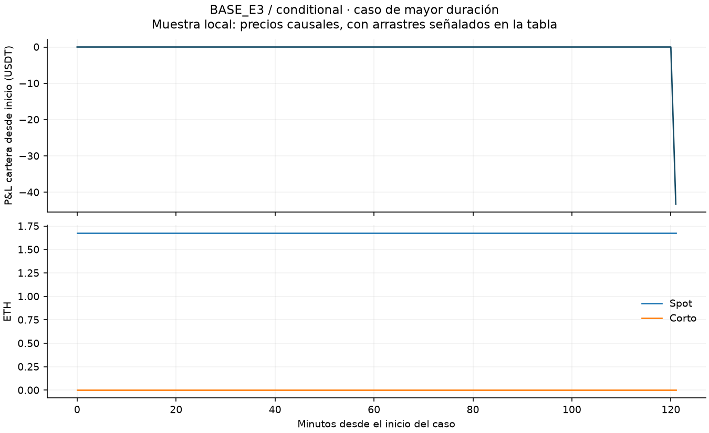
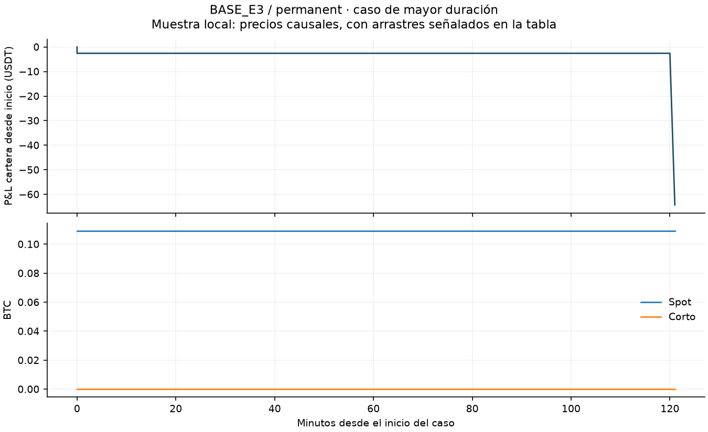
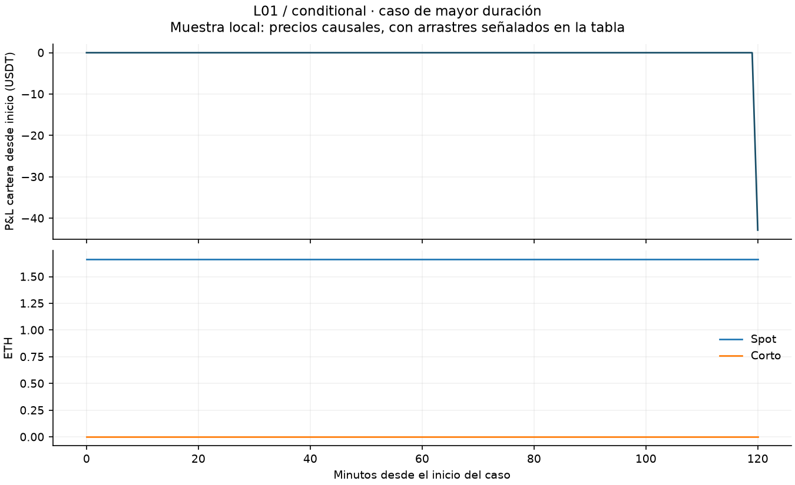
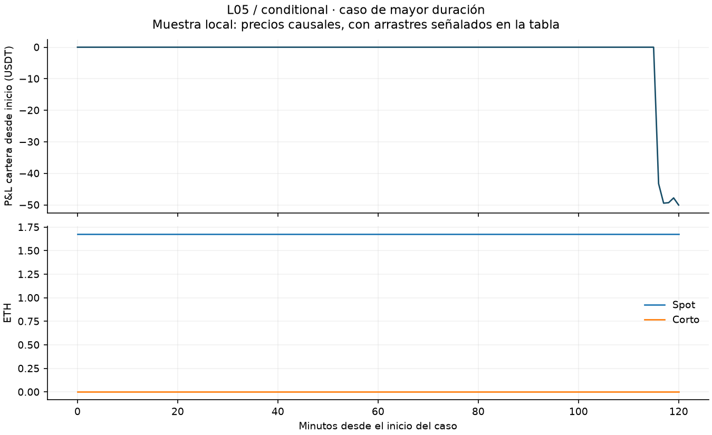
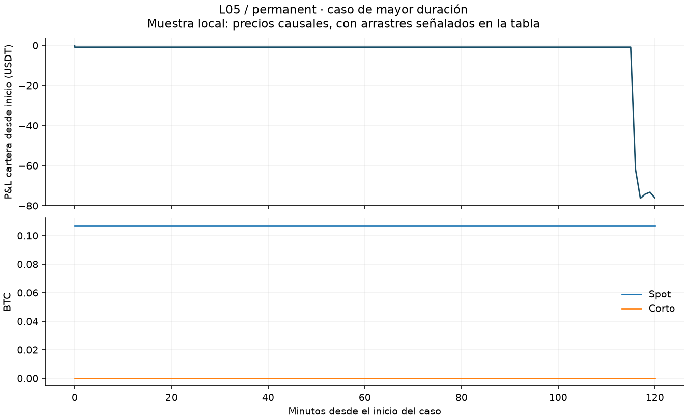
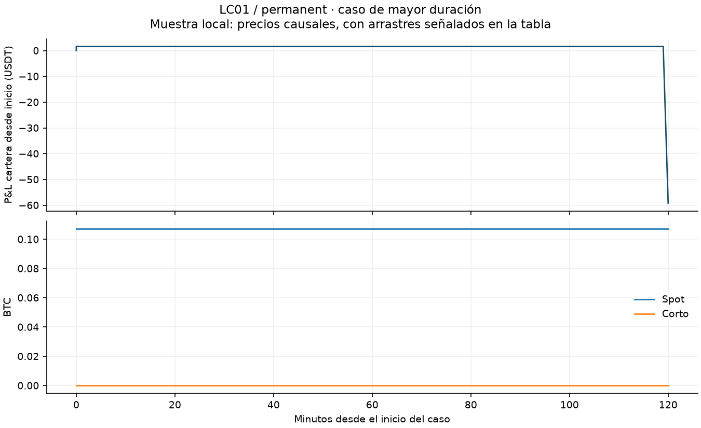
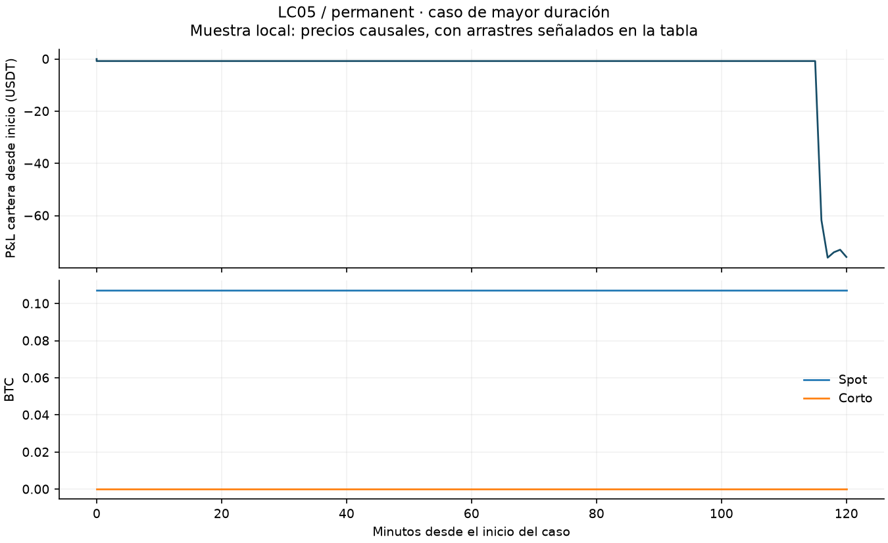
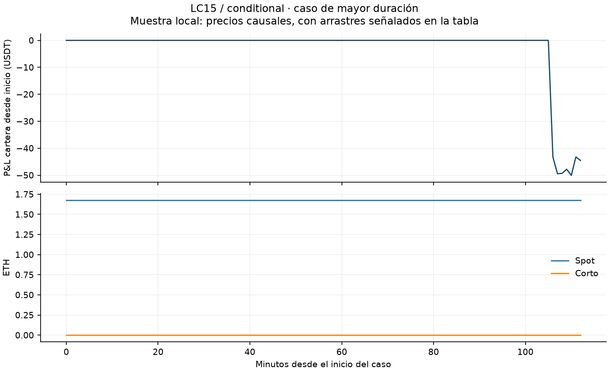

# Incidentes seleccionados

Selección fijada antes del lote: top cinco por duración y 24/03/2023 cuando hay exposición. El catálogo completo conserva los episodios restantes. Ningún máximo de esta tabla representa toda la muestra intradía.

| Escenario | Cartera | Caso / activo | Inicio UTC | Fin UTC | Observaciones | Pérdida máxima desde inicio | Holgura mínima observada | Obs. spot arrastrado | Obs. mark arrastrado |
|---|---|---|---|---|---|---|---|---|---|
| BASE_E3 | conditional | top5-1-ETHUSDT-1679659200000000000 / ETHUSDT | 2023-03-24T12:00:00.000000000Z | 2023-03-24T14:01:00.000000000Z | 122 | 43.2655 | ND | 121 | 0 |
| BASE_E3 | conditional | top5-2-ETHUSDT-1723248240000000000 / ETHUSDT | 2024-08-10T00:04:00.000000000Z | 2024-08-10T00:06:00.000000000Z | 4 | 2.5553 | ND | 0 | 0 |
| BASE_E3 | conditional | top5-3-ETHUSDT-1745798700000000000 / ETHUSDT | 2025-04-28T00:05:00.000000000Z | 2025-04-28T00:07:00.000000000Z | 4 | 1.9887 | ND | 0 | 0 |
| BASE_E3 | conditional | top5-4-ETHUSDT-1673683380000000000 / ETHUSDT | 2023-01-14T08:03:00.000000000Z | 2023-01-14T08:04:00.000000000Z | 2 | 0.0000 | ND | 0 | 0 |
| BASE_E3 | conditional | top5-5-ETHUSDT-1673798520000000000 / ETHUSDT | 2023-01-15T16:02:00.000000000Z | 2023-01-15T16:03:00.000000000Z | 2 | 0.6545 | ND | 0 | 0 |
| BASE_E3 | conditional | 20230324-ETHUSDT / ETHUSDT | 2023-03-24T00:00:00.000000000Z | 2023-03-24T23:59:59.999999999Z | 1447 | 0.4253 | 824.8868 | 153 | 0 |
| BASE_E3 | permanent | top5-1-BTCUSDT-1679659200000000000 / BTCUSDT | 2023-03-24T12:00:00.000000000Z | 2023-03-24T14:01:00.000000000Z | 123 | 64.3131 | ND | 122 | 0 |
| BASE_E3 | permanent | top5-2-ETHUSDT-1679659200000000000 / ETHUSDT | 2023-03-24T12:00:00.000000000Z | 2023-03-24T14:01:00.000000000Z | 123 | 61.7246 | ND | 121 | 0 |
| BASE_E3 | permanent | top5-3-ETHUSDT-1673769900000000000 / ETHUSDT | 2023-01-15T08:05:00.000000000Z | 2023-01-15T08:08:00.000000000Z | 6 | 2.0049 | ND | 0 | 0 |
| BASE_E3 | permanent | top5-4-BTCUSDT-1730246520000000000 / BTCUSDT | 2024-10-30T00:02:00.000000000Z | 2024-10-30T00:04:00.000000000Z | 5 | 10.1845 | ND | 0 | 0 |
| BASE_E3 | permanent | top5-5-BTCUSDT-1641254520000000000 / BTCUSDT | 2022-01-04T00:02:00.000000000Z | 2022-01-04T00:03:00.000000000Z | 2 | 0.0000 | ND | 0 | 0 |
| BASE_E3 | permanent | 20230324-BTCUSDT / BTCUSDT | 2023-03-24T00:00:00.000000000Z | 2023-03-24T23:59:59.999999999Z | 1451 | 0.7095 | 1185.9525 | 154 | 0 |
| BASE_E3 | permanent | 20230324-ETHUSDT / ETHUSDT | 2023-03-24T00:00:00.000000000Z | 2023-03-24T23:59:59.999999999Z | 1451 | 0.7095 | 855.9270 | 154 | 0 |
| E_OHLC4 | conditional | top5-1-ETHUSDT-1679659200000000000 / ETHUSDT | 2023-03-24T12:00:00.000000000Z | 2023-03-24T14:01:00.000000000Z | 122 | 43.2655 | ND | 121 | 0 |
| E_OHLC4 | conditional | top5-2-ETHUSDT-1723248240000000000 / ETHUSDT | 2024-08-10T00:04:00.000000000Z | 2024-08-10T00:06:00.000000000Z | 4 | 2.6220 | ND | 0 | 0 |
| E_OHLC4 | conditional | top5-3-ETHUSDT-1745798700000000000 / ETHUSDT | 2025-04-28T00:05:00.000000000Z | 2025-04-28T00:07:00.000000000Z | 4 | 2.0821 | ND | 0 | 0 |
| E_OHLC4 | conditional | top5-4-ETHUSDT-1673683380000000000 / ETHUSDT | 2023-01-14T08:03:00.000000000Z | 2023-01-14T08:04:00.000000000Z | 2 | 0.0000 | ND | 0 | 0 |
| E_OHLC4 | conditional | top5-5-ETHUSDT-1673798520000000000 / ETHUSDT | 2023-01-15T16:02:00.000000000Z | 2023-01-15T16:03:00.000000000Z | 2 | 0.6545 | ND | 0 | 0 |
| E_OHLC4 | conditional | 20230324-ETHUSDT / ETHUSDT | 2023-03-24T00:00:00.000000000Z | 2023-03-24T23:59:59.999999999Z | 1447 | 0.4253 | 825.0805 | 153 | 0 |
| E_OHLC4 | permanent | top5-1-BTCUSDT-1679659200000000000 / BTCUSDT | 2023-03-24T12:00:00.000000000Z | 2023-03-24T14:01:00.000000000Z | 123 | 63.2503 | ND | 122 | 0 |
| E_OHLC4 | permanent | top5-2-ETHUSDT-1679659200000000000 / ETHUSDT | 2023-03-24T12:00:00.000000000Z | 2023-03-24T14:01:00.000000000Z | 123 | 61.4159 | ND | 121 | 0 |
| E_OHLC4 | permanent | top5-3-ETHUSDT-1673769900000000000 / ETHUSDT | 2023-01-15T08:05:00.000000000Z | 2023-01-15T08:08:00.000000000Z | 6 | 2.3324 | ND | 0 | 0 |
| E_OHLC4 | permanent | top5-4-BTCUSDT-1730246520000000000 / BTCUSDT | 2024-10-30T00:02:00.000000000Z | 2024-10-30T00:04:00.000000000Z | 5 | 11.4320 | ND | 0 | 0 |
| E_OHLC4 | permanent | top5-5-BTCUSDT-1641254520000000000 / BTCUSDT | 2022-01-04T00:02:00.000000000Z | 2022-01-04T00:03:00.000000000Z | 2 | 0.0000 | ND | 0 | 0 |
| E_OHLC4 | permanent | 20230324-BTCUSDT / BTCUSDT | 2023-03-24T00:00:00.000000000Z | 2023-03-24T23:59:59.999999999Z | 1451 | 0.7010 | 1160.5652 | 154 | 0 |
| E_OHLC4 | permanent | 20230324-ETHUSDT / ETHUSDT | 2023-03-24T00:00:00.000000000Z | 2023-03-24T23:59:59.999999999Z | 1451 | 0.7010 | 853.2253 | 154 | 0 |
| L01 | conditional | top5-1-ETHUSDT-1679659260000000000 / ETHUSDT | 2023-03-24T12:01:00.000000000Z | 2023-03-24T14:01:00.000000000Z | 121 | 42.8792 | ND | 120 | 0 |
| L01 | conditional | top5-2-ETHUSDT-1723248420000000000 / ETHUSDT | 2024-08-10T00:07:00.000000000Z | 2024-08-10T00:11:00.000000000Z | 6 | 4.1659 | ND | 0 | 0 |
| L01 | conditional | top5-3-ETHUSDT-1673683440000000000 / ETHUSDT | 2023-01-14T08:04:00.000000000Z | 2023-01-14T08:06:00.000000000Z | 3 | 0.3476 | ND | 0 | 0 |
| L01 | conditional | top5-4-ETHUSDT-1674288480000000000 / ETHUSDT | 2023-01-21T08:08:00.000000000Z | 2023-01-21T08:10:00.000000000Z | 3 | 0.1920 | 1218.1643 | 0 | 0 |
| L01 | conditional | top5-5-ETHUSDT-1676102880000000000 / ETHUSDT | 2023-02-11T08:08:00.000000000Z | 2023-02-11T08:10:00.000000000Z | 3 | 0.0000 | 1461.8836 | 0 | 0 |
| L01 | conditional | 20230324-ETHUSDT / ETHUSDT | 2023-03-24T00:00:00.000000000Z | 2023-03-24T23:59:59.999999999Z | 1447 | 0.4218 | 794.9967 | 153 | 0 |
| L01 | permanent | top5-1-BTCUSDT-1679659260000000000 / BTCUSDT | 2023-03-24T12:01:00.000000000Z | 2023-03-24T14:01:00.000000000Z | 122 | 59.0652 | ND | 121 | 0 |
| L01 | permanent | top5-2-ETHUSDT-1679659260000000000 / ETHUSDT | 2023-03-24T12:01:00.000000000Z | 2023-03-24T14:01:00.000000000Z | 122 | 60.6689 | ND | 120 | 0 |
| L01 | permanent | top5-3-ETHUSDT-1673769840000000000 / ETHUSDT | 2023-01-15T08:04:00.000000000Z | 2023-01-15T08:08:00.000000000Z | 6 | 1.9235 | ND | 0 | 0 |
| L01 | permanent | top5-4-BTCUSDT-1641254580000000000 / BTCUSDT | 2022-01-04T00:03:00.000000000Z | 2022-01-04T00:05:00.000000000Z | 3 | 6.9971 | ND | 0 | 0 |
| L01 | permanent | top5-5-ETHUSDT-1641369840000000000 / ETHUSDT | 2022-01-05T08:04:00.000000000Z | 2022-01-05T08:06:00.000000000Z | 3 | 0.8883 | ND | 0 | 0 |
| L01 | permanent | 20230324-BTCUSDT / BTCUSDT | 2023-03-24T00:00:00.000000000Z | 2023-03-24T23:59:59.999999999Z | 1451 | 0.6962 | 1159.0567 | 154 | 0 |
| L01 | permanent | 20230324-ETHUSDT / ETHUSDT | 2023-03-24T00:00:00.000000000Z | 2023-03-24T23:59:59.999999999Z | 1451 | 0.6962 | 841.8778 | 154 | 0 |
| L05 | conditional | top5-1-ETHUSDT-1679659500000000000 / ETHUSDT | 2023-03-24T12:05:00.000000000Z | 2023-03-24T14:05:00.000000000Z | 121 | 50.0623 | ND | 116 | 0 |
| L05 | conditional | top5-2-BTCUSDT-1724199540000000000 / BTCUSDT | 2024-08-21T00:19:00.000000000Z | 2024-08-21T00:31:00.000000000Z | 14 | 3.5176 | ND | 0 | 0 |
| L05 | conditional | top5-3-ETHUSDT-1673683680000000000 / ETHUSDT | 2023-01-14T08:08:00.000000000Z | 2023-01-14T08:14:00.000000000Z | 7 | 0.0000 | ND | 0 | 0 |
| L05 | conditional | top5-4-ETHUSDT-1673798820000000000 / ETHUSDT | 2023-01-15T16:07:00.000000000Z | 2023-01-15T16:13:00.000000000Z | 7 | 0.4045 | ND | 0 | 0 |
| L05 | conditional | top5-5-ETHUSDT-1675613940000000000 / ETHUSDT | 2023-02-05T16:19:00.000000000Z | 2023-02-05T16:25:00.000000000Z | 7 | 0.0000 | 1244.7679 | 0 | 0 |
| L05 | conditional | 20230324-ETHUSDT / ETHUSDT | 2023-03-24T00:00:00.000000000Z | 2023-03-24T23:59:59.999999999Z | 1447 | 0.4255 | 831.9693 | 153 | 0 |
| L05 | permanent | top5-1-BTCUSDT-1679659500000000000 / BTCUSDT | 2023-03-24T12:05:00.000000000Z | 2023-03-24T14:05:00.000000000Z | 122 | 76.2445 | ND | 117 | 0 |
| L05 | permanent | top5-2-ETHUSDT-1679659500000000000 / ETHUSDT | 2023-03-24T12:05:00.000000000Z | 2023-03-24T14:05:00.000000000Z | 122 | 77.5500 | ND | 116 | 0 |
| L05 | permanent | top5-3-BTCUSDT-1641254820000000000 / BTCUSDT | 2022-01-04T00:07:00.000000000Z | 2022-01-04T00:13:00.000000000Z | 7 | 4.1143 | ND | 0 | 0 |
| L05 | permanent | top5-4-ETHUSDT-1641370080000000000 / ETHUSDT | 2022-01-05T08:08:00.000000000Z | 2022-01-05T08:14:00.000000000Z | 7 | 0.0000 | ND | 0 | 0 |
| L05 | permanent | top5-5-BTCUSDT-1641860340000000000 / BTCUSDT | 2022-01-11T00:19:00.000000000Z | 2022-01-11T00:25:00.000000000Z | 7 | 0.0000 | 1773.5804 | 0 | 0 |
| L05 | permanent | 20230324-BTCUSDT / BTCUSDT | 2023-03-24T00:00:00.000000000Z | 2023-03-24T23:59:59.999999999Z | 1451 | 0.6931 | 1150.2207 | 154 | 0 |
| L05 | permanent | 20230324-ETHUSDT / ETHUSDT | 2023-03-24T00:00:00.000000000Z | 2023-03-24T23:59:59.999999999Z | 1451 | 0.6931 | 854.4762 | 154 | 0 |
| LC01 | conditional | top5-1-ETHUSDT-1679659260000000000 / ETHUSDT | 2023-03-24T12:01:00.000000000Z | 2023-03-24T14:01:00.000000000Z | 121 | 43.2656 | ND | 120 | 0 |
| LC01 | conditional | top5-2-ETHUSDT-1673683380000000000 / ETHUSDT | 2023-01-14T08:03:00.000000000Z | 2023-01-14T08:07:00.000000000Z | 6 | 0.8763 | ND | 0 | 0 |
| LC01 | conditional | top5-3-ETHUSDT-1723248300000000000 / ETHUSDT | 2024-08-10T00:05:00.000000000Z | 2024-08-10T00:09:00.000000000Z | 6 | 0.0000 | ND | 0 | 0 |
| LC01 | conditional | top5-4-ETHUSDT-1704973680000000000 / ETHUSDT | 2024-01-11T11:48:00.000000000Z | 2024-01-11T11:50:00.000000000Z | 3 | 1.4442 | ND | 0 | 0 |
| LC01 | conditional | top5-5-BTCUSDT-1704984420000000000 / BTCUSDT | 2024-01-11T14:47:00.000000000Z | 2024-01-11T14:49:00.000000000Z | 3 | 6.5437 | ND | 0 | 0 |
| LC01 | conditional | 20230324-ETHUSDT / ETHUSDT | 2023-03-24T00:00:00.000000000Z | 2023-03-24T23:59:59.999999999Z | 1447 | 0.4253 | 825.0240 | 153 | 0 |
| LC01 | permanent | top5-1-BTCUSDT-1679659260000000000 / BTCUSDT | 2023-03-24T12:01:00.000000000Z | 2023-03-24T14:01:00.000000000Z | 122 | 59.1623 | ND | 121 | 0 |
| LC01 | permanent | top5-2-ETHUSDT-1679659260000000000 / ETHUSDT | 2023-03-24T12:01:00.000000000Z | 2023-03-24T14:01:00.000000000Z | 122 | 60.7698 | ND | 120 | 0 |
| LC01 | permanent | top5-3-ETHUSDT-1673769960000000000 / ETHUSDT | 2023-01-15T08:06:00.000000000Z | 2023-01-15T08:12:00.000000000Z | 9 | 3.8569 | ND | 0 | 0 |
| LC01 | permanent | top5-4-BTCUSDT-1730246520000000000 / BTCUSDT | 2024-10-30T00:02:00.000000000Z | 2024-10-30T00:05:00.000000000Z | 6 | 13.0459 | ND | 0 | 0 |
| LC01 | permanent | top5-5-BTCUSDT-1653758220000000000 / BTCUSDT | 2022-05-28T17:17:00.000000000Z | 2022-05-28T17:19:00.000000000Z | 4 | 9.7968 | ND | 0 | 0 |
| LC01 | permanent | 20230324-BTCUSDT / BTCUSDT | 2023-03-24T00:00:00.000000000Z | 2023-03-24T23:59:59.999999999Z | 1451 | 0.6949 | 1148.6086 | 154 | 0 |
| LC01 | permanent | 20230324-ETHUSDT / ETHUSDT | 2023-03-24T00:00:00.000000000Z | 2023-03-24T23:59:59.999999999Z | 1451 | 0.6949 | 844.0996 | 154 | 0 |
| LC05 | conditional | top5-1-ETHUSDT-1679659500000000000 / ETHUSDT | 2023-03-24T12:05:00.000000000Z | 2023-03-24T14:05:00.000000000Z | 121 | 50.0325 | ND | 116 | 0 |
| LC05 | conditional | top5-2-ETHUSDT-1673683380000000000 / ETHUSDT | 2023-01-14T08:03:00.000000000Z | 2023-01-14T08:09:00.000000000Z | 7 | 0.0000 | ND | 0 | 0 |
| LC05 | conditional | top5-3-ETHUSDT-1704973920000000000 / ETHUSDT | 2024-01-11T11:52:00.000000000Z | 2024-01-11T11:58:00.000000000Z | 7 | 1.8938 | ND | 0 | 0 |
| LC05 | conditional | top5-4-BTCUSDT-1704984660000000000 / BTCUSDT | 2024-01-11T14:51:00.000000000Z | 2024-01-11T14:57:00.000000000Z | 7 | 31.8855 | ND | 0 | 0 |
| LC05 | conditional | top5-5-BTCUSDT-1709593740000000000 / BTCUSDT | 2024-03-04T23:09:00.000000000Z | 2024-03-04T23:15:00.000000000Z | 7 | 0.4784 | ND | 0 | 0 |
| LC05 | conditional | 20230324-ETHUSDT / ETHUSDT | 2023-03-24T00:00:00.000000000Z | 2023-03-24T23:59:59.999999999Z | 1447 | 0.4253 | 824.8500 | 153 | 0 |
| LC05 | permanent | top5-1-BTCUSDT-1679659500000000000 / BTCUSDT | 2023-03-24T12:05:00.000000000Z | 2023-03-24T14:05:00.000000000Z | 122 | 76.1253 | ND | 117 | 0 |
| LC05 | permanent | top5-2-ETHUSDT-1679659500000000000 / ETHUSDT | 2023-03-24T12:05:00.000000000Z | 2023-03-24T14:05:00.000000000Z | 122 | 77.4312 | ND | 116 | 0 |
| LC05 | permanent | top5-3-BTCUSDT-1730246520000000000 / BTCUSDT | 2024-10-30T00:02:00.000000000Z | 2024-10-30T00:09:00.000000000Z | 10 | 22.3012 | ND | 0 | 0 |
| LC05 | permanent | top5-4-BTCUSDT-1653758220000000000 / BTCUSDT | 2022-05-28T17:17:00.000000000Z | 2022-05-28T17:23:00.000000000Z | 8 | 9.7968 | ND | 0 | 0 |
| LC05 | permanent | top5-5-ETHUSDT-1653758220000000000 / ETHUSDT | 2022-05-28T17:17:00.000000000Z | 2022-05-28T17:23:00.000000000Z | 8 | 7.3260 | ND | 0 | 0 |
| LC05 | permanent | 20230324-BTCUSDT / BTCUSDT | 2023-03-24T00:00:00.000000000Z | 2023-03-24T23:59:59.999999999Z | 1451 | 0.6940 | 1154.9698 | 154 | 0 |
| LC05 | permanent | 20230324-ETHUSDT / ETHUSDT | 2023-03-24T00:00:00.000000000Z | 2023-03-24T23:59:59.999999999Z | 1451 | 0.6940 | 846.4415 | 154 | 0 |
| LC15 | conditional | top5-1-ETHUSDT-1679660100000000000 / ETHUSDT | 2023-03-24T12:15:00.000000000Z | 2023-03-24T14:07:00.000000000Z | 113 | 50.0625 | ND | 106 | 0 |
| LC15 | conditional | top5-2-ETHUSDT-1673683380000000000 / ETHUSDT | 2023-01-14T08:03:00.000000000Z | 2023-01-14T08:19:00.000000000Z | 17 | 0.0000 | ND | 0 | 0 |
| LC15 | conditional | top5-3-ETHUSDT-1704974520000000000 / ETHUSDT | 2024-01-11T12:02:00.000000000Z | 2024-01-11T12:18:00.000000000Z | 17 | 19.9009 | ND | 0 | 0 |
| LC15 | conditional | top5-4-BTCUSDT-1704985260000000000 / BTCUSDT | 2024-01-11T15:01:00.000000000Z | 2024-01-11T15:17:00.000000000Z | 17 | 46.3180 | ND | 0 | 0 |
| LC15 | conditional | top5-5-BTCUSDT-1709594340000000000 / BTCUSDT | 2024-03-04T23:19:00.000000000Z | 2024-03-04T23:35:00.000000000Z | 17 | 37.0401 | ND | 0 | 0 |
| LC15 | conditional | 20230324-ETHUSDT / ETHUSDT | 2023-03-24T00:00:00.000000000Z | 2023-03-24T23:59:59.999999999Z | 1447 | 0.4256 | 825.5030 | 153 | 0 |
| LC15 | permanent | top5-1-BTCUSDT-1679660100000000000 / BTCUSDT | 2023-03-24T12:15:00.000000000Z | 2023-03-24T14:07:00.000000000Z | 114 | 75.1272 | ND | 107 | 0 |
| LC15 | permanent | top5-2-ETHUSDT-1679660100000000000 / ETHUSDT | 2023-03-24T12:15:00.000000000Z | 2023-03-24T14:07:00.000000000Z | 114 | 75.9245 | ND | 106 | 0 |
| LC15 | permanent | top5-3-BTCUSDT-1653758820000000000 / BTCUSDT | 2022-05-28T17:27:00.000000000Z | 2022-05-28T18:15:00.000000000Z | 54 | 1.2487 | ND | 0 | 0 |
| LC15 | permanent | top5-4-ETHUSDT-1653758820000000000 / ETHUSDT | 2022-05-28T17:27:00.000000000Z | 2022-05-28T17:59:00.000000000Z | 36 | 0.4353 | ND | 0 | 0 |
| LC15 | permanent | top5-5-ETHUSDT-1730246520000000000 / ETHUSDT | 2024-10-30T00:02:00.000000000Z | 2024-10-30T00:34:00.000000000Z | 35 | 31.4854 | ND | 0 | 0 |
| LC15 | permanent | 20230324-BTCUSDT / BTCUSDT | 2023-03-24T00:00:00.000000000Z | 2023-03-24T23:59:59.999999999Z | 1451 | 0.7012 | 1166.5895 | 154 | 0 |
| LC15 | permanent | 20230324-ETHUSDT / ETHUSDT | 2023-03-24T00:00:00.000000000Z | 2023-03-24T23:59:59.999999999Z | 1451 | 0.7012 | 852.6414 | 154 | 0 |

[Selección](tablas/incidentes_seleccion.csv) · [Detalle temporal](tablas/incidentes_detalle.parquet) · [Resumen y cobertura](tablas/incidentes_resumen.csv) · [Eventos originales del caso y hora previa](tablas/incidentes_eventos.parquet).

La holgura sólo es evaluable donde existe corto y mark válido. Un precio causal arrastrado conserva una valoración contable, no evidencia de ejecución. Los códigos de calidad distinguen falta de minuto, volumen cero y dato inválido. El flag de estimación del mark es independiente de su disponibilidad. Los índices del ledger y los IDs de movimiento fijan las fronteras de cada episodio: POST del movimiento inicial y estado inmediatamente anterior al movimiento final, conservando los movimientos simultáneos intermedios. Cuando sólo cambia el estado operativo sin movimiento de cantidades se usa POST de todo el timestamp inicial y PRE del timestamp final, con motivo explícito. El 24/03 es una ventana calendario: incluye PRE y todos los POST dentro del día UTC. Un episodio censurado por el final exclusivo sólo se observa hasta final−1 ns; conserva su duración y no consume precios disponibles en el límite excluido. La pérdida parte del equity de inicio, no del máximo anterior al incidente. Los helpers locales usan float64, como el bloque de riesgo original; la conciliación contable diaria/periódica conserva Decimal y tolerancia 1E-8 USDT. Los casos que comparten cartera/ventana pueden compartir pérdida patrimonial: no se suman entre activos.

