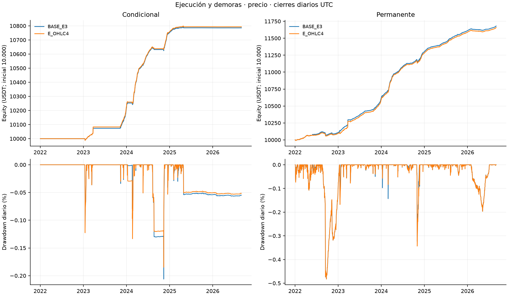
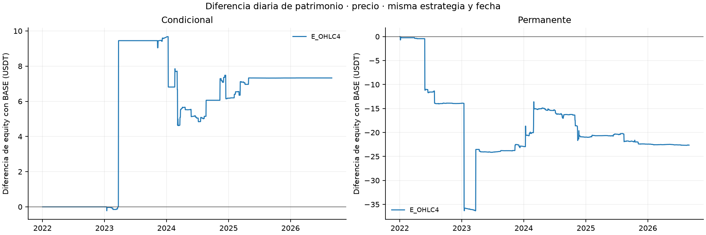
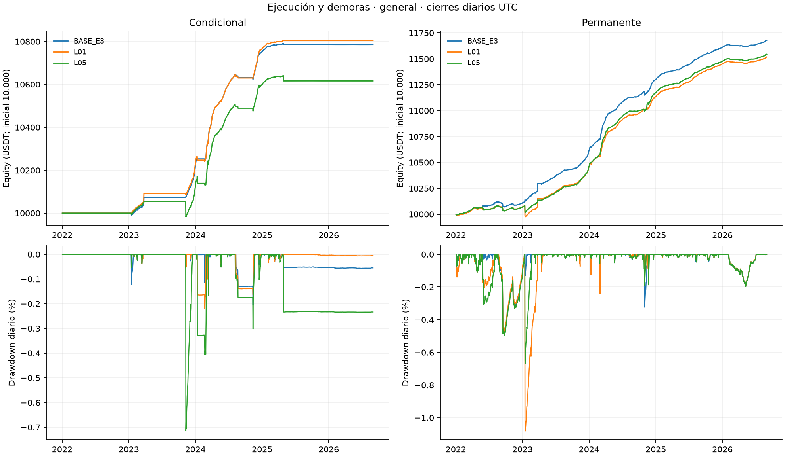
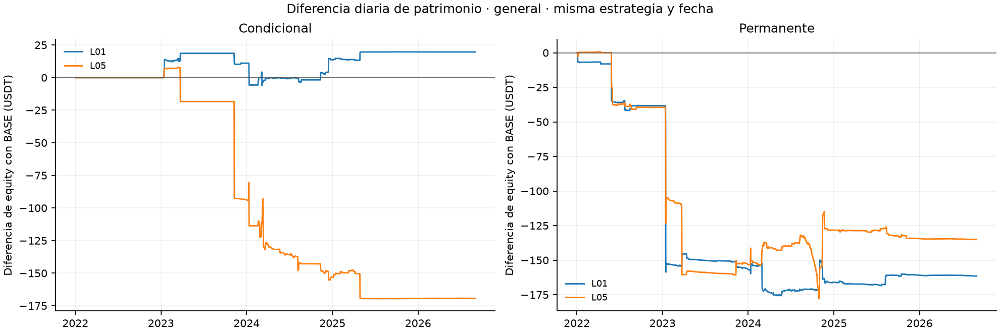
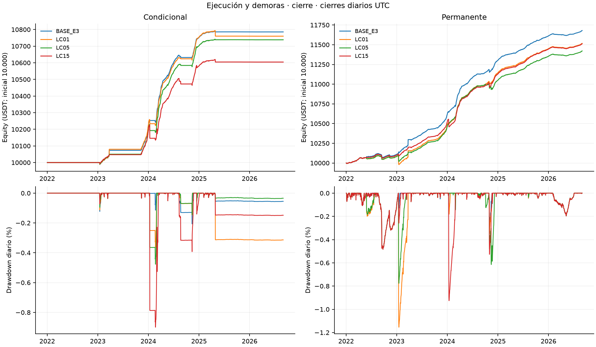
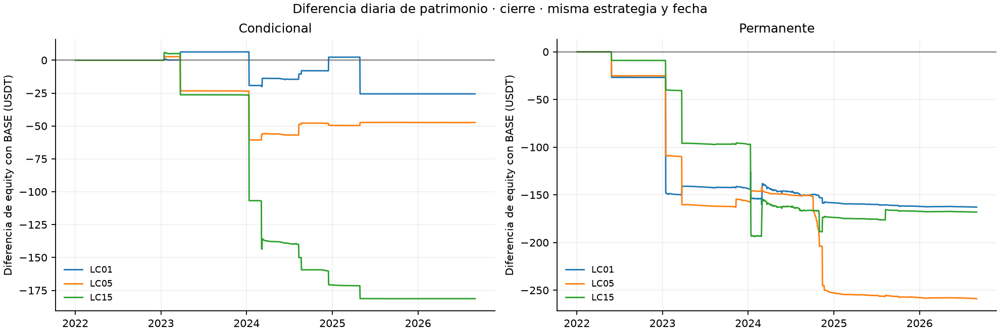
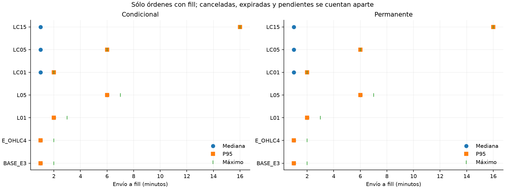

# Bloque 4: precio de ejecución y demoras

[Lectura comparada de precio, actividad, capital, riesgo e hipótesis](lectura_resultados.md).

**Seis variantes separadas, doce carteras nuevas y dos BASE reutilizadas verificadas.** BTCUSDT/ETHUSDT, UTC [01/01/2022,01/09/2026), 10.000 USDT por cartera. Cada trayectoria es continua y conserva saldos entre los ocho períodos. Las cifras y archivos son locales; no acreditan publicación en GitHub ni completan toda la Entrega 4.

[Síntesis](sintesis.md) · [Protocolo](documentos/protocolo.md) · [Corridas y comandos](indice_corridas.json) · [Auditoría](auditoria_ejecucion.md) · [Casos](incidentes.md) · [Reproducción](README.md)

## Resultados principales

**E_OHLC4** — conditional: P&L 793.09 USDT, diferencia con BASE 7.33 USDT; permanent: P&L 1657.44 USDT, diferencia con BASE -22.63 USDT.
**L01** — conditional: P&L 805.46 USDT, diferencia con BASE 19.70 USDT; permanent: P&L 1518.50 USDT, diferencia con BASE -161.57 USDT.
**L05** — conditional: P&L 616.45 USDT, diferencia con BASE -169.31 USDT; permanent: P&L 1544.95 USDT, diferencia con BASE -135.12 USDT.
**LC01** — conditional: P&L 760.21 USDT, diferencia con BASE -25.56 USDT; permanent: P&L 1517.24 USDT, diferencia con BASE -162.83 USDT.
**LC05** — conditional: P&L 738.41 USDT, diferencia con BASE -47.35 USDT; permanent: P&L 1421.23 USDT, diferencia con BASE -258.84 USDT.
**LC15** — conditional: P&L 604.49 USDT, diferencia con BASE -181.28 USDT; permanent: P&L 1512.01 USDT, diferencia con BASE -168.06 USDT.
H2, muestra completa: BASE_E3 no_favorable, E_OHLC4 no_favorable, L01 favorable, L05 no_favorable, LC01 no_favorable, LC05 no_favorable, LC15 no_favorable.
H3, contraste original: BASE_E3 contraria, E_OHLC4 contraria, L01 contraria, L05 contraria, LC01 contraria, LC05 contraria, LC15 contraria.

Las sensibilidades no son estimaciones probabilísticas ni seleccionan una política ganadora. Una demora cambia toda la trayectoria; no se exige deterioro monótono.

| Escenario | Cartera | Equity inicial | Equity final | P&L | Retorno | CAGR365 | Sharpe RF=0 | Vol. anual | DD diario |
|---|---|---|---|---|---|---|---|---|---|
| BASE_E3 | conditional | 10000.00 | 10785.76 | 785.76 | 7.8576% | 1.6335% | 4.9624 | 0.3266% | -0.2062% |
| BASE_E3 | permanent | 10000.00 | 11680.07 | 1680.07 | 16.8007% | 3.3825% | 6.5336 | 0.5094% | -0.4827% |
| E_OHLC4 | conditional | 10000.00 | 10793.09 | 793.09 | 7.9309% | 1.6482% | 4.6804 | 0.3494% | -0.1848% |
| E_OHLC4 | permanent | 10000.00 | 11657.44 | 1657.44 | 16.5744% | 3.3395% | 6.0784 | 0.5407% | -0.4824% |
| L01 | conditional | 10000.00 | 10805.46 | 805.46 | 8.0546% | 1.6732% | 4.7413 | 0.3501% | -0.2208% |
| L01 | permanent | 10000.00 | 11518.50 | 1518.50 | 15.1850% | 3.0745% | 4.2051 | 0.7208% | -1.0807% |
| L05 | conditional | 10000.00 | 10616.45 | 616.45 | 6.1645% | 1.2896% | 2.6082 | 0.4918% | -0.7147% |
| L05 | permanent | 10000.00 | 11544.95 | 1544.95 | 15.4495% | 3.1251% | 5.9355 | 0.5187% | -0.6678% |
| LC01 | conditional | 10000.00 | 10760.21 | 760.21 | 7.6021% | 1.5818% | 4.0507 | 0.3876% | -0.3631% |
| LC01 | permanent | 10000.00 | 11517.24 | 1517.24 | 15.1724% | 3.0721% | 4.1904 | 0.7227% | -1.1540% |
| LC05 | conditional | 10000.00 | 10738.41 | 738.41 | 7.3841% | 1.5377% | 4.5852 | 0.3329% | -0.4768% |
| LC05 | permanent | 10000.00 | 11421.23 | 1421.23 | 14.2123% | 2.8874% | 5.3324 | 0.5341% | -0.7761% |
| LC15 | conditional | 10000.00 | 10604.49 | 604.49 | 6.0449% | 1.2651% | 2.5099 | 0.5014% | -0.8990% |
| LC15 | permanent | 10000.00 | 11512.01 | 1512.01 | 15.1201% | 3.0620% | 5.7604 | 0.5238% | -0.9257% |

[Todos los períodos y motivos ND](tablas/metricas.csv) · [Componentes diarios](tablas/diario.csv) · [Diferencias con BASE](tablas/deltas.csv). 2026 comprende enero–agosto; los retornos anuales no se suman. El drawdown principal es diario. Slippage y redondeo ya integran los precios; no se deducen otra vez. Garantías y transferencias no son P&L. La conciliación conserva 1E-8 USDT.

## Contrato económico y temporal

| Escenario | Referencia | Demora añadida | Propósitos afectados |
|---|---|---|---|
| BASE_E3 | VWAP | 0 s | referencia sellada |
| E_OHLC4 | (O+H+L+C)/4 | 0 s | misma ruta de minuto |
| L01 | VWAP | 60 s | todas las órdenes cliente |
| L05 | VWAP | 300 s | todas las órdenes cliente |
| LC01 | VWAP | 60 s | close_perp y close_spot |
| LC05 | VWAP | 300 s | close_perp y close_spot |
| LC15 | VWAP | 900 s | close_perp y close_spot |

LC es una regla global para todo cierre cliente, cualquiera sea su motivo; sustituye el alcance por episodios de la antigua propuesta. Liquidate tiene cero demora adicional. El cierre spot posterior conserva su demora cliente. Las seis variantes no se cruzan entre sí ni adoptan parámetros de otros bloques; se conserva el modo BASE `realized`, umbral de entrada 34 pb, horizonte/holding 168 h, sizing joint_quantity, costos, cupos y calendario.

Generación significa creación de la orden y coincide con su envío; la decisión/señal es otro registro. Elegibilidad = envío + demora aplicable. Inicio de ventana = techo al minuto de la elegibilidad, fin = inicio + 60 s; fill y vencimiento del intento están en ese fin. El reloj conserva nanosegundos. No se usa el high/low/close de la ventana futura al decidir o dimensionar. OHLC4 reemplaza sólo la referencia de ejecución; el slippage y el tick adverso se aplican una vez.

Durante la espera siguen funding, garantías, reservas, inventario, deuda y controles de riesgo. Funding precede al fill simultáneo. No se trasladan holding, cooldown ni correction_deadline. Una corrección cancelada por su plazo preventivo no es una expiración contra una ventana antigua. Cancelar antes o exactamente al inicio anula el intento; dentro de una ventana comprometida se conserva la política diferida original, sin nueva latencia de cancelación. Ningún fill se admite en o después del final exclusivo.

La liquidación BASE sigue usando ventana y cupo de volumen: no es un motor independiente del exchange. Se aprobó reparar la prioridad de los reintentos ya escalados a liquidación; se congeló una identidad nueva y se ejecutaron controles BASE completos separados. [Aprobación y transcripción UTF-8](controles/aprobacion_reparacion_transcripcion_utf8.md) · [Comparación exacta de controles](documentos/control_compatibilidad_base_completa.json). Las referencias selladas se conservan.

## Actividad, capital y ejecución

| Escenario | Cartera | Activo sin polvo | Descubierto | Capital usado medio | Uso diario medio | Garantía media | Deuda máxima diaria |
|---|---|---|---|---|---|---|---|
| BASE_E3 | conditional | 28.3178% | 0.0077% | 2074.62 | 19.8068% | 705.72 | 0.00 |
| BASE_E3 | permanent | 98.2083% | 0.0112% | 8972.08 | 82.6309% | 3308.11 | 0.00 |
| E_OHLC4 | conditional | 28.3178% | 0.0077% | 2075.35 | 19.8026% | 705.93 | 0.00 |
| E_OHLC4 | permanent | 98.2083% | 0.0111% | 8958.58 | 82.6490% | 3302.10 | 0.00 |
| L01 | conditional | 28.3962% | 0.0103% | 2077.00 | 19.8192% | 706.21 | 0.00 |
| L01 | permanent | 98.2689% | 0.0161% | 8877.41 | 82.7663% | 3273.35 | 0.00 |
| L05 | conditional | 28.3197% | 0.0223% | 2022.20 | 19.5250% | 684.30 | 0.00 |
| L05 | permanent | 98.2867% | 0.0396% | 8657.55 | 80.6315% | 3186.24 | 0.00 |
| LC01 | conditional | 28.3182% | 0.0081% | 2070.78 | 19.7809% | 704.55 | 0.00 |
| LC01 | permanent | 98.2195% | 0.0122% | 8872.27 | 82.6541% | 3265.15 | 0.00 |
| LC05 | conditional | 28.3194% | 0.0095% | 2067.41 | 19.8209% | 703.35 | 0.00 |
| LC05 | permanent | 98.2097% | 0.0142% | 8768.88 | 81.9998% | 3229.64 | 0.00 |
| LC15 | conditional | 28.3223% | 0.0128% | 2053.95 | 19.8257% | 698.46 | 0.00 |
| LC15 | permanent | 98.2273% | 0.0208% | 8880.94 | 82.6795% | 3267.15 | 0.00 |

La actividad integra la unión BTC/ETH sobre toda la trayectoria antes de recortar períodos. El polvo sigue valorado, pero no cuenta como tiempo activo. El capital utilizado proviene de cada cartera, no de escalar la referencia. [Actividad, renovaciones y fallos](tablas/actividad.csv), [eventos y liquidaciones](tablas/eventos.csv), [motivos de cierre](tablas/motivos_cierre.csv), [ciclos](tablas/ciclos.csv), [demoras de apertura/cierre](tablas/demoras_ciclos.csv), [órdenes completas](tablas/ordenes.csv), [capacidad](tablas/capacidad.csv), [faltantes](tablas/causas_faltantes.csv) y [conciliación del ledger](tablas/conciliacion_ledger.csv).

| Escenario | Cartera | Órdenes | Completas | Parciales | Sin fill | Canceladas | Expiradas | Pendientes | Reintentos |
|---|---|---|---|---|---|---|---|---|---|
| BASE_E3 | conditional | 258 | 135 | 3 | 120 | 0 | 123 | 0 | 122 |
| BASE_E3 | permanent | 735 | 328 | 4 | 403 | 0 | 407 | 0 | 404 |
| E_OHLC4 | conditional | 258 | 135 | 3 | 120 | 0 | 123 | 0 | 122 |
| E_OHLC4 | permanent | 735 | 328 | 4 | 403 | 0 | 407 | 0 | 404 |
| L01 | conditional | 194 | 134 | 1 | 59 | 0 | 60 | 0 | 60 |
| L01 | permanent | 503 | 303 | 2 | 198 | 0 | 200 | 0 | 199 |
| L05 | conditional | 164 | 142 | 3 | 19 | 0 | 22 | 0 | 20 |
| L05 | permanent | 368 | 309 | 3 | 56 | 0 | 59 | 0 | 56 |
| LC01 | conditional | 197 | 135 | 3 | 59 | 0 | 62 | 0 | 61 |
| LC01 | permanent | 541 | 338 | 4 | 199 | 0 | 203 | 0 | 200 |
| LC05 | conditional | 157 | 137 | 1 | 19 | 0 | 20 | 0 | 19 |
| LC05 | permanent | 389 | 327 | 5 | 57 | 0 | 62 | 0 | 56 |
| LC15 | conditional | 142 | 135 | 1 | 6 | 0 | 7 | 0 | 6 |
| LC15 | permanent | 353 | 326 | 6 | 21 | 0 | 27 | 0 | 24 |

Cada pata y cada nuevo intento tienen envío y demora propios. La capacidad usa el minuto realmente elegido, consumo bruto compartido y orden persistido. BTC/ETH y spot/futuros mantienen cupos separados. La columna reintentos identifica una nueva orden de igual propósito emitida en el vencimiento de la anterior; las escaladas a liquidate conservan su propósito distinto y sus eventos de riesgo. Se distinguen volumen, filtros, cancelación preventiva, plazo de corrección, fin de muestra y fondos/inventario/reservas cuando la evidencia no permite una causa más específica. No se atribuye falsamente cada parcial al cupo.

[Cronología por propósito y período](tablas/cronologia_resumen.csv): percentiles sólo sobre órdenes con fill; una orden no ejecutada conserva latencia ND. La elegibilidad no equivale a ejecución ni a confirmación del exchange.

[L frente a LC de igual demora](tablas/comparacion_L_LC.csv) presenta ambos valores y LC−L. Es una comparación descriptiva de políticas con trayectorias distintas, no un efecto aditivo aislado de la apertura.

## Incidentes y límites de valoración

El [catálogo completo](tablas/episodios_descubiertos.csv) acompaña la selección previa de los cinco episodios de mayor duración por cartera, con desempate por inicio y activo. Se agrega el 24/03/2023 cuando existe inventario en esa variante, incluso polvo con riesgo de precio; las clases se registran sin convertir polvo en tiempo activo. No se impone una duración de 121 minutos. [Detalle e interpretación](incidentes.md).

Los casos usan minutos y cada estado del ledger original. El episodio comienza después del movimiento de su activo y termina antes del movimiento que lo cierra, conservando funding y movimientos simultáneos intermedios. Las fronteras sin cambio de cantidades y la ventana calendario tienen políticas explícitas en el resumen. La valoración usa precios disponibles causalmente y reglas BASE. La pérdida desde el inicio corresponde al patrimonio de la cartera; spot/corto y holgura se muestran por el activo del caso. No se infiere un máximo intradía global. Un spot arrastrado acredita valoración, no venta durante una suspensión. La estimación futures_scaled del mark se identifica por separado; no se trata como mark oficial. Al extinguirse el corto, margen de ese contrato es ND.

## H1, H2 y H3

H1 reutiliza una sola evaluación BASE autenticada, después de comparar forecast, historia, targets y disponibilidad por corrida. No multiplica el tamaño de muestra por las variantes. La oportunidad H3 mantiene forecast, basis, umbral y operatividad, independientemente de llegada de órdenes, fondos o posiciones. [Invariancias](tablas/invariancias.csv) · [H1 original](hipotesis_base/h1_resumen.csv).

H2 compara ambas estrategias del mismo escenario y período: CAGR condicional finito, definido y positivo; Sharpe definido y superior al permanente. RF sigue en cero. H3 conserva los cortes 2022–2023 y enero 2024–agosto 2026: ambos indicadores bajan = favorable; ambos suben = contraria; otros casos evaluables = mixta; faltantes = no concluyente.

| Escenario | H2 completo | CAGR condicional | H3 contraste original |
|---|---|---|---|
| BASE_E3 | no_favorable | 1.6335% | contraria |
| E_OHLC4 | no_favorable | 1.6482% | contraria |
| L01 | favorable | 1.6732% | contraria |
| L05 | no_favorable | 1.2896% | contraria |
| LC01 | no_favorable | 1.5818% | contraria |
| LC05 | no_favorable | 1.5377% | contraria |
| LC15 | no_favorable | 1.2651% | contraria |

[H2: todos los períodos y razones](tablas/h2.csv) · [H3: cortes y desglose anual](tablas/h3_resumen.csv).

## Evidencia y alcance

CSV y Parquet preservan precisión textual; las tablas de decisiones voluminosas se incluyen sólo en Parquet. El verificador incluido recalcula resultados desde registros y extractos compactos; comparte funciones con el constructor. La opción con raíz de datos vuelve a extraer ventanas y casos desde fuentes masivas; el modo offline no afirma leer archivos ausentes. Los hashes, código, configuraciones, pruebas y logs enlazan las identidades. La incompatibilidad histórica de inventario/config permanece separada de los cambios nuevos autorizados.

No se recalcularon SOFR, concentración completa ni la serie intradía sellada. Shocks y contrafactual sin interrupción no se ejecutaron: bloques 5 y 6 pendientes, igual que la revisión transversal/redacción. [Matriz de cumplimiento](matriz_cumplimiento.md) · [Fuentes de figuras](figuras/fuentes.json).
