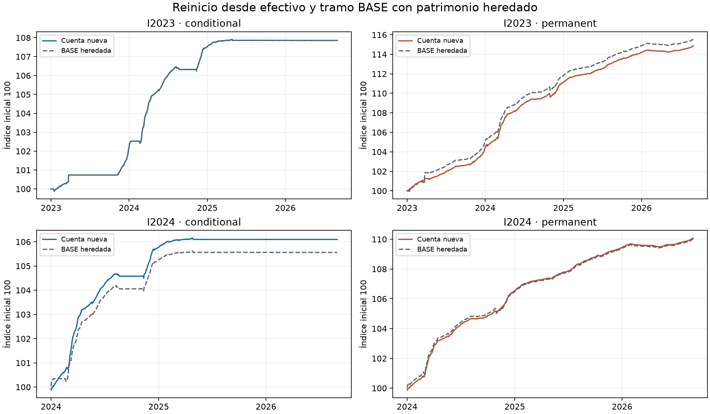
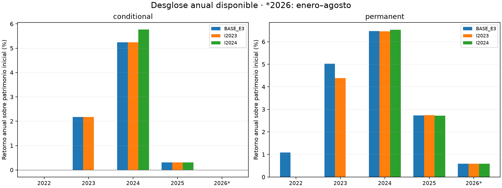
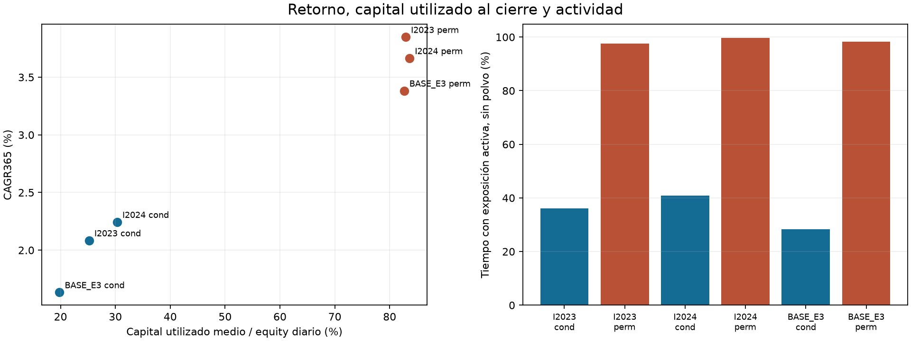
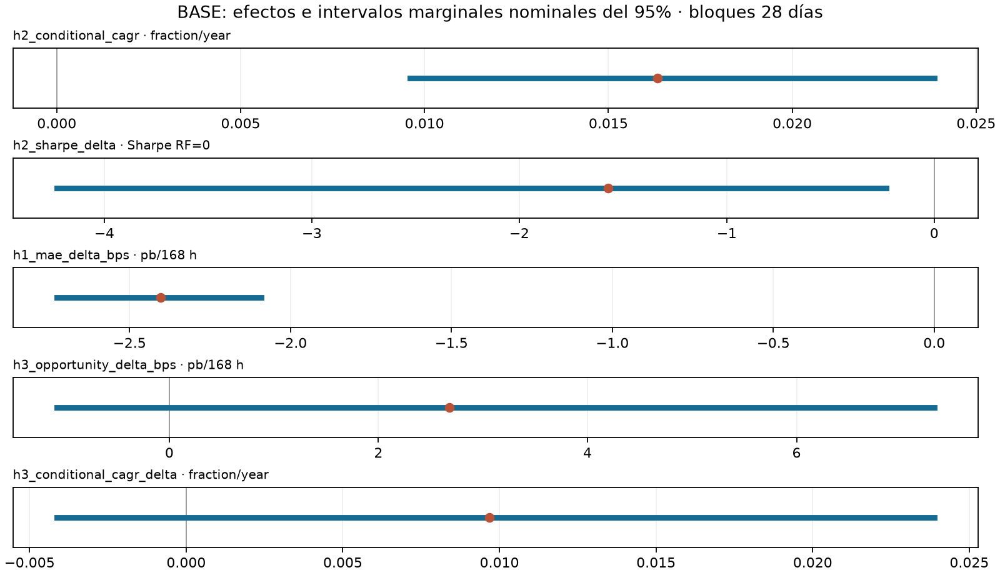

# Bloque 6: estabilidad temporal e incertidumbre

Se comparan cuatro cuentas nuevas desde 10.000 USDT, sin posiciones heredadas, con
los tramos coincidentes de BASE continua iniciada en 2022. Las cuentas continuas
conservan el patrimonio, el inventario, los ciclos y los costos acumulados reales.
El índice 100 facilita la lectura; no representa una nueva cartera ni vuelve
directamente comparables los P&L monetarios. Toda la historia ya fue examinada:
los inicios alternativos no son una validación fuera de muestra.

## Muestra disponible y denominadores

| Cuenta / tramo | Estrategia | Días | Denominador USDT | Retorno | CAGR365 | Sharpe RF=0 | DD diario | Capital/equity medio |
| --- | --- | --- | --- | --- | --- | --- | --- | --- |
| I2023 | conditional | 1,339.00 | 10,000.00 | 7.86% | 2.08% | 5.65 | -0.21% | 25.21% |
| I2023 | permanent | 1,339.00 | 10,000.00 | 14.86% | 3.85% | 8.48 | -0.32% | 82.92% |
| I2024 | conditional | 974.00 | 10,000.00 | 6.10% | 2.24% | 6.82 | -0.17% | 30.31% |
| I2024 | permanent | 974.00 | 10,000.00 | 10.08% | 3.66% | 10.68 | -0.20% | 83.63% |
| BASE_E3 | conditional | 1,704.00 | 10,000.00 | 7.86% | 1.63% | 4.96 | -0.21% | 19.81% |
| BASE_CONTINUA_I2023 | conditional | 1,339.00 | 10,000.00 | 7.86% | 2.08% | 5.65 | -0.21% | 25.21% |
| BASE_CONTINUA_I2024 | conditional | 974.00 | 10,217.44 | 5.56% | 2.05% | 6.18 | -0.21% | 26.84% |
| BASE_E3 | permanent | 1,704.00 | 10,000.00 | 16.80% | 3.38% | 6.53 | -0.48% | 82.63% |
| BASE_CONTINUA_I2023 | permanent | 1,339.00 | 10,109.16 | 15.54% | 4.02% | 7.46 | -0.32% | 83.76% |
| BASE_CONTINUA_I2024 | permanent | 974.00 | 10,616.66 | 10.02% | 3.64% | 9.61 | -0.32% | 83.59% |

Las fechas observadas, nominales y solicitadas constan en [métricas](tablas/metricas.csv).
Se publican sólo años con evidencia; 2026 termina el 1 de septiembre exclusivo.
Los cortes originales incompletos llevan el sufijo `disponible`. La tabla de
[saldos iniciales](tablas/saldos_iniciales.csv) conserva efectivo, deuda, spot,
cortos, collateral y costos heredados. No se imputan filas cero anteriores al inicio.

## Retorno, capital y actividad

El P&L concilia patrimonio final menos inicial con spot, futuros, funding, fees y
cargos de liquidación a 1E-8 USDT. El slippage es informativo y no se descuenta dos
veces. CAGR usa 365 días; Sharpe RF=0 usa retornos diarios, días inactivos y varianza
muestral (ddof=1). Sharpe sin volatilidad evaluable permanece ND.
El capital utilizado es valor spot más collateral al cierre diario; su media es
descriptiva y no mide el pico intradía. La exposición activa excluye polvo y conserva
por separado el inventario bruto y su riesgo de precio.

## Hipótesis y dependencia de la fecha inicial

| Cuenta / tramo | H2 muestra disponible | CAGR condicional | Diferencia de Sharpe | Criterio |
| --- | --- | --- | --- | --- |
| BASE_CONTINUA_I2023 | no_favorable | 2.08% | -1.81 | sharpe_not_superior |
| BASE_CONTINUA_I2024 | no_favorable | 2.05% | -3.43 | sharpe_not_superior |
| BASE_E3 | no_favorable | 1.63% | -1.57 | sharpe_not_superior |
| I2023 | no_favorable | 2.08% | -2.83 | sharpe_not_superior |
| I2024 | no_favorable | 2.24% | -3.86 | sharpe_not_superior |

H2 compara estrategias con el mismo inicio y período: requiere CAGR condicional
positivo y Sharpe superior. La [tabla completa H2](tablas/h2.csv) conserva todos los
cortes y años, incluidos los favorables y no evaluables. H3 original permanece en
BASE continua: I2023/I2024 carecen de parte o todo el régimen 2022–2023 y son ND
para ese contraste. Ver [cobertura H3](tablas/h3_cobertura.csv) y
[comparación de inicios](tablas/comparacion_inicios.csv).

## Incertidumbre de BASE y síntesis

El bootstrap utiliza exclusivamente BASE autenticada; los inicios y escenarios
hipotéticos no se agregan como observaciones. Bloques circulares emparejados de 28
días, sensibilidades 14/56, estratos anuales y segmentos contiguos; 5.000 réplicas por
longitud, PCG64/SeedSequence raíz 20261001 e intervalos percentiles marginales
nominales del 95%, cuantiles lineales. Son decisiones del estudio. La circularidad
no es contigüidad histórica; estratificar supone estabilidad aproximada dentro del
estrato y corta dependencia entre años. La selección histórica, los pocos ciclos y
los días inactivos limitan la inferencia. Dos intervalos marginales al 95% no son un
contraste conjunto al 95%; las frecuencias no son probabilidades de verdad ni de
ganancia futura. Menos del 95% de réplicas válidas deja el intervalo principal ND;
los cuantiles finitos se identifican como condicionales a evaluabilidad.

Ver [efectos, intervalos y degeneración](tablas/bootstrap_intervalos.csv),
[protocolo y cobertura estadística](estadistica/protocolo.json) y [síntesis](sintesis.md).
Las excepciones favorables H336, A100, L01 y contrafactuales deben conservarse por
período. El diagnóstico de logs y estados B2/B3 registra {'rama_no_activada': 28}. Corridas pendientes o afectadas: ninguna según la cobertura documentada. Su criterio y cobertura constan en la síntesis; no se ejecutaron replays históricos. SOFR es una comparación hipotética bruta;
no es una cuenta realizada comparable en riesgo. El drawdown de este informe es
diario: riesgo intradía global y ventanas locales permanecen separados en sus fuentes.

## Trazabilidad y verificación

[Conciliaciones](tablas/conciliaciones.csv), [componentes por activo](tablas/componentes_periodo.csv),
[actividad](tablas/actividad.csv) y [ejecución](tablas/ejecucion_resumen.csv).
La evidencia financiera contiene bytes originales comprimidos sin pérdida y
manifiestos de seis carteras únicas; los dos tramos de cada BASE son vistas de la
misma cuenta. Las ventanas mínimas de ejecución conservan identidad de partición,
volumen y precio. El verificador recalcula contabilidad, funding, fees, posiciones,
actividad, exposición, métricas y H2 desde esos insumos; comparte helpers auditados
con el constructor. No relee particiones masivas ni ejecuta el motor offline.

Mecanismo estadístico: [CircularBlockBootstrap](https://bashtage.github.io/arch/bootstrap/generated/arch.bootstrap.CircularBlockBootstrap.html),
[bootstrap de series](https://bashtage.github.io/arch/bootstrap/timeseries-bootstraps.html),
[flujos NumPy](https://numpy.org/doc/stable/reference/random/parallel.html),
[compatibilidad NumPy](https://numpy.org/doc/stable/reference/global_state.html).
La documentación respalda el mecanismo, no los parámetros ni la estratificación elegidos.

