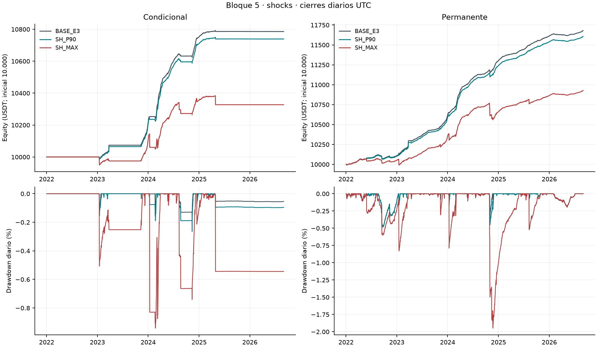
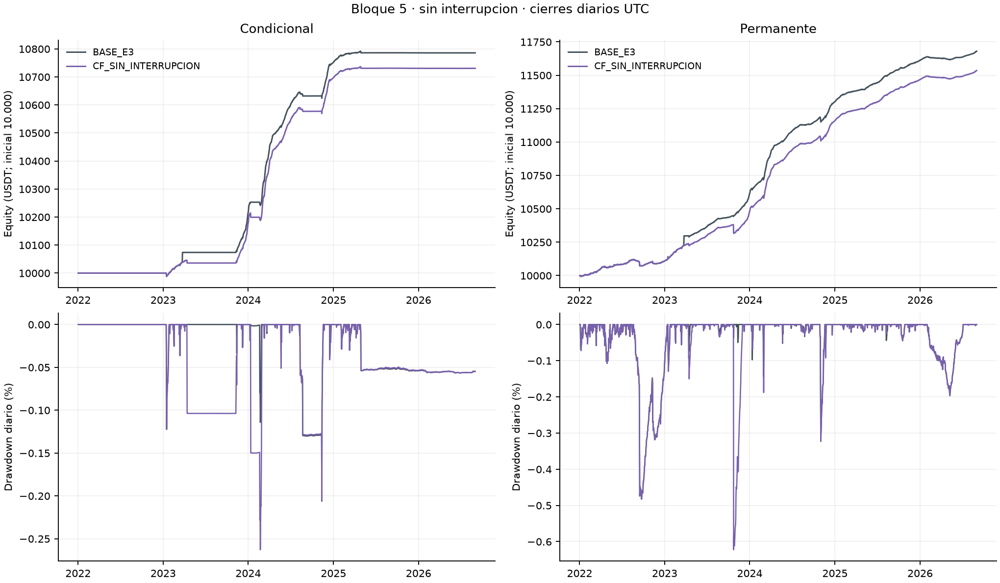
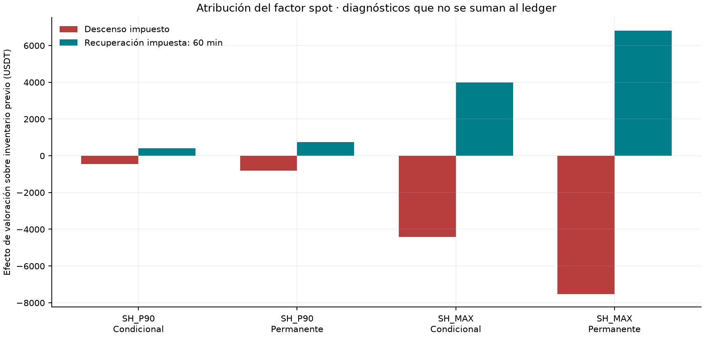
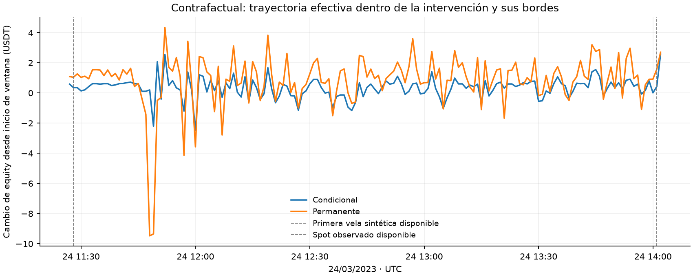

# Bloque 5: estrés spot y contrafactual sin interrupción

**Matriz ejecutada:** seis carteras económicas continuas y cuatro controles técnicos separados. Las dos BASE originales y sus dos controles corregidos se preservan como referencias.

**SH_P90.** condicional: equity final 10738.95 USDT (diferencia -46.81 USDT), retorno 7.390% y CAGR 1.539%; permanente: equity final 11606.69 USDT (diferencia -73.38 USDT), retorno 16.067% y CAGR 3.243%.
**SH_MAX.** condicional: equity final 10327.26 USDT (diferencia -458.51 USDT), retorno 3.273% y CAGR 0.692%; permanente: equity final 10927.75 USDT (diferencia -752.32 USDT), retorno 9.278% y CAGR 1.919%.
**CF_SIN_INTERRUPCION.** condicional: equity final 10730.61 USDT (diferencia -55.15 USDT), retorno 7.306% y CAGR 1.522%; permanente: equity final 11535.16 USDT (diferencia -144.91 USDT), retorno 15.352% y CAGR 3.106%.
## Alcance y supuestos aprobados

La [aprobación registrada](aprobacion_recibida.json) remite a la [ficha](ficha_decision.md), al [protocolo técnico](protocolo_tecnico.md) y a sus hashes. Sus textos históricos pendientes se conservan; la respuesta posterior del usuario autoriza las dos familias. Magnitudes, calendario, recuperación, anclas y volumen quedaron fijados antes del primer replay. No se eligieron escenarios por rendimiento.

Las carteras comienzan con 10.000 USDT y siguen `[2022-01-01,2026-09-01)` UTC. Los ocho cortes son full, 2022, 2023, 2024, 2025, 2026 parcial, 2022–2023 y 2024+. Cada corte hereda inventario y saldos; no reinicia el capital. Se mantienen VWAP, tasas, marks, costos, cupo bruto compartido del 1%, secuencia, reservas y controles de BASE; las demoras de investigación están apagadas.

SH_P90 y SH_MAX reducen sólo spot respecto del perpetuo. No son shocks conjuntos ni prueban resistencia del corto a subas del mark. Las magnitudes son descriptivas ex post: P90 no es probabilidad de pérdida ni nivel de confianza. El precio antiguo durante la suspensión limita la calibración original.

## Resultados continuos y conciliación

| Escenario | Cartera | Equity final USDT | P&L USDT | Retorno | CAGR365 | Sharpe RF=0 | DD diario |
|---|---|---|---|---|---|---|---|
| BASE_E3 | Condicional | 10785.76 | 785.76 | 7.858% | 1.633% | 4.962 | -0.206% |
| BASE_E3 | Permanente | 11680.07 | 1680.07 | 16.801% | 3.382% | 6.534 | -0.483% |
| SH_P90 | Condicional | 10738.95 | 738.95 | 7.390% | 1.539% | 4.666 | -0.265% |
| SH_P90 | Permanente | 11606.69 | 1606.69 | 16.067% | 3.243% | 6.369 | -0.487% |
| SH_MAX | Condicional | 10327.26 | 327.26 | 3.273% | 0.692% | 1.035 | -0.941% |
| SH_MAX | Permanente | 10927.75 | 927.75 | 9.278% | 1.919% | 2.258 | -1.948% |
| CF_SIN_INTERRUPCION | Condicional | 10730.61 | 730.61 | 7.306% | 1.522% | 5.104 | -0.263% |
| CF_SIN_INTERRUPCION | Permanente | 11535.16 | 1535.16 | 15.352% | 3.106% | 6.283 | -0.623% |

El P&L concilia equity final menos equity inicial con spot + futuros + funding + fees + liquidación a `1E-8` USDT por cierre y por período. El slippage ya está en precios de fills; su diagnóstico informativo no se resta por segunda vez. ND conserva su motivo, incluido Sharpe con volatilidad muestral cero. El cuadro principal mide drawdown **diario**.

[Ocho períodos y utilización](resultados/metricas.csv) · [Componentes por activo](resultados/componentes_periodo.csv) · [Ejecución y cupo](resultados/ejecucion_resumen.csv) · [Eventos, deuda y liquidaciones](resultados/eventos.csv) · [Actividad y ciclos](resultados/actividad.csv) · [Conciliación](resultados/conciliacion_ledger.csv).





## Descenso, recuperación impuesta y operaciones

La recuperación de **60 minutos es impuesta**: no es un plazo estimado ni elegido por P&L. A cada instante se usa la mayor intensidad vigente; los pulsos no se multiplican. El descenso comienza a afectar información cuando termina la primera vela aprobada y no modifica fills ya consumidos. Al regresar el factor a uno se conserva todo el inventario, órdenes y saldos resultantes.

La atribución utiliza cantidad spot previa `q`, precio original `S` y factor `f`: `q·S_anterior·(f_nuevo−f_anterior)` mide el factor impuesto y `q·f_nuevo·(S_nuevo−S_anterior)` mide el movimiento del precio original. Su suma concilia el cambio de valoración spot sobre ese inventario. El componente positivo del factor es recuperación impuesta; el negativo es descenso. Son diagnósticos, no transferencias ni cargos adicionales. No se suman a P&L ni identifican una diferencia causal contra otra cartera con inventario diferente.

| Escenario | Cartera | Ventanas conjuntas | Factor descenso USDT | Factor recuperación USDT | Peor pérdida desde apertura de ventana USDT |
|---|---|---|---|---|---|
| SH_P90 | Condicional | 212 | -458.6152 | 413.3955 | -46.9468 |
| SH_P90 | Permanente | 212 | -820.8608 | 747.8004 | -69.4867 |
| SH_MAX | Condicional | 212 | -4410.3909 | 3980.3070 | -85.6187 |
| SH_MAX | Permanente | 212 | -7521.0048 | 6807.0325 | -122.0024 |



| Escenario | Cartera | Realizado spot + futuros USDT | Fees + liquidación USDT | Operaciones netas realizadas USDT | Funding USDT |
|---|---|---|---|---|---|
| SH_P90 | Condicional | 4.9012 | -114.2300 | -109.3288 | 1.6080 |
| SH_P90 | Permanente | 31.6020 | -208.4068 | -176.8048 | 3.7107 |
| SH_MAX | Condicional | -392.8848 | -112.1633 | -505.0481 | 1.5765 |
| SH_MAX | Permanente | -587.6131 | -218.3350 | -805.9481 | 3.6001 |

[Operaciones por ventana](resultados/operaciones_ventanas.csv) incluye eventos del ledger en los intervalos observados, con preludio y bordes explícitos. Excluye cambios no realizados. Estos resultados no son el P&L total de equity y no se les suma la atribución del factor, pues eso contaría valoración dos veces. El slippage ya está en el precio de cada fill.

La pérdida transitoria incluye movimientos del mercado y las operaciones de la trayectoria; se informa separadamente del factor impuesto y del P&L realizado, funding y comisiones del ledger. Los extremos se limitan a ventanas intervenidas y sus bordes, a cierres de minuto y eventos financieros; no son máximos intradía de toda la muestra. Su base es el estado anterior al primer evento de cada ventana; se conserva su timestamp. La valoración sobre spot antiguo durante la suspensión se identifica por fuente y antigüedad, sin habilitar fills ni renovar su disponibilidad.

**El calendario BASE permanece fijo.** No estresa automáticamente exposiciones nuevas que aparezcan en las trayectorias modificadas. Una posición cerrada antes tampoco elimina el pulso. [Cobertura de episodios modificados](resultados/cobertura_calendario_fijo.parquet) cuantifica los segundos dentro y fuera del calendario revelado, sin agregar shocks.

## Garantías y caja

[Garantías por activo y fase](resultados/garantias_ventanas.parquet) separa saldo de margen, mantenimiento, holgura, distancia a liquidación y necesidad preventiva. Tras cerrar el corto, su margen es ND/no aplicable y su requerimiento es cero. Se observan estados anteriores a fills con el mark recién disponible, además de los estados posteriores. No se combinan extremos de velas como si hubieran ocurrido simultáneamente.

[Necesidad conjunta](resultados/garantias_simultaneas.parquet) suma requerimientos **simultáneos**, descuenta caja libre de reservas y conserva deuda. No reutiliza colateral aislado ni suma máximos de distintos instantes. La cifra preventiva es un ínfimo: el límite de ratio exige desigualdad estricta cuando resulta vinculante. No se inyectan esos importes al backtest.

| Escenario | Cartera | Máximo preventivo conjunto (ínfimo USDT) | Máximo faltante externo conocido (ínfimo USDT) | Observaciones ND |
|---|---|---|---|---|
| CF_SIN_INTERRUPCION | Condicional | 0.0000 | 0.0000 | 0 |
| CF_SIN_INTERRUPCION | Permanente | 0.0000 | 0.0000 | 0 |
| SH_MAX | Condicional | 20.0021 | 0.0000 | 0 |
| SH_MAX | Permanente | 14.6834 | 0.0000 | 0 |
| SH_P90 | Condicional | 18.9380 | 0.0000 | 0 |
| SH_P90 | Permanente | 15.1030 | 0.0000 | 0 |

La tabla se limita a las ventanas auditadas. Cero no se interpreta como ausencia de riesgo fuera de ellas; cuando vincula una restricción estricta, se conserva la distinción entre ínfimo y aporte suficiente. [Timestamps y cobertura](resultados/garantias_resumen.csv).

## Escenario sin interrupción y sus fronteras

Se sustituyen 153 aperturas de vela por activo del 24/03/2023 `[11:27,14:00)` UTC. Incluyen la vela parcial de 11:27; los 152 minutos de cierre completo y los 121 minutos descubiertos de BASE son duraciones distintas. Cada vela sintética se publica al terminar. La reapertura observada vuelve con la vela abierta 14:00, conocida 14:01.

Las anclas aprobadas son BTC `28068.79/28053.70` y ETH `1788.70/1787.90`. Implican **basis futuro/spot−1 negativo constante** durante las velas sintéticas (salvo redondeo Decimal 28): aproximadamente −5,3761 pb BTC y −4,4725 pb ETH. Eso restringe nuevas entradas con el filtro inclusivo `[0,0.005]`. No se alteraron las anclas para conseguir operaciones. Órdenes heredadas y decisiones posteriores siguen evolucionando con las reglas ordinarias.

El volumen es la mediana spot por hora UTC de los dos días completos anteriores aprobados, con ceros y 120 observaciones por grupo. No copia volumen de futuros ni supone liquidez infinita. El lapso corto no acredita estacionalidad semanal o profundidad del libro. Las fuentes de futuros, marks y tasas quedan intactas como condición hipotética; el importe de funding se recalcula con el corto anterior a fills simultáneos, mark de cálculo del pago y tasa.

| Cartera | Activo | Frontera | Salto cierre/cierre | Cantidad previa | Valoración previa USDT |
|---|---|---|---|---|---|
| Condicional | BTCUSDT | synthetic_start | 0.0581% | 0.00000000 | 0.0000 |
| Condicional | ETHUSDT | synthetic_start | 0.0358% | 1.67500900 | 1.0725 |
| Condicional | BTCUSDT | observed_reopening | -0.1907% | 0.00000000 | -0.0000 |
| Condicional | ETHUSDT | observed_reopening | -0.1800% | 1.67500900 | -5.3269 |
| Permanente | BTCUSDT | synthetic_start | 0.0581% | 0.10900772 | 1.7778 |
| Permanente | ETHUSDT | synthetic_start | 0.0358% | 1.73800870 | 1.1128 |
| Permanente | BTCUSDT | observed_reopening | -0.1907% | 0.10900772 | -5.8157 |
| Permanente | ETHUSDT | observed_reopening | -0.1800% | 1.73800870 | -5.5273 |



| Cartera | Corte | Cierre UTC | Diferencia de equity CF−BASE USDT | Diferencia de P&L del día USDT |
|---|---|---|---|---|
| Condicional | Antes del incidente | 2023-03-23 | 0.0000 | 0.0000 |
| Condicional | Día intervenido | 2023-03-24 | -34.9155 | -34.9155 |
| Condicional | Fin de muestra | 2026-08-31 | -55.1531 | 0.0019 |
| Permanente | Antes del incidente | 2023-03-23 | 0.0000 | 0.0000 |
| Permanente | Día intervenido | 2023-03-24 | -71.1031 | -71.1031 |
| Permanente | Fin de muestra | 2026-08-31 | -144.9133 | -0.0074 |

[Contraste diario completo](resultados/cf_contraste_diario.csv) conserva los cambios posteriores; la diferencia final no se atribuye íntegramente al día de la intervención.

| Cartera | Tramo | Registro | BASE / CF | Claves comunes modificadas | Sólo BASE / sólo CF |
|---|---|---|---|---|---|
| Condicional | 11:28–14:02 UTC | Decisión/estado | 0 / 0 | 0 | 0 / 0 |
| Condicional | Resto del 24/03 | Decisión/estado | 2 / 2 | 1 | 0 / 0 |
| Condicional | Desde 25/03 hasta fin | Decisión/estado | 7630 / 7633 | 65 | 0 / 3 |
| Condicional | 11:28–14:02 UTC | Emisión de orden | 122 / 0 | 0 | 122 / 0 |
| Condicional | Resto del 24/03 | Emisión de orden | 0 / 0 | 0 | 0 / 0 |
| Condicional | Desde 25/03 hasta fin | Emisión de orden | 120 / 124 | 70 | 2 / 6 |
| Condicional | 11:28–14:02 UTC | Fill | 2 / 0 | 0 | 2 / 0 |
| Condicional | Resto del 24/03 | Fill | 0 / 0 | 0 | 0 / 0 |
| Condicional | Desde 25/03 hasta fin | Fill | 120 / 124 | 68 | 2 / 6 |
| Permanente | 11:28–14:02 UTC | Decisión/estado | 0 / 0 | 0 | 0 / 0 |
| Permanente | Resto del 24/03 | Decisión/estado | 2 / 2 | 2 | 0 / 0 |
| Permanente | Desde 25/03 hasta fin | Decisión/estado | 7879 / 7884 | 157 | 142 / 147 |
| Permanente | 11:28–14:02 UTC | Emisión de orden | 244 / 0 | 0 | 244 / 0 |
| Permanente | Resto del 24/03 | Emisión de orden | 0 / 0 | 0 | 0 / 0 |
| Permanente | Desde 25/03 hasta fin | Emisión de orden | 399 / 395 | 235 | 140 / 136 |
| Permanente | 11:28–14:02 UTC | Fill | 4 / 0 | 0 | 4 / 0 |
| Permanente | Resto del 24/03 | Fill | 0 / 0 | 0 | 0 / 0 |
| Permanente | Desde 25/03 hasta fin | Fill | 244 / 240 | 79 | 140 / 136 |

[Comparación de decisiones y ejecuciones](resultados/cf_decisiones_ejecuciones.csv) exige identidad antes de la primera vela sintética disponible, a las 11:28. Agrupa por timestamp, activo y tipo; excluye identificadores generados. Un cambio de timestamp aparece como una clave exclusiva en cada senda, no como una pareja causal demostrada. Para órdenes se comparan datos de emisión: una orden previa puede ejecutarse después de forma distinta. Los precios/cantidades y cargos de fills se comparan en su instante de ejecución. El detalle conserva multiplicidad, proyecciones y primera divergencia por tramo.

La unión no se suaviza. El salto cierre/cierre en cada frontera y su efecto sobre inventario previo se separan de las operaciones. Ese salto combina el cambio de fuente con el movimiento de mercado entre los dos cierres; no mide aisladamente un efecto causal de la fuente. La cartera se ejecuta hasta el fin conservando las consecuencias del episodio, no se limita a restar el resultado de ese día. Este ejercicio no identifica causalmente el costo real de la interrupción ni predice cómo habría reaccionado el resto del mercado.

## H1, H2 y H3

H1 autentica proyecciones, disponibilidad y cohortes de funding antes de reutilizarlas; recalcula targets desde los registros consumidos y coteja la evaluación archivada. Los targets posteriores no se usan como información ex ante. H2 compara condicional y permanente del mismo escenario y mantiene el criterio de exigir CAGR condicional positivo y Sharpe superior al permanente, con RF=0 y ND explícito.

H3 se obtiene del replay del mercado modificado, independiente de inventario y fondos: forecast completo al pasar filtros, cero para fallas conocidas, ND para desconocidos; promedio diario por activo y pesos 50/50. Se recomputan las fórmulas de los testigos de las ventanas, su cobertura y las agregaciones diarias; no se copia H3 BASE. Las dos estrategias deben recibir la misma senda y oportunidad. Estas sensibilidades hipotéticas no son nueva evidencia histórica ni validación fuera de muestra.

| Escenario | H2 full | H3 2022–2023 vs 2024+ | Oportunidad full pb/168h |
|---|---|---|---|
| BASE_E3 | no_favorable | contraria | 2.871869 |
| CF_SIN_INTERRUPCION | no_favorable | contraria | 2.871869 |
| SH_MAX | no_favorable | contraria | 2.853926 |
| SH_P90 | no_favorable | contraria | 2.871957 |

[H1 por períodos](resultados/h1_resumen.csv) · [H2 por ocho cortes](resultados/h2.csv) · [H3 por períodos](resultados/h3_resumen.csv) · [Deltas frente a BASE](resultados/deltas.csv). Los resultados anuales no se suman ni se imponen relaciones monótonas entre shocks.

## Evidencia, reproducción y pendientes

[Índice de corridas](indice_corridas.json) distingue referencias, controles y seis carteras nuevas. [Contrato congelado](protocolo_ejecucion.json), [exportaciones exactas](fuentes_exportadas.json) y [catálogo de resultados](resultados/catalogo.json) identifican sus fuentes. Las corridas originales permanecen intactas; la evaluación CSV grande se incluye comprimida sin pérdida y se coteja descomprimida contra su hash original. No se duplicaron las bases de minutos por escenario.

Hubo además cuatro intentos técnicos iniciales preservados. El control de shock cero detuvo el avance por cuatro celdas de precio con valor numérico idéntico y distinta representación Decimal. Se corrigió la identidad cuando el factor vale uno y se repitieron los cuatro controles con código nuevo, antes de ejecutar economía. No se relajó la comparación ni se cambiaron referencias o supuestos. [Incidente y corrección](controles/incidente_control_cero.md) · [Identidades de los intentos previos](intentos_tecnicos_previos.json).

El verificador offline recalcula contabilidad, ejecución, fórmulas de intervención, diagnósticos de ventanas y agregados H1/H2/H3. Comparte helpers de reporte con el constructor; no es otro motor económico independiente. Las ecuaciones de transformación del auditor son separadas de la capa de replay. Los minutos de H3 fuera de los testigos se autentican como salida persistida y se agregan; no se reejecutan millones de minutos offline. Las pertenencias a particiones masivas se autenticaron al extraer; reproducirlas exige las 1.731 entradas locales identificadas.

```powershell
python -B herramientas/scripts/verify_stress_counterfactual.py . --output ../verificacion_bloque5.json
```

La [guía de reproducción](reproducibilidad.md) declara dependencias y alcance. Las auditorías finales se guardan fuera del sello. El índice Git no fue modificado por este trabajo; no se hizo commit ni push. No se ejecutó limpieza, borrado ni archivado. El inventario previo conserva carácter de propuesta separada.

Bloque 6, revisión transversal y redacción final siguen pendientes. El alcance de la reparación de liquidación sobre variantes de bloques 2/3 continúa pendiente y separado: la equivalencia BASE no lo resuelve. Este bloque no declara completa toda Entrega 4.
