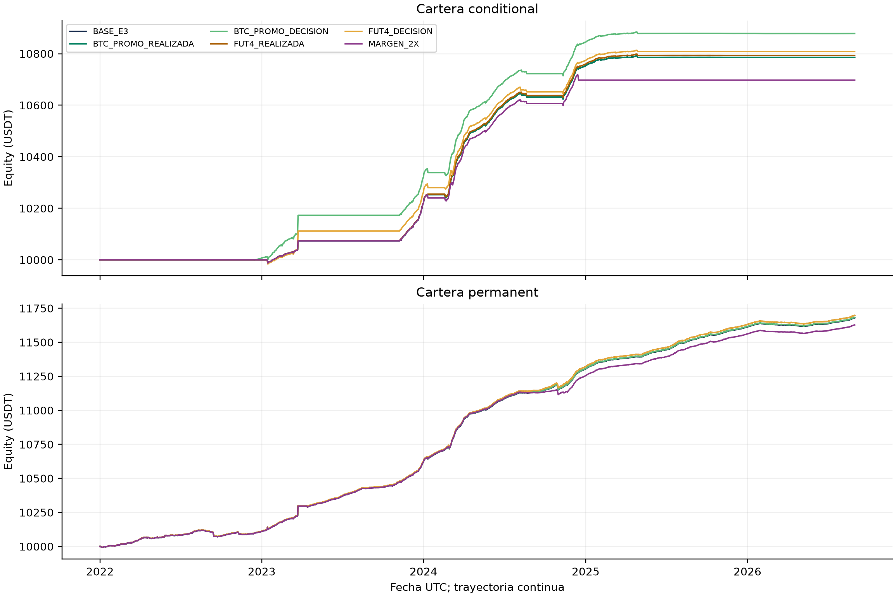
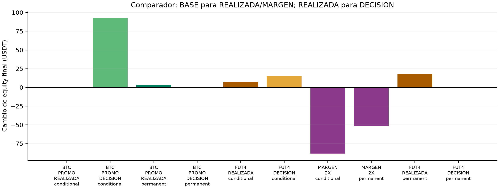
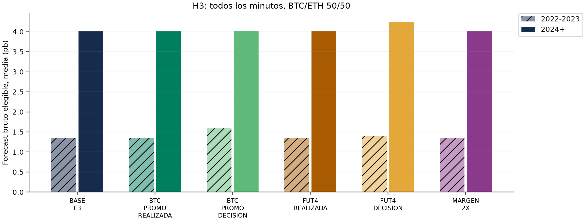

# Primera sensibilidad de reglas — versión técnica preliminar

Pendiente de comentarios del profesor. Comparación exploratoria sobre historia observada; no es evaluación fuera de muestra ni Entrega 4 completa. Trabajo local, sin commit ni push.

## Referencia presentada y estado de ejecución

BASE_E3 conserva las corridas archivadas y sus manifiestos; la reutilización se documenta en la verificación previa del paquete. Las carteras son independientes. Los valores de esta tabla provienen de [metricas_cartera_periodo.csv](metricas_cartera_periodo.csv); cada cifra mantiene su run_id.

Hay 12 resultados utilizables entre 12 estados previstos. Los estados fallido/bloqueado se conservan con motivo y no se convierten en períodos sin inversión.

| scenario | strategy | status | engine_status | run_id | reason |
| --- | --- | --- | --- | --- | --- |
| BASE_E3 | conditional | reutilizado_verificado | complete | run_ad71d751b20623006c195ff3 | Exact code/config/dependencies/data/output verification before extension |
| BASE_E3 | permanent | reutilizado_verificado | complete | run_dfea4b7ac1475668d5968c97 | Exact code/config/dependencies/data/output verification before extension |
| BTC_PROMO_REALIZADA | conditional | ejecutado | complete | run_1ae1cf88ac71b976740edc03 | ND |
| BTC_PROMO_DECISION | conditional | ejecutado | complete | run_d434594cde4077ba6661d7e4 | ND |
| BTC_PROMO_REALIZADA | permanent | ejecutado | complete | run_d3ebbfeb6f98be343782ccbb | ND |
| BTC_PROMO_DECISION | permanent | ejecutado | complete | run_a45c9456ea5d541c9ddce187 | ND |
| FUT4_REALIZADA | conditional | ejecutado | complete | run_d17c6848d9a0c5c85249b152 | ND |
| FUT4_DECISION | conditional | ejecutado | complete | run_8f497f6f609b074f796e043f | ND |
| MARGEN_2X | conditional | ejecutado | complete | run_70383794701c4f0fc157b2ed | ND |
| MARGEN_2X | permanent | ejecutado | complete | run_3f5d9cce8ff1c2ba5447e3b6 | ND |
| FUT4_REALIZADA | permanent | ejecutado | complete | run_edc965655c124abd4318e838 | ND |
| FUT4_DECISION | permanent | ejecutado | complete | run_9a4b6b4c853215594e14bd86 | ND |

## Evidencia y supuestos experimentales

La promoción BTC spot usa el intervalo documentado `[2022-07-08T14:00:00Z, 2023-03-22T00:00:00Z)`; [fact_id BTC_SPOT_ZERO](../evidencia_historica/data/research/historical-rules-followup-20260924T234206Z/reglas_historicas.json), [source_id PROMO_START y PROMO_END](../evidencia_historica/data/research/historical-rules-followup-20260924T234206Z/fuentes.json), enlazados en la [matriz de integración](../documentos/matriz_integracion.csv). El supuesto de conocimiento al inicio en DECISION no acredita un known_from histórico. La tasa spot 0,001 fuera de promoción sigue siendo un supuesto base. FUT4 es el supuesto constante de 4 pb y no identifica una transición histórica. MARGEN_2X es estrés de mantenimiento, conservando apalancamiento inicial 2x. El [protocolo previo](../documentos/protocolo.md) fija esos comparadores y supuestos.

Las variantes REALIZADA cambian comisiones cobradas y conservan filtro 34 pb; DECISION compara con su REALIZADA y usa 2×spot vigente + 2×futuros vigente + 4×slippage, sin anticipar la tarifa futura de salida. Cambian trayectorias completas; los deltas no son un ahorro aislado con posiciones fijas.

## Resultados económicos ejecutados

USDT para equity/P&L; retorno, CAGR y drawdown son razones (0,01 = 1%). Sharpe usa retornos diarios, desviación muestral, 365 días y tasa libre de riesgo cero. ND conserva su motivo en el CSV.

| scenario | strategy | run_id | starting_equity_usdt | final_equity_usdt | net_pnl_usdt | net_return | cagr | sharpe | max_drawdown |
| --- | --- | --- | --- | --- | --- | --- | --- | --- | --- |
| BASE_E3 | conditional | run_ad71d751b20623006c195ff3 | 10,000.0000 | 10,785.7630 | 785.7630 | 0.0786 | 0.0163 | 4.9624 | -0.0021 |
| BASE_E3 | permanent | run_dfea4b7ac1475668d5968c97 | 10,000.0000 | 11,680.0692 | 1,680.0692 | 0.1680 | 0.0338 | 6.5336 | -0.0048 |
| BTC_PROMO_REALIZADA | conditional | run_1ae1cf88ac71b976740edc03 | 10,000.0000 | 10,785.7630 | 785.7630 | 0.0786 | 0.0163 | 4.9624 | -0.0021 |
| BTC_PROMO_DECISION | conditional | run_d434594cde4077ba6661d7e4 | 10,000.0000 | 10,878.3142 | 878.3142 | 0.0878 | 0.0182 | 4.0381 | -0.0026 |
| BTC_PROMO_REALIZADA | permanent | run_d3ebbfeb6f98be343782ccbb | 10,000.0000 | 11,683.3805 | 1,683.3805 | 0.1683 | 0.0339 | 6.5440 | -0.0048 |
| BTC_PROMO_DECISION | permanent | run_a45c9456ea5d541c9ddce187 | 10,000.0000 | 11,683.3805 | 1,683.3805 | 0.1683 | 0.0339 | 6.5440 | -0.0048 |
| FUT4_REALIZADA | conditional | run_d17c6848d9a0c5c85249b152 | 10,000.0000 | 10,793.3188 | 793.3188 | 0.0793 | 0.0165 | 5.0137 | -0.0019 |
| FUT4_DECISION | conditional | run_8f497f6f609b074f796e043f | 10,000.0000 | 10,808.1158 | 808.1158 | 0.0808 | 0.0168 | 3.7323 | -0.0024 |
| MARGEN_2X | conditional | run_70383794701c4f0fc157b2ed | 10,000.0000 | 10,697.4125 | 697.4125 | 0.0697 | 0.0145 | 4.2338 | -0.0024 |
| MARGEN_2X | permanent | run_3f5d9cce8ff1c2ba5447e3b6 | 10,000.0000 | 11,628.2341 | 1,628.2341 | 0.1628 | 0.0328 | 6.3991 | -0.0048 |
| FUT4_REALIZADA | permanent | run_edc965655c124abd4318e838 | 10,000.0000 | 11,697.9849 | 1,697.9849 | 0.1698 | 0.0342 | 6.5949 | -0.0048 |
| FUT4_DECISION | permanent | run_9a4b6b4c853215594e14bd86 | 10,000.0000 | 11,697.9849 | 1,697.9849 | 0.1698 | 0.0342 | 6.5949 | -0.0048 |

Cambios frente al comparador fijado, calculados en [deltas.csv](deltas.csv):

- **BTC_PROMO_REALIZADA frente a BASE_E3**, cambio de equity final: conditional: +0.0000 USDT (`run_1ae1cf88ac71b976740edc03` frente a `run_ad71d751b20623006c195ff3`); permanent: +3.3113 USDT (`run_d3ebbfeb6f98be343782ccbb` frente a `run_dfea4b7ac1475668d5968c97`).
- **BTC_PROMO_DECISION frente a BTC_PROMO_REALIZADA**, cambio de equity final: conditional: +92.5512 USDT (`run_d434594cde4077ba6661d7e4` frente a `run_1ae1cf88ac71b976740edc03`); permanent: +0.0000 USDT (`run_a45c9456ea5d541c9ddce187` frente a `run_d3ebbfeb6f98be343782ccbb`).
- **FUT4_REALIZADA frente a BASE_E3**, cambio de equity final: conditional: +7.5558 USDT (`run_d17c6848d9a0c5c85249b152` frente a `run_ad71d751b20623006c195ff3`); permanent: +17.9157 USDT (`run_edc965655c124abd4318e838` frente a `run_dfea4b7ac1475668d5968c97`).
- **FUT4_DECISION frente a FUT4_REALIZADA**, cambio de equity final: conditional: +14.7970 USDT (`run_8f497f6f609b074f796e043f` frente a `run_d17c6848d9a0c5c85249b152`); permanent: +0.0000 USDT (`run_9a4b6b4c853215594e14bd86` frente a `run_edc965655c124abd4318e838`).
- **MARGEN_2X frente a BASE_E3**, cambio de equity final: conditional: -88.3506 USDT (`run_70383794701c4f0fc157b2ed` frente a `run_ad71d751b20623006c195ff3`); permanent: -51.8351 USDT (`run_3f5d9cce8ff1c2ba5447e3b6` frente a `run_dfea4b7ac1475668d5968c97`).

Los cortes continuos 2022–2023, 2024–agosto de 2026 y años disponibles están en el mismo CSV. Cada subperíodo arranca con equity anterior; no se reinician 10.000 USDT. [Deltas](deltas.csv) identifica la pareja de run_id y el comparador predefinido.

## Atribución, exposición y riesgo

[Diario](diario_carteras.csv), [atribución por activo/período](componentes_por_activo_periodo.csv) y [conciliaciones](conciliaciones.csv) derivan los cambios de cumulativos spot/futuros realizados y no realizados, funding, fees y liquidación. Slippage ya está en precios: su columna es informativa y nunca se resta otra vez.

| scenario | strategy | run_id | spot_pnl_usdt | futures_pnl_usdt | funding_usdt | fees_usdt | liquidation_fees_usdt | slippage_informational_usdt | reconciliation_residual_usdt |
| --- | --- | --- | --- | --- | --- | --- | --- | --- | --- |
| BASE_E3 | conditional | run_ad71d751b20623006c195ff3 | 2,211.1936 | -2,161.4880 | 850.9551 | -114.8976 | 0.0000 | 15.3478 | 0.0000 |
| BASE_E3 | permanent | run_dfea4b7ac1475668d5968c97 | 2,428.9054 | -2,316.0470 | 1,796.4188 | -229.2080 | 0.0000 | 30.5094 | 0.0000 |
| BTC_PROMO_REALIZADA | conditional | run_1ae1cf88ac71b976740edc03 | 2,211.1936 | -2,161.4880 | 850.9551 | -114.8976 | 0.0000 | 15.3478 | 0.0000 |
| BTC_PROMO_DECISION | conditional | run_d434594cde4077ba6661d7e4 | 3,790.6897 | -3,714.5321 | 927.8762 | -125.7196 | 0.0000 | 18.3469 | -0.0000 |
| BTC_PROMO_REALIZADA | permanent | run_d3ebbfeb6f98be343782ccbb | 2,418.7455 | -2,307.0102 | 1,797.7084 | -226.0633 | 0.0000 | 30.4321 | 0.0000 |
| BTC_PROMO_DECISION | permanent | run_a45c9456ea5d541c9ddce187 | 2,418.7455 | -2,307.0102 | 1,797.7084 | -226.0633 | 0.0000 | 30.4321 | 0.0000 |
| FUT4_REALIZADA | conditional | run_d17c6848d9a0c5c85249b152 | 2,209.4116 | -2,159.7001 | 851.2096 | -107.6023 | 0.0000 | 15.3484 | 0.0000 |
| FUT4_DECISION | conditional | run_8f497f6f609b074f796e043f | 2,707.5479 | -2,638.1376 | 862.2716 | -123.5661 | 0.0000 | 17.3830 | 0.0000 |
| MARGEN_2X | conditional | run_70383794701c4f0fc157b2ed | 4,404.8835 | -4,391.9776 | 791.4937 | -106.9871 | 0.0000 | 14.2726 | -0.0000 |
| MARGEN_2X | permanent | run_3f5d9cce8ff1c2ba5447e3b6 | 2,101.9311 | -1,995.3774 | 1,752.1968 | -230.5164 | 0.0000 | 30.5501 | -0.0000 |
| FUT4_REALIZADA | permanent | run_edc965655c124abd4318e838 | 2,324.2147 | -2,210.1970 | 1,797.8878 | -213.9205 | 0.0000 | 30.3783 | 0.0000 |
| FUT4_DECISION | permanent | run_9a4b6b4c853215594e14bd86 | 2,324.2147 | -2,210.1970 | 1,797.8878 | -213.9205 | 0.0000 | 30.3783 | 0.0000 |

[Eventos por período](eventos_periodo.csv) cuenta aperturas, intentos fallidos por orden, fills/parciales, cierres solicitados por margen y fills de liquidación. [Exposición](exposicion_periodo.csv) integra cantidades del ledger entre eventos; los segundos de cartera son la unión de activos y conservan residuos spot como inversión, igual que el contador original. Un residuo sin corto cuenta como exposición sin cobertura. No se infieren trades subminuto.

| scenario | strategy | run_id | openings | failed_attempts | fills | partial_fills | invested_fraction | unhedged_seconds | margin_close_requests | liquidation_fills |
| --- | --- | --- | --- | --- | --- | --- | --- | --- | --- | --- |
| BASE_E3 | conditional | run_ad71d751b20623006c195ff3 | 10 | 123 | 138 | 3 | 0.7780 | 85,644,240.0000 | 5 | 0 |
| BASE_E3 | permanent | run_dfea4b7ac1475668d5968c97 | 20 | 407 | 332 | 4 | 0.9982 | 8,188,680.0000 | 7 | 0 |
| BTC_PROMO_REALIZADA | conditional | run_1ae1cf88ac71b976740edc03 | 10 | 123 | 138 | 3 | 0.7780 | 85,644,240.0000 | 5 | 0 |
| BTC_PROMO_DECISION | conditional | run_d434594cde4077ba6661d7e4 | 12 | 243 | 156 | 3 | 0.7958 | 85,644,720.0000 | 6 | 0 |
| BTC_PROMO_REALIZADA | permanent | run_d3ebbfeb6f98be343782ccbb | 20 | 407 | 324 | 4 | 0.9982 | 8,188,440.0000 | 7 | 0 |
| BTC_PROMO_DECISION | permanent | run_a45c9456ea5d541c9ddce187 | 20 | 407 | 324 | 4 | 0.9982 | 8,188,440.0000 | 7 | 0 |
| FUT4_REALIZADA | conditional | run_d17c6848d9a0c5c85249b152 | 10 | 123 | 138 | 3 | 0.7780 | 85,644,240.0000 | 5 | 0 |
| FUT4_DECISION | conditional | run_8f497f6f609b074f796e043f | 12 | 243 | 149 | 2 | 0.7780 | 91,111,860.0000 | 5 | 0 |
| MARGEN_2X | conditional | run_70383794701c4f0fc157b2ed | 10 | 121 | 110 | 1 | 0.7780 | 85,776,060.0000 | 6 | 0 |
| MARGEN_2X | permanent | run_3f5d9cce8ff1c2ba5447e3b6 | 21 | 366 | 324 | 6 | 0.9982 | 15,241,740.0000 | 7 | 0 |
| FUT4_REALIZADA | permanent | run_edc965655c124abd4318e838 | 20 | 407 | 324 | 4 | 0.9982 | 8,164,560.0000 | 7 | 0 |
| FUT4_DECISION | permanent | run_9a4b6b4c853215594e14bd86 | 20 | 407 | 324 | 4 | 0.9982 | 8,164,560.0000 | 7 | 0 |

Utilización = (valor spot + collateral)/equity, exposición bruta = spot + nocional corto. Utilización, collateral, mantenimiento y su razón se observan al cierre diario; sus máximos no son máximos intradiarios. Mantenimiento se deriva de los tramos prescritos guardados en research_assumptions.json de cada corrida. No es una tabla histórica de Binance. [Fronteras de promoción](fronteras_promocion.csv) conserva todos los fills que tocan una frontera exacta o declara su ausencia.

## H1, H2 y H3

[H1 invariancia](h1_invariancia.csv) compara exactamente pronósticos Decimal de signals, targets/exclusiones de forecast_evaluation y resumen original, ignorando identidad de corrida. [H1 resumen](h1_resumen.csv) recalcula MAE por activo y promedio 50/50. La invariancia es un control de entradas, no un descubrimiento económico.

[H2](h2.csv) compara Sharpe condicional y permanente dentro del mismo escenario y período; un Sharpe ND implica no_concluyente.

| scenario | conditional_run_id | permanent_run_id | conditional_sharpe | permanent_sharpe | sharpe_difference | verdict | reason |
| --- | --- | --- | --- | --- | --- | --- | --- |
| BASE_E3 | run_ad71d751b20623006c195ff3 | run_dfea4b7ac1475668d5968c97 | 4.9624 | 6.5336 | -1.5713 | no_favorable | ND |
| BTC_PROMO_DECISION | run_d434594cde4077ba6661d7e4 | run_a45c9456ea5d541c9ddce187 | 4.0381 | 6.5440 | -2.5059 | no_favorable | ND |
| BTC_PROMO_REALIZADA | run_1ae1cf88ac71b976740edc03 | run_d3ebbfeb6f98be343782ccbb | 4.9624 | 6.5440 | -1.5816 | no_favorable | ND |
| FUT4_DECISION | run_8f497f6f609b074f796e043f | run_9a4b6b4c853215594e14bd86 | 3.7323 | 6.5949 | -2.8626 | no_favorable | ND |
| FUT4_REALIZADA | run_d17c6848d9a0c5c85249b152 | run_edc965655c124abd4318e838 | 5.0137 | 6.5949 | -1.5812 | no_favorable | ND |
| MARGEN_2X | run_70383794701c4f0fc157b2ed | run_3f5d9cce8ff1c2ba5447e3b6 | 4.2338 | 6.3991 | -2.1653 | no_favorable | ND |

Lectura descriptiva H2 en la muestra completa ([parejas y cifras](h2.csv)): BASE_E3: no_favorable; BTC_PROMO_DECISION: no_favorable; BTC_PROMO_REALIZADA: no_favorable; FUT4_DECISION: no_favorable; FUT4_REALIZADA: no_favorable; MARGEN_2X: no_favorable.

[H3 diario](h3_diario.csv) usa todos los minutos, media de forecast bruto elegible por activo y ponderación 50/50. Desconocido mantiene ND. [H3 invariancia](h3_invariancia.csv) prueba igualdad exacta diaria en variantes sin cambio de costo ex ante e independencia de las dos carteras. DECISION recalcula elegibilidad con su costo. El origen de cada reconstrucción por activo figura como source_run_id y provenance; BASE derivada de una REALIZADA no se presenta como archivo por activo archivado de Entrega 3.

| scenario | period | run_id | source_run_id | opportunity_mean | eligible_fraction | portfolio_cagr | valid_days | h3_descriptive |
| --- | --- | --- | --- | --- | --- | --- | --- | --- |
| BASE_E3 | 2022-2023 | run_ad71d751b20623006c195ff3 | run_d17c6848d9a0c5c85249b152 | 0.00013404 | 0.0250 | 0.0108 | 730 | contraria |
| BASE_E3 | 2024+ | run_ad71d751b20623006c195ff3 | run_d17c6848d9a0c5c85249b152 | 0.00040197 | 0.0636 | 0.0205 | 974 | contraria |
| BTC_PROMO_REALIZADA | 2022-2023 | run_1ae1cf88ac71b976740edc03 | run_1ae1cf88ac71b976740edc03 | 0.00013404 | 0.0250 | 0.0108 | 730 | contraria |
| BTC_PROMO_REALIZADA | 2024+ | run_1ae1cf88ac71b976740edc03 | run_1ae1cf88ac71b976740edc03 | 0.00040197 | 0.0636 | 0.0205 | 974 | contraria |
| BTC_PROMO_DECISION | 2022-2023 | run_d434594cde4077ba6661d7e4 | run_d434594cde4077ba6661d7e4 | 0.00015881 | 0.0357 | 0.0158 | 730 | contraria |
| BTC_PROMO_DECISION | 2024+ | run_d434594cde4077ba6661d7e4 | run_d434594cde4077ba6661d7e4 | 0.00040197 | 0.0636 | 0.0200 | 974 | contraria |
| FUT4_REALIZADA | 2022-2023 | run_d17c6848d9a0c5c85249b152 | run_d17c6848d9a0c5c85249b152 | 0.00013404 | 0.0250 | 0.0109 | 730 | contraria |
| FUT4_REALIZADA | 2024+ | run_d17c6848d9a0c5c85249b152 | run_d17c6848d9a0c5c85249b152 | 0.00040197 | 0.0636 | 0.0207 | 974 | contraria |
| FUT4_DECISION | 2022-2023 | run_8f497f6f609b074f796e043f | run_8f497f6f609b074f796e043f | 0.00014078 | 0.0270 | 0.0129 | 730 | contraria |
| FUT4_DECISION | 2024+ | run_8f497f6f609b074f796e043f | run_8f497f6f609b074f796e043f | 0.00042473 | 0.0705 | 0.0197 | 974 | contraria |
| MARGEN_2X | 2022-2023 | run_70383794701c4f0fc157b2ed | run_70383794701c4f0fc157b2ed | 0.00013404 | 0.0250 | 0.0108 | 730 | contraria |
| MARGEN_2X | 2024+ | run_70383794701c4f0fc157b2ed | run_70383794701c4f0fc157b2ed | 0.00040197 | 0.0636 | 0.0174 | 974 | contraria |

Lectura H3 de oportunidad y CAGR condicional entre regímenes ([tabla trazable](h3_regimen.csv)): BASE_E3: contraria; BTC_PROMO_REALIZADA: contraria; BTC_PROMO_DECISION: contraria; FUT4_REALIZADA: contraria; FUT4_DECISION: contraria; MARGEN_2X: contraria. Un cambio de costos puede alterar el CAGR aun cuando la oportunidad de mercado permanezca igual.

## Límites y trabajo pendiente

El reporte conserva las aproximaciones futures_scaled para marcas/funding y los límites de ejecución de minuto de Entrega 3. No demuestra una cronología completa de tarifas, filtros ni margen. El diagnóstico sobre la base no simula órdenes que aparecerían bajo otras reglas. La integración de capturas y una segunda tanda permanecen separadas, sin forward-fill ni política de cohortes inventados. Consulte la matriz y el diagnóstico del paquete.

El verificador portable comprueba bytes/manifiestos y aritmética persistida sin motor ni datos masivos; los hashes de inputs se conservan pero el comando portable no vuelve a leer esos inputs. El registro previo documenta su rehash local. La integridad no certifica autenticidad de fuentes, primera publicación, causalidad completa del motor ni publicación GitHub.

Construcción: `python scripts/report_historical_rules_sensitivity.py --package <paquete>`. Tras cerrar todos los artefactos, sello explícito con `--seal`; verificación: `python -B scripts/verify_rules_sensitivity_package.py --package <paquete>`. Resultados opcionales del verificador van a una ruta nueva externa.

