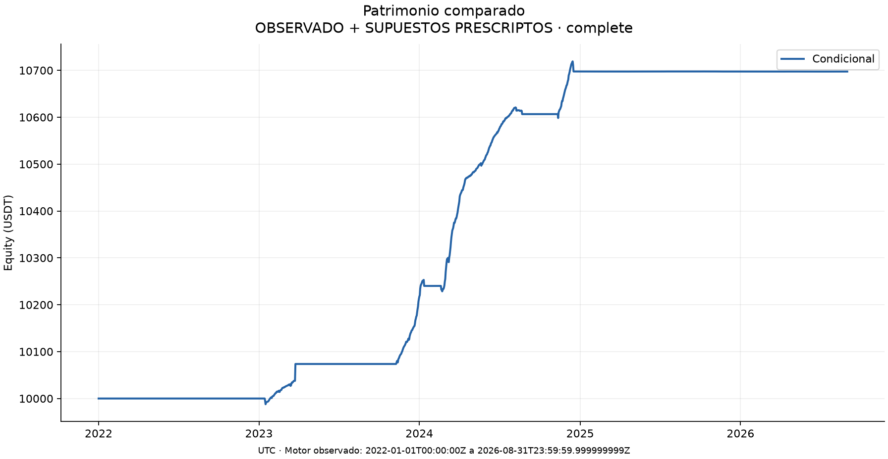
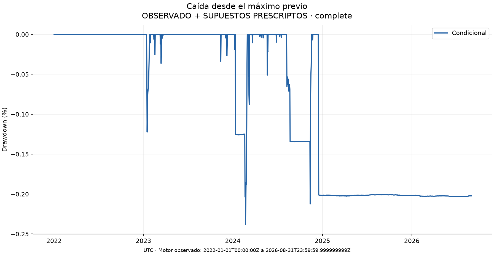
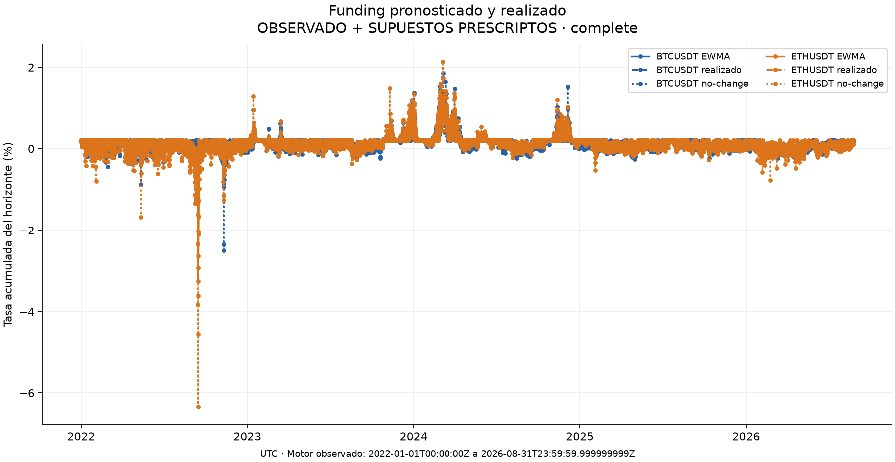
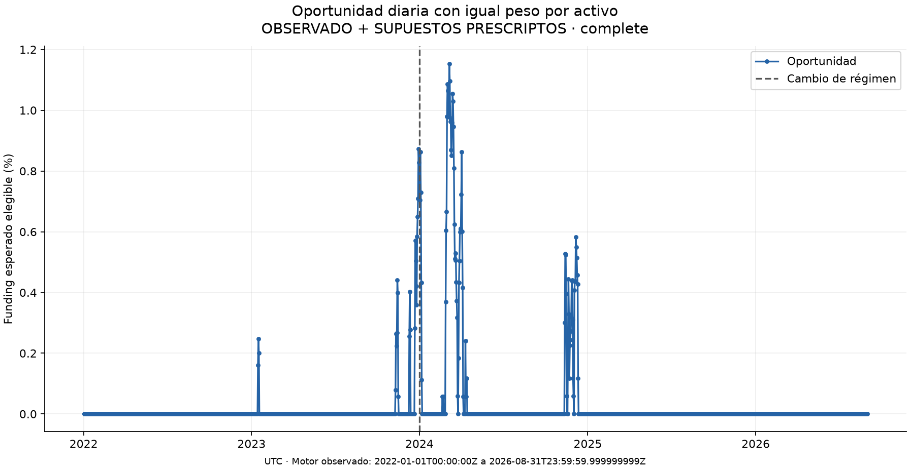
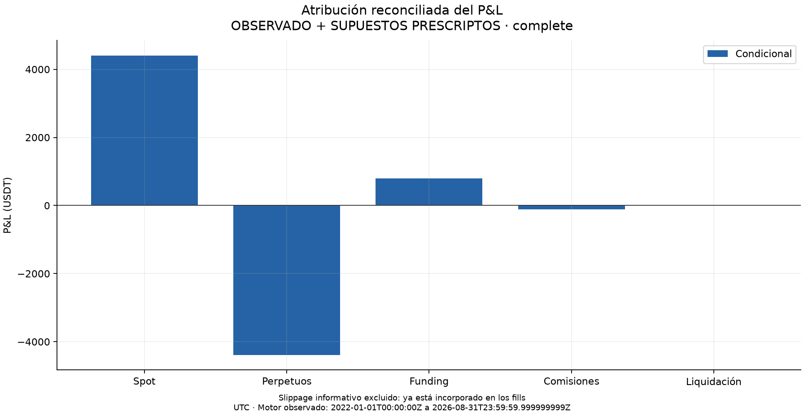
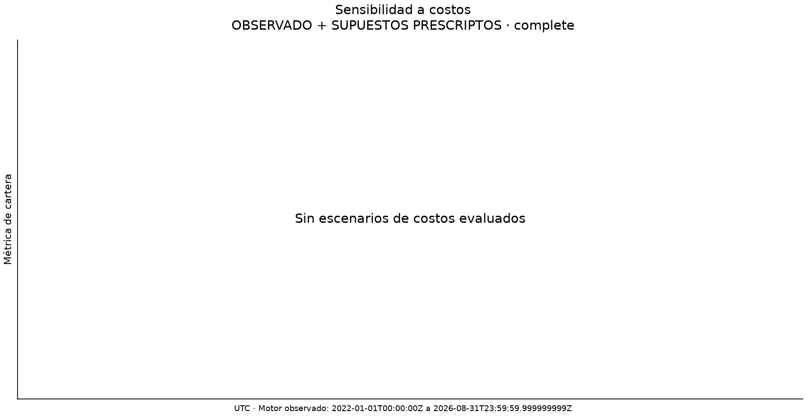

# Crypto carry: PRECIOS OBSERVADOS CON SUPUESTOS PRESCRIPTOS

Corrida `run_70383794701c4f0fc157b2ed` · escenario `E4-reglas-MARGEN_2X` · estado `complete`.

Los resultados se limitan a la cobertura verificada. Un prefijo incompleto es diagnóstico; no evalúa toda la muestra solicitada.

## Entrega 3: implementación, muestra y método

Se implementó replay con Nautilus, la máquina de estados compartida por carry condicional y permanente, ledger decimal, funding, reglas prescriptas declaradas, gestión de margen y deuda, conciliación y evaluación descriptiva. Las cantidades, decisiones y saldos se conservan en Parquet; este informe y las figuras usan exclusivamente las tablas guardadas.

Rango solicitado UTC: [2022-01-01T00:00:00Z, 2026-09-01T00:00:00Z); historia prevista en configuración desde 2022-01-01T00:00:00Z. El extremo final solicitado es exclusivo. Los extremos observados se muestran abajo. Cartera del intervalo solicitado con 10000 USDT iniciales por estrategia; no se reinician posiciones ni capital al cambiar de año o régimen. Cobertura completed_with_approximations: método `futures_scaled`, opción limitada a los 15 minutos documentados, con disponibilidad al minuto siguiente. Se conserva la aproximación de funding vigente.

| strategy | funding_filter_enabled | start | end | status | capital_usdt | final_equity_usdt | debt_usdt | reasons |
| --- | --- | --- | --- | --- | --- | --- | --- | --- |
| conditional | True | 2022-01-01T00:00:00Z | 2026-08-31T23:59:59.999999999Z | complete | 10000 | 10697.41246587300859872900000 | 0E-26 | [] |

Convencion de ejecucion por minuto cerrado: cada orden usa el VWAP, calculado como volumen cotizado dividido por volumen base, del primer minuto completo que comienza al momento de envio o despues. El fill se registra al cierre de ese minuto, cuando precio y volumen ya son conocidos. La capacidad maxima es 1% del volumen base observado; la cantidad restante vence al cierre. Una ejecucion parcial produce un solo evento nativo.

| parameter | value |
| --- | --- |
| capital | 10000 |
| window_hours | 336 |
| half_life_hours | 24 |
| horizon_hours | 168 |
| holding_hours | 168 |
| signal_delay_seconds | 60 |
| target_fraction | 0.30 |
| leverage | 2 |
| slippage | 0.0001 |
| cost_multiplier | 1 |
| leg_delay_seconds | 1 |
| order_timeout_seconds | 120 |
| participation_seconds | 60 |
| execution_model | next_minute_vwap |
| sizing_model | joint_quantity |
| signal_price_model | closed_minute |
| max_volume_participation | 0.01 |

### Cobertura, bloqueos y reglas

| dataset | symbol | market | expected_start_utc | expected_end_utc | observed_start_utc | observed_end_utc | rows | status |
| --- | --- | --- | --- | --- | --- | --- | --- | --- |
| minute_bars | BTCUSDT | spot | 2022-01-01T00:00:00.000000000Z | 2026-09-01T00:00:00.000000000Z | 2022-01-01T00:00:00.000000000Z | 2026-09-01T00:00:00.000000000Z | 2453681 | complete |
| minute_bars | BTCUSDT | futures | 2022-01-01T00:00:00.000000000Z | 2026-09-01T00:00:00.000000000Z | 2022-01-01T00:00:00.000000000Z | 2026-09-01T00:00:00.000000000Z | 2453761 | complete |
| marks | BTCUSDT | futures | 2022-01-01T00:00:00.000000000Z | 2026-09-01T00:00:00.000000000Z | 2021-12-01T00:01:00.000000000Z | 2026-09-01T00:00:00.000000000Z | 2498400 | complete |
| funding | BTCUSDT | futures | 2021-12-17T00:00:00.000000000Z | 2026-09-01T00:00:00.000000000Z | 2021-12-16T16:00:00.000000000Z | 2026-08-31T16:00:00.001000000Z | 5201 | complete |
| minute_bars | ETHUSDT | spot | 2022-01-01T00:00:00.000000000Z | 2026-09-01T00:00:00.000000000Z | 2022-01-01T00:00:00.000000000Z | 2026-09-01T00:00:00.000000000Z | 2453681 | complete |
| minute_bars | ETHUSDT | futures | 2022-01-01T00:00:00.000000000Z | 2026-09-01T00:00:00.000000000Z | 2022-01-01T00:00:00.000000000Z | 2026-09-01T00:00:00.000000000Z | 2453761 | complete |
| marks | ETHUSDT | futures | 2022-01-01T00:00:00.000000000Z | 2026-09-01T00:00:00.000000000Z | 2021-12-01T00:01:00.000000000Z | 2026-09-01T00:00:00.000000000Z | 2498400 | complete |
| funding | ETHUSDT | futures | 2021-12-17T00:00:00.000000000Z | 2026-09-01T00:00:00.000000000Z | 2021-12-16T16:00:00.000000000Z | 2026-08-31T16:00:00.001000000Z | 5201 | complete |

No se registraron bloqueos adicionales.

### Cierres documentados de mercado

Estos cierres publicados por la fuente son evidencia ex post de cobertura. No se clasifican como datos faltantes, no generan barras sintéticas y no se entregaron anticipadamente a la estrategia.

| symbols | market | start_utc | end_utc | minutes | source_url | description |
| --- | --- | --- | --- | --- | --- | --- |
| BTCUSDT, ETHUSDT | spot | 2023-03-24T11:28:00.000000000Z | 2023-03-24T14:00:00.000000000Z | 152 | https://www.binance.com/en/blog/from-our-ceo/6789340645608890113 | Binance spot trading halt; full unavailable minutes after the 11:27 partial minute |

### Resultados diarios, anuales y por régimen

Las métricas usan calendario real, anualización de 365 días, Sharpe con tasa libre de riesgo cero y desviación estándar muestral. El primer retorno parte del capital inicial. Las métricas indefinidas quedan vacías con motivo; se conservan días inactivos, pérdidas e insolvencia. Los días parciales permanecen en la curva y no se usan como retornos diarios completos.

| strategy | period | start | end | observations | coverage_complete | net_return | cagr | sharpe | annual_volatility | max_drawdown | max_drawdown_days | cagr_reason | sharpe_reason |
| --- | --- | --- | --- | --- | --- | --- | --- | --- | --- | --- | --- | --- | --- |
| conditional | full | 2022-01-01T00:00:00.000000000Z | 2026-09-01T00:00:00.000000000Z | 1704 | True | 0.06974124658730085 | 0.014545575926453225 | 4.233782404690904 | 0.0034122924172464045 | -0.0023826883660562626 | 625.0 | — | — |
| conditional | 2022-2023 | 2022-01-01T00:00:00.000000000Z | 2024-01-01T00:00:00.000000000Z | 730 | True | 0.021744071106276852 | 0.010813568916779426 | 3.337436835297611 | 0.0032242892635431903 | -0.0012238200504499641 | 206.0 | — | — |
| conditional | 2024+ | 2024-01-01T00:00:00.000000000Z | 2026-09-01T00:00:00.000000000Z | 974 | True | 0.046975731827888945 | 0.017351696135619044 | 4.859502820322144 | 0.0035414204690284046 | -0.0023826883660562626 | 625.0 | — | — |
| conditional | 2022 | 2022-01-01T00:00:00.000000000Z | 2023-01-01T00:00:00.000000000Z | 365 | True | 0.0 | 0.0 | — | 0.0 | 0.0 | 0.0 | — | zero sample volatility |
| conditional | 2023 | 2023-01-01T00:00:00.000000000Z | 2024-01-01T00:00:00.000000000Z | 365 | True | 0.021744071106276852 | 0.021744071106276852 | 4.790370676993324 | 0.004492705254516005 | -0.0012238200504499641 | 206.0 | — | — |
| conditional | 2024 | 2024-01-01T00:00:00.000000000Z | 2025-01-01T00:00:00.000000000Z | 366 | True | 0.04698216835048408 | 0.046850840682761685 | 8.3858788419711 | 0.0054620635962853315 | -0.0023826883660562626 | 102.0 | — | — |
| conditional | 2025 | 2025-01-01T00:00:00.000000000Z | 2026-01-01T00:00:00.000000000Z | 365 | True | -2.4926702560934544e-06 | -2.4926702560934544e-06 | -0.15961199415599434 | 1.561631860200469e-05 | -1.5297475123854376e-05 | 169.0 | — | — |
| conditional | 2026 | 2026-01-01T00:00:00.000000000Z | 2026-09-01T00:00:00.000000000Z | 243 | True | -3.6550296077519917e-06 | -5.490060011492659e-06 | -0.4572584635416965 | 1.2006345862998531e-05 | -1.4502916943492927e-05 | 229.0 | — | — |

### Hipótesis: lecturas descriptivas

H1: favorable.

| period | symbol | observations | excluded | mae_ewma | mae_no_change |
| --- | --- | --- | --- | --- | --- |
| full | BTCUSDT | 5090 | 22 | 0.0005738673687550346 | 0.0007883688661062381 |
| full | ETHUSDT | 5090 | 22 | 0.0006859281684077234 | 0.0009522955567889762 |
| full | EQUAL_WEIGHT | 10180 | 44 | 0.000629897768581379 | 0.0008703322114476072 |
| 2022-2023 | BTCUSDT | 2190 | 0 | 0.0006289535940745395 | 0.0008781982522651852 |
| 2022-2023 | ETHUSDT | 2190 | 0 | 0.0008478924536525869 | 0.0011770984092330681 |
| 2022-2023 | EQUAL_WEIGHT | 4380 | 0 | 0.0007384230238635632 | 0.0010276483307491266 |
| 2024+ | BTCUSDT | 2900 | 22 | 0.0005322677710137531 | 0.0007205321917310335 |
| 2024+ | ETHUSDT | 2900 | 22 | 0.0005636172081710851 | 0.0007825306440811964 |
| 2024+ | EQUAL_WEIGHT | 5800 | 44 | 0.0005479424895924191 | 0.0007515314179061149 |

Ambos pronósticos usan las mismas observaciones válidas; el MAE conjunto da igual peso a cada activo. El objetivo suma tasas liquidadas después de la señal y hasta el extremo inclusivo del horizonte. Los horizontes se solapan: estas comparaciones no establecen significancia estadística. Un menor error predictivo no demuestra rentabilidad.

H2: no concluyente: faltan dos carteras comparables o métricas válidas.

H3: contraria. En las ventanas de evaluación por minuto, la clasificación anterior/posterior a 2024 es descriptiva dentro de esta corrida; un informe de una sola ventana no establece una comparación entre ventanas reiniciadas independientemente.

| period | observed_days | valid_days | coverage_complete | opportunity_mean | eligible_fraction | conditional_cagr | h3_descriptive |
| --- | --- | --- | --- | --- | --- | --- | --- |
| 2022-2023 | 730 | 730 | True | 0.00013404148677285764 | 0.02495148401826484 | 0.010813568916779426 | contraria |
| 2024+ | 974 | 974 | True | 0.0004019673830496383 | 0.0635837326032398 | 0.017351696135619044 | contraria |

La oportunidad promedia todos los minutos de días completos, incluyendo ceros, y pondera por igual los activos. No depende del saldo, posiciones o cooldown de una cartera. Un minuto desconocido excluye el día conjunto. La clasificación temporal de esta ventana no enlaza capital, posiciones ni equity con otra corrida de evaluación.

### Atribución, costos y cierre de la muestra

| strategy | symbol | spot_pnl_usdt | futures_pnl_usdt | funding_usdt | fees_usdt | liquidation_fees_usdt | total_pnl_usdt | slippage_informational_usdt |
| --- | --- | --- | --- | --- | --- | --- | --- | --- |
| conditional | BTCUSDT | 2493.459855375700000000000000 | -2511.904700000000000000000000 | 354.6899006775893147955 | -46.0365897357 | 0 | 290.208466317589314795500000 | 6.169901407276783203776897660 |
| conditional | ETHUSDT | 1911.423626058000000000000000 | -1880.072909999999999999999999 | 436.8038034124192839335 | -60.950519915 | 0 | 407.203999555419283933500001 | 8.102748304804278242535162530 |

La suma de spot, perpetuos, funding y comisiones negativas reconcilia con equity menos capital inicial. El slippage es informativo: ya está en los precios de fill y no se resta otra vez. Spot usa el último open de barra de un minuto conocido y perpetuos el último mark disponible; no se mezcla un basis de ejecución con una valuación mark para forzar la identidad. La comisión de compra spot reduce inventario; se valora al fill. La conciliación nativa ajusta las unidades base cobradas como comisión porque el ledger económico conserva ese descuento. Las posiciones finales se valúan sin cierre forzado ni comisiones hipotéticas.

| strategy | symbol | timestamp_utc | state | spot | short | collateral | dust_spot | spot_price | mark_price | spot_price_age_seconds | mark_age_seconds |
| --- | --- | --- | --- | --- | --- | --- | --- | --- | --- | --- | --- |
| conditional | BTCUSDT | 2026-08-31T23:59:59.999999999Z | FLAT | 0.00000274 | 0.000 | 0E-24 | 0.00000274 | 78564.00000000 | 78528.00000000 | 59.999999999 | 60.000999999 |
| conditional | ETHUSDT | 2026-08-31T23:59:59.999999999Z | FLAT | 0.0000282 | 0.000 | 0E-24 | 0.0000282 | 2467.28000000 | 2466.01725581 | 59.999999999 | 60.000999999 |

El polvo forma parte del inventario y del patrimonio. Una valuación antigua conserva su antigüedad; no habilita ejecución ni señales frescas. La deuda y cualquier equity no positivo permanecen en las tablas.

## Entrega 4: ejecución, liquidez y análisis crítico

| strategy | symbol | orders | fills | failed_attempts | openings | renewals | rebalances | corrections | closes | liquidations | blocked_orders | rejected_signals | turnover_usdt | risk_events |
| --- | --- | --- | --- | --- | --- | --- | --- | --- | --- | --- | --- | --- | --- | --- |
| conditional | PORTFOLIO | 230 | 110 | 121 | 10 | 82 | 36 | 0 | 98 | 0 | 0 | 10214 | 140863.2340857 | 528 |
| conditional | BTCUSDT | 52 | 52 | 0 | 4 | 37 | 18 | 0 | 48 | 0 | 0 | 5108 | 61385.1678857 | 193 |
| conditional | ETHUSDT | 178 | 58 | 121 | 6 | 45 | 18 | 0 | 50 | 0 | 0 | 5106 | 79478.066200 | 335 |

| strategy | symbol | invested_seconds | unhedged_seconds | cash_seconds | cooldown_seconds | participation_observations | participation_missing | participation_p50 | participation_p90 | participation_p95 | participation_max | native_fill_count | native_reconciliation_count |
| --- | --- | --- | --- | --- | --- | --- | --- | --- | --- | --- | --- | --- | --- |
| conditional | PORTFOLIO | 114537419.999999999 | — | 32688180.000000000 | — | 109 | 121 | 0.0001510155516187935 | 0.0009898656757493449 | 0.0034914541249730646 | 0.011477552270958112 | 110 | 110 |
| conditional | BTCUSDT | 88415819.999999999 | 64445939.999999999 | — | 377040.000000000 | 52 | 0 | 0.00013485226509967054 | 0.0006143141682068645 | 0.001974156323532986 | 0.009796033747934243 | — | — |
| conditional | ETHUSDT | 114537419.999999999 | 85606079.999999999 | — | 620880.011000000 | 57 | 121 | 0.00023528048542674086 | 0.0011870763254969937 | 0.004440602504738638 | 0.011477552270958112 | — | — |

Los tiempos se expresan en segundos. La exposición sin cobertura se muestra por activo, incluyendo intervalos entre patas. El tiempo invertido de cartera es la unión temporal de activos expuestos; no la suma. La participación es cantidad de cada orden frente al volumen reciente del mismo mercado conocido al enviarla, incluyendo órdenes sin fill; si no existe denominador verificable queda vacía. Sus cuantiles describen órdenes y no estiman impacto de mercado. Para la ejecución por minuto, el denominador es el volumen del minuto cerrado anterior, una aproximación del volumen móvil de 60 segundos; el volumen no está disponible antes del cierre de la barra.

### Robustez pendiente o ejecutada

| label | strategy | dimension | value | status | cagr | sharpe | coverage_complete | scenario_evaluated |
| --- | --- | --- | --- | --- | --- | --- | --- | --- |
| E4-reglas-MARGEN_2X | conditional | baseline | 1 | complete | 0.014545575926453225 | 4.233782404690904 | True | False |

Sin escenarios de costos evaluados en esta corrida individual. Las comparaciones reales de sensibilidad se guardan por separado y no se reemplaza el baseline ni se elige retrospectivamente el mejor escenario.

AUM: sensibilidad pendiente de ejecutar y validar con reglas aplicables al nocional. También deben compararse costos, slippage, latencia entre patas, disponibilidad del funding, ventana, vida media, horizonte, e inicios alternativos en sus propias corridas. Retornos similares bajo fills completos no demuestran escalabilidad.

### Supuestos y límites

USDT a la par; transferencias inmediatas y gratuitas; ejecución total de cada pata; mark por minuto; liquidación total; sin ADL, libro completo, impuestos ni insolvencia del exchange. El baseline no incorpora restricciones de liquidez dentro del fill ni impacto estimado sin datos. Los fallos artificiales son pruebas de software separadas de la historia observada. Las liquidaciones por minuto no modelan una trayectoria intraminuto de máximos y mínimos; el riesgo usa el último mark de un minuto cerrado disponible.

### Reproducibilidad y próximos pasos

La configuración efectiva, hashes de código e inputs, versiones, estado y hashes de artefactos están en `run_manifest.json`; `run_manifest.sha256` controla cambios accidentales del manifiesto. `source_manifests/` conserva los manifiestos de descarga, procesamiento y cobertura disponibles al crear la corrida; `input_hashes` identifica los inputs efectivos. La verificación no certifica autenticidad externa. Los importes Parquet son cadenas decimales exactas; las figuras convierten copias a punto flotante para dibujar. La regeneración usa las tablas guardadas y rechaza cambios sobre resultados previos. Completar los bloqueos de cobertura y reglas precede a cualquier conclusión histórica de muestra completa.

### Declaración del escenario de investigación

Los precios y tasas son observados; los marks sustituidos y las reglas de mercado son supuestos prescriptos declarados en 2026. Esta corrida no certifica una reconstrucción histórica. H2 y H3 se evalúan dentro de ese escenario, por separado de la cobertura histórica estricta. `research_assumptions.json` declara las reglas y `funding_mark_audit.json` separa los marks validados de los usados, con conteos exactos y sustituidos. El motor consumió 6214 exactos, 4010 proxies causales y 92 observaciones de precalentamiento sin imputación. Son observaciones entregadas al motor y no implican, por sí solas, pagos de funding en efectivo.
