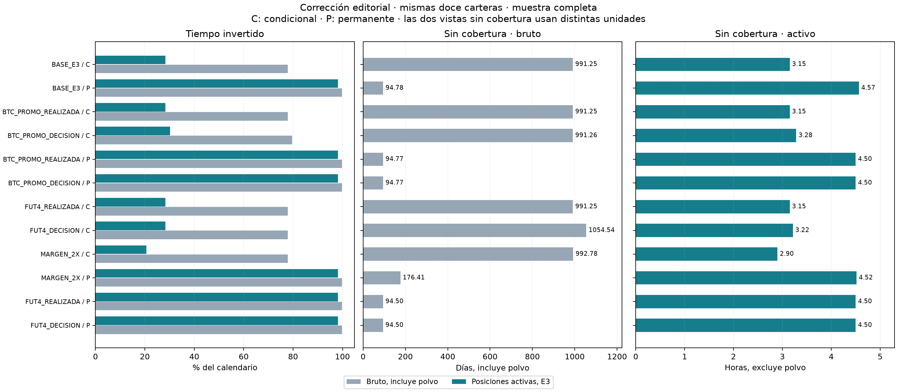

# Corrección de exposición y H2 de la primera sensibilidad de reglas

Versión técnica preliminar, pendiente del feedback del profesor. Generada 2026-09-26T20:43:36.498283+00:00.
Corrección metodológica del reporte de doce carteras ya existentes; no es otra
sensibilidad ni una nueva ejecución económica. El paquete padre y la Entrega 3
presentada conservan todos sus bytes. Esta entrega nueva es local; no acredita
publicación de la corrección en GitHub.

## Qué se corrigió y por qué

El informe padre calculó exposición desde cantidades del ledger y contó cualquier
saldo positivo, incluidos residuos no negociables. Ese contador bruto no reproduce
el indicador editorial presentado en E3. El ledger a solas no conserva los estados
que E3 utiliza para distinguir polvo. Se recuperó la trayectoria completa de
`positions.parquet`, su orden persistido y el clasificador archivado de E3.

H2 se evaluaba únicamente por diferencia de Sharpe. Ahora exige conjuntamente
CAGR condicional definido, finito y estrictamente positivo, y Sharpe condicional
definido, finito y estrictamente superior al permanente del mismo escenario,
período y ventana comparable. No exige Sharpe positivo ni CAGR superior al permanente.
Las métricas se comparan sin redondear. El caso sintético CAGR −0,01 y Sharpes
−0,5 / −1 reproduce el defecto previo y ahora da `no_favorable`.

La corrección reemplaza la interpretación y las tablas de exposición/H2 de
`20260925T005436Z/comparacion/reporte.md`, `exposicion_periodo.csv`, `h2.csv` y
las columnas operativas de métricas/deltas. No reescribe esas fuentes selladas.
Las afirmaciones antiguas de que contar polvo coincidía con E3 quedan reemplazadas
por la definición de esta versión. Las notas «sin commit ni push» del informe
anterior describen aquella sesión, no el estado de publicación actual.

## Comparación de las doce carteras

Muestra completa `[2022-01-01, 2026-09-01)` UTC. Porcentajes sólo redondeados para
esta vista; segundos exactos y todos los cortes en [antes_despues.csv](antes_despues.csv).
Cada fila conserva el run_id original en ese CSV y en el registro de corridas.
Bruto y activo son uniones temporales de BTC y ETH, sin doble conteo.

| scenario | strategy | bruto_pct | activo_E3_pct | sin_cobertura_activa_s | solo_polvo_s | H2_antes | H2_ahora |
| --- | --- | --- | --- | --- | --- | --- | --- |
| BASE_E3 | conditional | 77.79721733 | 28.31784690 | 11340.000000000 | 72846300.000000000 | no_favorable | no_favorable |
| BASE_E3 | permanent | 99.82386215 | 98.20834148 | 16440.000000000 | 2378460.000000000 | no_favorable | no_favorable |
| BTC_PROMO_REALIZADA | conditional | 77.79721733 | 28.31784690 | 11340.000000000 | 72846300.000000000 | no_favorable | no_favorable |
| BTC_PROMO_DECISION | conditional | 79.57738328 | 30.17621935 | 11820.000000000 | 72731160.000000000 | no_favorable | no_favorable |
| BTC_PROMO_REALIZADA | permanent | 99.82386215 | 98.20834148 | 16200.000000000 | 2378460.000000000 | no_favorable | no_favorable |
| BTC_PROMO_DECISION | permanent | 99.82386215 | 98.20834148 | 16200.000000000 | 2378460.000000000 | no_favorable | no_favorable |
| FUT4_REALIZADA | conditional | 77.79721733 | 28.31784690 | 11340.000000000 | 72846300.000000000 | no_favorable | no_favorable |
| FUT4_DECISION | conditional | 77.79721733 | 28.31515715 | 11580.000000000 | 72850260.000000000 | no_favorable | no_favorable |
| MARGEN_2X | conditional | 77.79721733 | 20.55853058 | 10440.000000000 | 84270000.000000000 | no_favorable | no_favorable |
| MARGEN_2X | permanent | 99.82386215 | 98.19338485 | 16260.000000000 | 2400480.000000000 | no_favorable | no_favorable |
| FUT4_REALIZADA | permanent | 99.82386215 | 98.19004304 | 16200.000000000 | 2405400.000000000 | no_favorable | no_favorable |
| FUT4_DECISION | permanent | 99.82386215 | 98.19004304 | 16200.000000000 | 2405400.000000000 | no_favorable | no_favorable |

Se mantienen por separado el bruto con cualquier cantidad positiva, tiempo activo,
tiempo con algún residuo, tiempo únicamente con polvo y tiempo sin inventario.
«Sin posición activa» admite residuos y no equivale a efectivo puro. El contador
de algún activo cubierto puede solaparse con el de algún activo sin cobertura:
su suma no es el tiempo invertido. La [guía](../documentos/guia_metricas.md) explicita
particiones, unidades y fracciones.

## Equivalencia exacta con E3

| strategy | invested_seconds | calendar_seconds | porcentaje | unhedged_seconds |
| --- | --- | --- | --- | --- |
| conditional | 41691120.000000000 | 147225600 | 28.31784689619196661450182577 | 11340.000000000 |
| permanent | 144587820.000000000 | 147225600 | 98.20834148408972352634324465 | 16440.000000000 |

| strategy | intervals_checked | summaries_checked | exact | terminal_difference_ns |
| --- | --- | --- | --- | --- |
| conditional | 3710 | 9 | True | 0 |
| permanent | 3913 | 9 | True | 0 |

Los intervalos y segundos se contrastan contra las tablas archivadas de E3,
sin tolerancia numérica. Los porcentajes 28,32% y 98,21% son controles de redondeo,
no objetivos usados para clasificar. La fracción exacta es segundos activos /
147225600; los decimales se conservan con la precisión Decimal del posprocesamiento
original. El final exclusivo es `2026-09-01T00:00:00.000000000Z`; el snapshot
terminal ocurre un nanosegundo antes. No hay discrepancia terminal con E3.
Usar erróneamente el timestamp terminal como final exclusivo perdería 1 ns:
polvo/sin actividad en la condicional y cobertura/actividad en la permanente.

El [episodio del 24/03/2023](episodio_2023_03_24.csv) conserva 7260 segundos
(121 minutos) activos sin cobertura en ETH condicional y BTC/ETH permanente.
La unión de cartera es 7260 segundos en cada una. No se confunde este episodio
con toda la exposición sin cobertura de la muestra.

## H2 completo y datos no evaluables

Se evaluaron 48 pares, seis escenarios y ocho períodos: {'no_concluyente': 5, 'no_favorable': 43}.
Cambiaron 0 veredictos respecto del padre. Las cifras completas,
ambos run_id, límites, CAGR condicional, Sharpes, diferencia, booleanos y motivos
figuran en [h2.csv](h2.csv); la comparación de todos los veredictos está en
[h2_cambios.csv](h2_cambios.csv).

| scenario | conditional_cagr | conditional_sharpe | permanent_sharpe | cagr_positive | sharpe_superior | verdict | reason |
| --- | --- | --- | --- | --- | --- | --- | --- |
| BASE_E3 | 0.016334619265710986 | 4.9623712776540545 | 6.5336323814925095 | True | False | no_favorable | sharpe_not_superior |
| BTC_PROMO_DECISION | 0.018196414423353898 | 4.038075708354908 | 6.543972219536645 | True | False | no_favorable | sharpe_not_superior |
| BTC_PROMO_REALIZADA | 0.016334619265710986 | 4.9623712776540545 | 6.543972219536645 | True | False | no_favorable | sharpe_not_superior |
| FUT4_DECISION | 0.016785422410500392 | 3.7323075336031555 | 6.594886333890124 | True | False | no_favorable | sharpe_not_superior |
| FUT4_REALIZADA | 0.01648708339087119 | 5.013681786321673 | 6.594886333890124 | True | False | no_favorable | sharpe_not_superior |
| MARGEN_2X | 0.014545575926453112 | 4.233782404690964 | 6.39911129023173 | True | False | no_favorable | sharpe_not_superior |

Los casos no concluyentes son explícitos:

| scenario | period | conditional_cagr | conditional_sharpe | permanent_sharpe | cagr_positive | sharpe_superior | reason |
| --- | --- | --- | --- | --- | --- | --- | --- |
| BASE_E3 | 2022 | 0.0 | ND | 2.621727629634954 | False | ND | undefined_or_nonfinite_conditional_sharpe (zero sample volatility) |
| BTC_PROMO_REALIZADA | 2022 | 0.0 | ND | 2.665925094969278 | False | ND | undefined_or_nonfinite_conditional_sharpe (zero sample volatility) |
| FUT4_DECISION | 2022 | 0.0 | ND | 2.6711978181368212 | False | ND | undefined_or_nonfinite_conditional_sharpe (zero sample volatility) |
| FUT4_REALIZADA | 2022 | 0.0 | ND | 2.6711978181368212 | False | ND | undefined_or_nonfinite_conditional_sharpe (zero sample volatility) |
| MARGEN_2X | 2022 | 0.0 | ND | 2.621727629634954 | False | ND | undefined_or_nonfinite_conditional_sharpe (zero sample volatility) |

`no_favorable` significa que, con los tres valores evaluables, no se cumplen
simultáneamente ambas condiciones; no implica automáticamente evidencia contraria.
`no_concluyente` conserva cada componente que sí puede evaluarse y registra
faltantes, métricas no finitas, cobertura incompleta o ventanas distintas.
Un booleano desconocido queda vacío en CSV, nunca se transforma en falso o cero.
Las claves duplicadas se rechazan. `full_baseline_coverage=False` de las corridas
prescritas no se interpreta como cobertura temporal incompleta: esa bandera exige
reglas históricas certificadas. Se comprueban fechas y registros diarios efectivos.

## Resultados financieros, H1 y H3 preservados

| scenario | strategy | run_id | equity_final | CAGR | Sharpe | drawdown |
| --- | --- | --- | --- | --- | --- | --- |
| BASE_E3 | conditional | run_ad71d751b20623006c195ff3 | 10785.76304964716593690000000 | 0.016334619265710986 | 4.9623712776540545 | -0.0020616558706701528492637308 |
| BASE_E3 | permanent | run_dfea4b7ac1475668d5968c97 | 11680.06921675742584680269999 | 0.03382477331458349 | 6.5336323814925095 | -0.0048274899052302995404322594 |
| BTC_PROMO_REALIZADA | conditional | run_1ae1cf88ac71b976740edc03 | 10785.76304964716593690000000 | 0.016334619265710986 | 4.9623712776540545 | -0.0020616558706701528492637308 |
| BTC_PROMO_DECISION | conditional | run_d434594cde4077ba6661d7e4 | 10878.31423365334728051730000 | 0.018196414423353898 | 4.038075708354908 | -0.0026326404324395932438654197 |
| BTC_PROMO_REALIZADA | permanent | run_d3ebbfeb6f98be343782ccbb | 11683.38048945462628528569999 | 0.03388754609591999 | 6.543972219536645 | -0.0047826165248016987258055249 |
| BTC_PROMO_DECISION | permanent | run_a45c9456ea5d541c9ddce187 | 11683.38048945462628528569999 | 0.03388754609591999 | 6.543972219536645 | -0.0047826165248016987258055249 |
| FUT4_REALIZADA | conditional | run_d17c6848d9a0c5c85249b152 | 10793.31880780948408291340000 | 0.01648708339087119 | 5.013681786321673 | -0.0019464811454683936116193585 |
| FUT4_DECISION | conditional | run_8f497f6f609b074f796e043f | 10808.11580959666064684170000 | 0.016785422410500392 | 3.7323075336031555 | -0.0024069198074740677577868956 |
| MARGEN_2X | conditional | run_70383794701c4f0fc157b2ed | 10697.41246587300859872900000 | 0.014545575926453112 | 4.233782404690964 | -0.0023826883660560890349353976 |
| MARGEN_2X | permanent | run_3f5d9cce8ff1c2ba5447e3b6 | 11628.23407455384730719199999 | 0.03284029152080845 | 6.39911129023173 | -0.0048274899052302995404322594 |
| FUT4_REALIZADA | permanent | run_edc965655c124abd4318e838 | 11697.98490316772421996220000 | 0.03416423962066937 | 6.594886333890124 | -0.0048155972256906167881401708 |
| FUT4_DECISION | permanent | run_9a4b6b4c853215594e14bd86 | 11697.98490316772421996220000 | 0.03416423962066937 | 6.594886333890124 | -0.0048155972256906167881401708 |

Los 96 registros cartera/período conservan
literalmente todas las columnas no afectadas: equity, P&L y componentes, retornos,
CAGR, Sharpe, volatilidad, drawdown, utilización diaria, margen y eventos.
[preservacion_financiera.csv](preservacion_financiera.csv) compara los valores
antes/después; [preservacion_tablas.csv](preservacion_tablas.csv) compara bytes de
las tablas preservadas y del índice de corridas. Excluir polvo del tiempo operativo
no elimina unidades, valuación ni riesgo de precio de equity y P&L.

[H1 resumen](h1_resumen.csv), [H1 invariancia](h1_invariancia.csv),
[H3 diario](h3_diario.csv), [H3 invariancia](h3_invariancia.csv) y
[H3 por régimen](h3_regimen.csv) son copias binarias del padre, con sus valores
y procedencias originales. Los estados descriptivos H3 conservados son
contraria, not_used_for_H3_cagr. No se reinterpretan como resultados fuera de muestra.
Los [deltas](deltas.csv) conservan las comparaciones financieras; sólo se actualizan
los indicadores operativos afectados y se agregan los diagnósticos de residuos.

## Evidencia, supuestos y límites

Evidencia: trayectorias, metadatos y resultados ejecutados conservados en el padre;
tablas y código editorial E3 autenticados en [referencia_e3](../referencia_e3/).
Supuestos: siguen vigentes las reglas prescritas, aproximaciones `futures_scaled`,
promoción observada y límites de ejecución de minuto del protocolo padre. FUT4
continúa siendo un supuesto constante, no una fecha histórica inferida.
Resultado ejecutado ahora: posprocesamiento, pruebas y verificaciones offline.
No se ejecutaron carteras ni se descargaron mercados/fuentes en esta corrección.

Las doce trayectorias contienen los metadatos necesarios; no hay intervalos con
clasificación pendiente. Una fuente que perdiera estado, cantidades o cobertura
se rechaza con su intervalo y símbolo; no se inventa un umbral monetario.
La investigación de reglas sigue parcial: esta corrección no agrega evidencia
para cerrar fechas históricas ni constituye una nueva tanda de sensibilidad.

## Procedencia y verificación

Manifiesto padre SHA-256: `77f1cfcaf4fb13044dbcb3b242a2eb19749cf7e88806db023a08bbe4ec272057`.
[procedencia.json](../procedencia.json) fija entradas y versión `exposure_h2_v2`;
[procedencia_corridas.csv](procedencia_corridas.csv) separa el hash del motor
original de la identidad del posprocesador actual. El producto requiere el padre
íntegro por argumento; no es autocontenido. No necesita datos masivos de mercado,
Git, red ni el motor. La verificación v2 requiere PyArrow para leer las posiciones.

El [resultado de construcción](../verificacion_construccion.json) conserva las
comparaciones realizadas al construir. La verificación independiente se ejecuta
después del sello y guarda su resultado en una ruta nueva externa. Comprueba
semántica de H2, clasificación, duraciones, uniones, cuadros y preservación,
además de hashes. El verificador archivado del padre conserva su alcance v1;
su aprobación por sí sola no acredita esta corrección. Véanse los comandos y
dependencias en el [README](../README.md).
