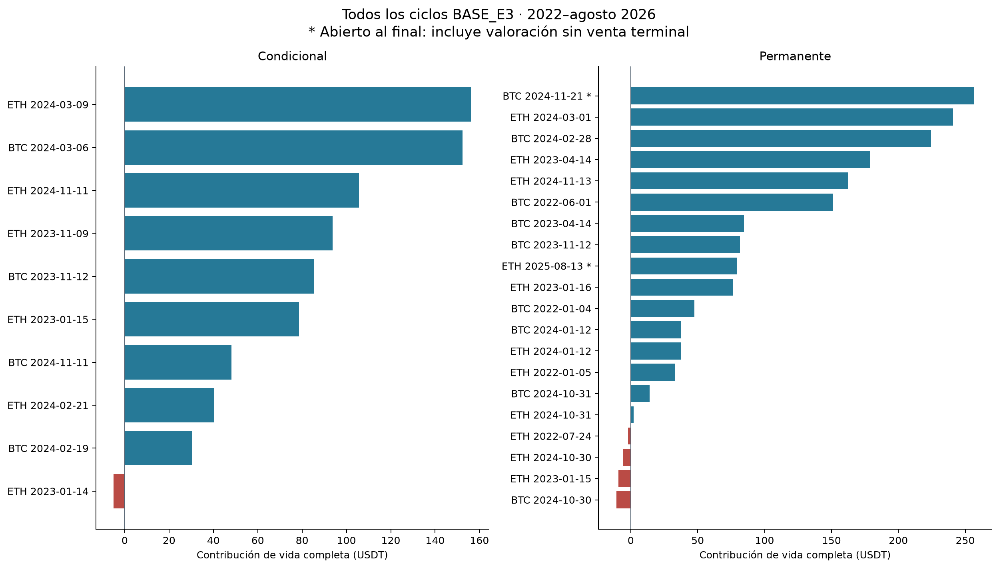
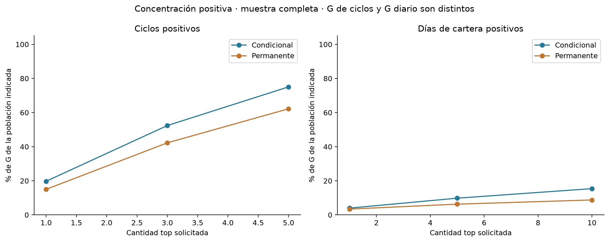
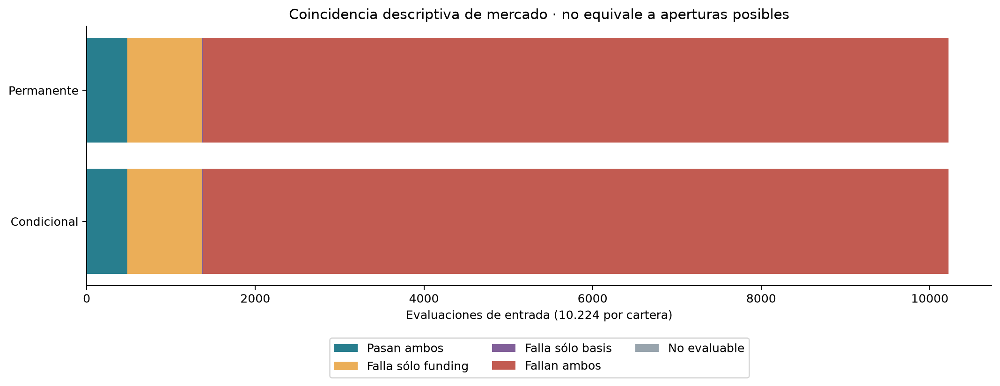
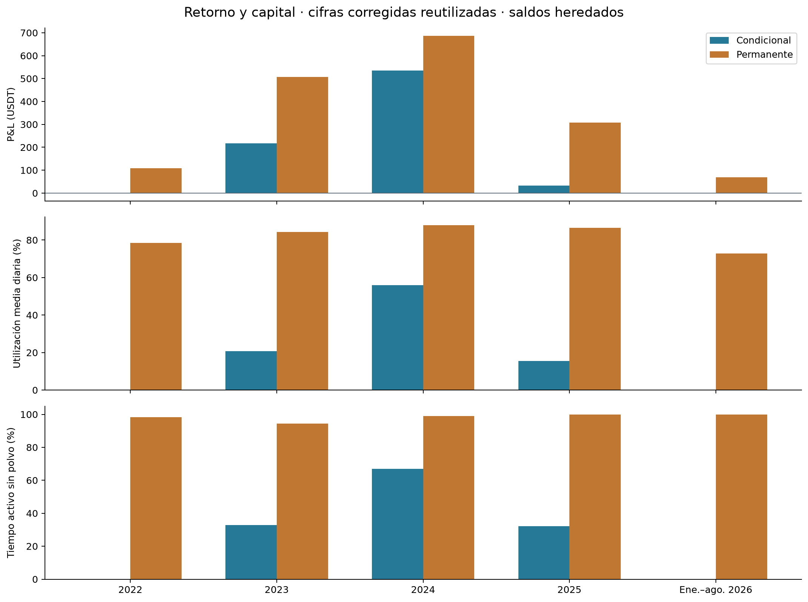

# Retorno, capital y restricciones de entrada

Entrega 4 · Bloque técnico local · Muestra continua [01/01/2022,01/09/2026) UTC. Sólo las dos BASE_E3, 10.000 USDT iniciales cada una. Concentración y restricciones: **ejecutado**. Benchmark: **pendiente_aprobacion_benchmark**. Este bloque no completa toda la Entrega 4.

[Protocolo](documentos/protocolo.md) · [Mapa de fuentes](documentos/mapa_fuentes.md) · [Propuesta remunerada](documentos/propuesta_benchmark.md) · [Ficha exacta](documentos/ficha_benchmark.json)

## Resultado y concentración

### Condicional

P&L de cartera: **785,76 USDT**, retorno 7,86% y CAGR 1,63% sobre 1.704 días. Los tres ciclos positivos de mayor contribución reúnen 52,40% de G. G=790,76 y L=5,00 USDT; fuera de ciclo: -0,000811 USDT.

| Signo | Top solicitado | Cantidad efectiva | P&L seleccionado (USDT) | % de G o L | % del neto de ciclos |
| --- | --- | --- | --- | --- | --- |
| Ganancia | 1 | 1 | 156,23 | 19,76% | 19,88% |
| Ganancia | 3 | 3 | 414,36 | 52,40% | 52,73% |
| Ganancia | 5 | 5 | 593,61 | 75,07% | 75,55% |
| Pérdida | 1 | 1 | -5,00 | 100,00% | -0,64% |
| Pérdida | 3 | 1 | -5,00 | 100,00% | -0,64% |
| Pérdida | 5 | 1 | -5,00 | 100,00% | -0,64% |

### Permanente

P&L de cartera: **1.680,07 USDT**, retorno 16,80% y CAGR 3,38% sobre 1.704 días. Los tres ciclos positivos de mayor contribución reúnen 42,27% de G. G=1.707,99 y L=28,02 USDT; fuera de ciclo: 0,096487 USDT.

| Signo | Top solicitado | Cantidad efectiva | P&L seleccionado (USDT) | % de G o L | % del neto de ciclos |
| --- | --- | --- | --- | --- | --- |
| Ganancia | 1 | 1 | 256,49 | 15,02% | 15,27% |
| Ganancia | 3 | 3 | 721,94 | 42,27% | 42,97% |
| Ganancia | 5 | 5 | 1.062,85 | 62,23% | 63,27% |
| Pérdida | 1 | 1 | -10,70 | 38,20% | -0,64% |
| Pérdida | 3 | 3 | -25,91 | 92,47% | -1,54% |
| Pérdida | 5 | 4 | -28,02 | 100,00% | -1,67% |

Los denominadores G/L incluyen únicamente los ciclos del período. El neto de ciclos puede diferir del de cartera por polvo fuera de ciclo. Los porcentajes sobre neto no son proporciones del capital; no se recortan si superan 100%. En los CSV se advierte neto no positivo o pequeño (menor al 10% de G+L). No se calcula un CAGR hipotético quitando los mejores ciclos.

[Ciclos con todos sus componentes](tablas/ciclos_vida.csv) · [Contribución por fecha y período](tablas/contribuciones_ciclo_periodo.csv) · [Top por activo y cartera](tablas/concentracion_ciclos.csv)

### Contribución de cada activo en la muestra completa

| Cartera | Activo | Dentro de ciclos (USDT) | Fuera de ciclos (USDT) | Total (USDT) |
| --- | --- | --- | --- | --- |
| Condicional | BTCUSDT | 316,133835 | -0,071565 | 316,062270 |
| Condicional | ETHUSDT | 469,630026 | 0,070754 | 469,700780 |
| Permanente | BTCUSDT | 886,965448 | 0,100278 | 887,065726 |
| Permanente | ETHUSDT | 793,007282 | -0,003791 | 793,003491 |

## Días de cartera: mejores y peores

Cada jornada aparece una sola vez por cartera, aunque operen ambos activos. Se reutiliza el P&L diario conciliado; no se suman retornos porcentuales. Los denominadores diarios son propios de los días positivos y negativos e incluyen todo el resultado de cartera, incluido el polvo.

| Cartera | Signo | Top días | P&L (USDT) | % de G/L diario |
| --- | --- | --- | --- | --- |
| Condicional | positive | 1 | 35,91 | 4,00% |
| Condicional | positive | 5 | 88,28 | 9,83% |
| Condicional | positive | 10 | 138,46 | 15,42% |
| Condicional | negative | 1 | -8,30 | 7,39% |
| Condicional | negative | 5 | -36,64 | 32,63% |
| Condicional | negative | 10 | -61,07 | 54,37% |
| Permanente | positive | 1 | 73,86 | 3,43% |
| Permanente | positive | 5 | 135,82 | 6,32% |
| Permanente | positive | 10 | 188,97 | 8,79% |
| Permanente | negative | 1 | -19,45 | 4,13% |
| Permanente | negative | 5 | -74,54 | 15,84% |
| Permanente | negative | 10 | -118,95 | 25,27% |

[Fechas seleccionadas y denominadores de todos los períodos](tablas/concentracion_dias.csv) · [Todos los días originales](tablas/diario_reutilizado.csv)

## Contabilidad, ciclos y remanentes

Se reconstruyeron las cuentas de cada activo desde el ledger, conservando compras netas, costo promedio, parciales, rebalanceos, funding, fees y cargos. La atribución es la diferencia de P&L acumulado del activo entre fronteras. No se asigna el cambio total de equity al activo que envió una orden. Las 3.408 jornadas concilian a la tolerancia original de 1E-8 USDT.

| Cartera | Ciclos | Cerrados completos | Apertura incompleta | Sin fill | Abiertos al fin | Intentos fallidos de órdenes |
| --- | --- | --- | --- | --- | --- | --- |
| Condicional | 10 | 9 | 1 | 0 | 0 | 123 |
| Permanente | 20 | 15 | 3 | 0 | 2 | 407 |

Un intento fallido de orden no es necesariamente una apertura fallida: puede ser un rebalanceo, reintento o cierre. Las renovaciones conservan cycle_id. Los abiertos al final incluyen P&L no realizado sin venta ni comisión terminal. El costo y las unidades del polvo se conservan; su variación fuera de ciclo figura como outside_dust. Al ingresar a otro ciclo se toma como base el P&L ya devengado, sin reconocerlo de nuevo. El slippage ya está en los precios.

Las filas por período atribuyen cambios económicos dentro de cada corte, aunque el ciclo haya comenzado antes o termine después. No son agrupaciones por año de cierre. Tiempo activo excluye polvo según la corrección vigente. Una variación de realizado/no realizado puede ser una reclasificación de una ganancia anterior; sólo su suma es contribución neta nueva.

[Fronteras y precios trazables](tablas/fronteras_contables.csv) · [Segmentos contables](tablas/atribuciones_segmentos.csv) · [Movimientos con event_id/order_id/fill_id](tablas/movimientos_ciclo.csv) · [Conciliaciones](tablas/conciliaciones.csv)

## Restricciones: tres poblaciones que no deben confundirse

### A. Condiciones simultáneas de funding y basis

Las 10.224 evaluaciones de entrada de cada estrategia están emparejadas por activo, instante y clase. Tienen las mismas condiciones de mercado, pero diferentes caja y posiciones. 480 pasan ambos filtros; esto no significa 480 órdenes posibles o enviadas. Los límites de basis 0 y 0,005 son inclusivos. No hubo fallos por basis superior al techo; los fallos de basis observados son negativos. Una fila no evaluable queda fuera de las cuatro celdas.

| Cartera | Celda | Filas | Población |
| --- | --- | --- | --- |
| Condicional | basis_only_fail | 4 | 10224 |
| Condicional | both_fail | 8846 | 10224 |
| Condicional | both_pass | 480 | 10224 |
| Condicional | funding_only_fail | 893 | 10224 |
| Condicional | not_evaluable | 1 | 10224 |
| Permanente | basis_only_fail | 4 | 10224 |
| Permanente | both_fail | 8846 | 10224 |
| Permanente | both_pass | 480 | 10224 |
| Permanente | funding_only_fail | 893 | 10224 |
| Permanente | not_evaluable | 1 | 10224 |

### B. Primer bloqueo y restricciones simultáneas

El embudo usa el orden persistido, con grupos excluyentes. La tabla de motivos simultáneos conserva pass/fail/not_evaluable y puede solaparse. En la permanente el fallo de funding es diagnóstico, no aplicado. Un sizing o presupuesto prospectivo con posición abierta no prueba una entrada perdida por falta de fondos.

| Cartera | Primer bloqueo diagnóstico | Filas | Población |
| --- | --- | --- | --- |
| Condicional | all_pass | 10 | 10224 |
| Condicional | cooldown | 27 | 10224 |
| Condicional | freshness | 1 | 10224 |
| Condicional | funding | 7952 | 10224 |
| Condicional | state_active | 2234 | 10224 |
| Permanente | all_pass | 20 | 10224 |
| Permanente | basis_negative | 323 | 10224 |
| Permanente | cooldown | 54 | 10224 |
| Permanente | state_active | 9827 | 10224 |

[Todos los motivos simultáneos, con orden y aplicación](tablas/motivos_simultaneos.csv) · [Grupos por activo, estrategia y período](tablas/grupos_excluyentes.csv)

El detalle siguiente usa 10.224 evaluaciones por cartera y conserva el orden registrado (posición mostrada desde 1). Cada filtro particiona su propia población; los fallos de filtros distintos se solapan y no deben sumarse como entradas perdidas. Se muestran también los filtros con cero fallos y los diagnósticos no aplicados.

| Cartera | Orden | Filtro | Aplicado | Pass | Fail | No evaluable |
| --- | --- | --- | --- | --- | --- | --- |
| Condicional | 1 | state_active | Sí | 7990 | 2234 | 0 |
| Condicional | 2 | cooldown | Sí | 10197 | 27 | 0 |
| Condicional | 3 | pending_orders | Sí | 10224 | 0 | 0 |
| Condicional | 4 | debt | Sí | 10224 | 0 | 0 |
| Condicional | 5 | coverage | Sí | 10224 | 0 | 0 |
| Condicional | 6 | forecast | Sí | 10224 | 0 | 0 |
| Condicional | 7 | rules | Sí | 10224 | 0 | 0 |
| Condicional | 8 | operational | Sí | 10224 | 0 | 0 |
| Condicional | 9 | mark | Sí | 10224 | 0 | 0 |
| Condicional | 10 | price_alignment | Sí | 10224 | 0 | 0 |
| Condicional | 11 | freshness | Sí | 10223 | 1 | 0 |
| Condicional | 12 | funding | Sí | 484 | 9740 | 0 |
| Condicional | 13 | basis_negative | Sí | 1373 | 8850 | 1 |
| Condicional | 14 | basis_above_max | Sí | 10223 | 0 | 1 |
| Condicional | 15 | sizing | Sí | 9842 | 382 | 0 |
| Condicional | 16 | budget | Sí | 9781 | 61 | 382 |
| Permanente | 1 | state_active | Sí | 397 | 9827 | 0 |
| Permanente | 2 | cooldown | Sí | 10170 | 54 | 0 |
| Permanente | 3 | pending_orders | Sí | 10223 | 1 | 0 |
| Permanente | 4 | debt | Sí | 10224 | 0 | 0 |
| Permanente | 5 | coverage | Sí | 10224 | 0 | 0 |
| Permanente | 6 | forecast | Sí | 10224 | 0 | 0 |
| Permanente | 7 | rules | Sí | 10224 | 0 | 0 |
| Permanente | 8 | operational | Sí | 10224 | 0 | 0 |
| Permanente | 9 | mark | Sí | 10224 | 0 | 0 |
| Permanente | 10 | price_alignment | Sí | 10224 | 0 | 0 |
| Permanente | 11 | freshness | Sí | 10223 | 1 | 0 |
| Permanente | 12 | funding | No | 484 | 9740 | 0 |
| Permanente | 13 | basis_negative | Sí | 1373 | 8850 | 1 |
| Permanente | 14 | basis_above_max | Sí | 10223 | 0 | 1 |
| Permanente | 15 | sizing | Sí | 8849 | 1375 | 0 |
| Permanente | 16 | budget | Sí | 4928 | 3921 | 1375 |

### C. Decisiones y acciones acreditadas

Los logs registran 10 entradas aceptadas condicionales y 20 permanentes, enlazadas una a una con la transición y orden inicial originales. En la condicional, 7.952 decisiones registran funding_not_above_cost; en la permanente, 323 registran basis_outside_entry_range. No hay decisiones de entrada con causa insufficient_free_funds: ello no elimina las restricciones de presupuesto en otros estados ni los rebalanceos omitidos. El campo de primer bloqueo diagnóstico y la causa de decisión permanecen separados.

Las acciones sin evaluación exacta acreditable permanecen como unreconciled en su enlace temporal; incluyen acciones autónomas posteriores a una señal. Coincidir en tiempo no prueba causalidad. Las órdenes iniciales tienen además un vínculo por order_id; cada tabla conserva el ordinal original, sin convertir el historial de evaluaciones en órdenes.

Renovación se analiza aparte: 103 evaluaciones condicionales y 458 permanentes. Su umbral es forecast positivo, sin costo ni basis de entrada; el registro de resultado puede carecer de causa textual y se contrasta con las transiciones. La cobertura de emparejamiento se entrega sin forzar igualdad. Ninguno de estos conteos equivale a minutos elegibles de H3.

[Registros clasificados](tablas/decisiones_clasificadas.csv) · [Diagnóstico frente a decisión](tablas/diagnostico_vs_decision.csv) · [Acciones y enlaces, incluidos los no reconciliados](tablas/acciones_y_enlaces.csv) · [Entradas acreditadas](tablas/entradas_acreditadas.csv) · [Emparejamiento](tablas/emparejamiento.csv)

## Retorno anual y capital utilizado

### Condicional

Capital utilizado al cierre: media de 2.074,62 USDT y máximo de 10.811,78 USDT en la muestra completa. Los valores diarios y por período se conservan en el resumen integrado.

| Período | Días | P&L USDT | Retorno | CAGR | Tiempo activo | Utiliz. media | Utiliz. máxima | Ciclos con participación | Intentos fallidos |
| --- | --- | --- | --- | --- | --- | --- | --- | --- | --- |
| full | 1704 | 785,76 | 7,858% | 1,633% | 28,32% | 19,81% | 102,74% | 10 | 123 |
| 2022-2023 | 730 | 217,44 | 2,174% | 1,081% | 16,47% | 10,42% | 95,49% | 4 | 121 |
| 2024+ | 974 | 568,32 | 5,562% | 2,049% | 37,20% | 26,84% | 102,74% | 8 | 2 |
| 2022 | 365 | 0,00 | 0,000% | 0,000% | 0,00% | 0,00% | 0,00% | 0 | 0 |
| 2023 | 365 | 217,44 | 2,174% | 2,174% | 32,94% | 20,84% | 95,49% | 4 | 121 |
| 2024 | 366 | 535,13 | 5,237% | 5,223% | 67,02% | 55,98% | 102,74% | 8 | 1 |
| 2025 | 365 | 33,28 | 0,310% | 0,310% | 32,06% | 15,49% | 58,86% | 1 | 1 |
| 2026 | 243 | -0,09 | -0,001% | -0,001% | 0,00% | 0,01% | 0,01% | 0 | 0 |

### Permanente

Capital utilizado al cierre: media de 8.972,08 USDT y máximo de 11.390,84 USDT en la muestra completa. Los valores diarios y por período se conservan en el resumen integrado.

| Período | Días | P&L USDT | Retorno | CAGR | Tiempo activo | Utiliz. media | Utiliz. máxima | Ciclos con participación | Intentos fallidos |
| --- | --- | --- | --- | --- | --- | --- | --- | --- | --- |
| full | 1704 | 1.680,07 | 16,801% | 3,382% | 98,21% | 82,63% | 101,78% | 20 | 407 |
| 2022-2023 | 730 | 616,66 | 6,167% | 3,037% | 96,30% | 81,35% | 100,06% | 9 | 319 |
| 2024+ | 974 | 1.063,41 | 10,016% | 3,642% | 99,64% | 83,59% | 101,78% | 13 | 88 |
| 2022 | 365 | 109,16 | 1,092% | 1,092% | 98,28% | 78,47% | 100,06% | 4 | 8 |
| 2023 | 365 | 507,50 | 5,020% | 5,020% | 94,31% | 84,24% | 99,74% | 7 | 311 |
| 2024 | 366 | 686,80 | 6,469% | 6,451% | 99,04% | 87,88% | 101,78% | 12 | 88 |
| 2025 | 365 | 308,14 | 2,726% | 2,726% | 100,00% | 86,48% | 99,39% | 3 | 0 |
| 2026 | 243 | 68,46 | 0,590% | 0,887% | 100,00% | 72,78% | 90,35% | 2 | 0 |

CAGR usa duración/365; 2026 es enero–agosto, no doce meses observados. El capital utilizado al cierre es spot valuado más garantía, dividido por equity. Puede superar 100% por la valuación del corto. El tiempo activo es la unión temporal sin polvo: no es utilización de patrimonio. No se divide CAGR por utilización. Los saldos se heredan y los retornos de tramos no se suman.

La mejora de precisión de H1 no garantiza superar el umbral económico ni permanecer invertido. Los registros muestran pocos ciclos condicionales, concentración de ganancias y menor utilización. Es consistente con una menor captura de ingresos de funding, pero no cuantifica cuánto rendiría eliminar filtros o remunerar su caja: eso alteraría tamaños, margen y decisiones. Son explicaciones posibles, no una prueba causal ni una optimización.

H1, H2 corregida y H3 se reutilizan sin redefinirlos. H2 sigue no favorable en muestra completa y ambos cortes por Sharpe condicional inferior. En 2022 el Sharpe condicional permanece ND por volatilidad muestral cero. El análisis anual complementa los cortes H3; no sustituye su serie por rechazos. No se rehizo riesgo intradía.

[Resumen completo y capital en USDT](tablas/resumen_integrado.csv) · [Componentes por activo originales](tablas/componentes_por_activo_periodo_reutilizado.csv) · [H1](tablas/h1_resumen_reutilizado.csv) · [H2](tablas/h2_reutilizado.csv) · [H3](tablas/h3_regimen_reutilizado.csv)

## Propuesta remunerada y límites

Se recomienda someter a aprobación una cuenta hipotética bruta USD ligada a SOFR realizada, ACT/360, con paridad nominal 1 USDT=1 USD. SGOV fue la única alternativa real examinada. La serie oficial SOFR descargada contiene 1.166 observaciones entre 30/12/2021 y 01/09/2026; se comprobó cobertura, sin calcular retornos. La ficha enumera supuestos, costos excluidos, acceso hipotético, calendario por acreditar y reglas de frontera. No es una cuenta remunerada disponible para el inversor ni una tasa pagada por el exchange.

[Propuesta, fuentes primarias y aprobación puntual](documentos/propuesta_benchmark.md). Estado pendiente_aprobacion_benchmark. Una aprobación posterior habilitará sólo ese componente en otra versión; no sumará intereses al carry ni cambiará H2.

## Verificación y portabilidad

El paquete contiene código, pruebas, manifiesto y fuentes con hashes. El verificador compacto recalcula aritmética, segmentos, denominadores y clasificaciones. El completo autentica las dependencias por rutas explícitas y vuelve a derivar todas las tablas desde los movimientos originales; comparte los módulos de posprocesamiento y no es una validación independiente del motor. No consulta Git ni escribe en los paquetes fuente. Ver comandos en [README](README.md).

Se conserva la incertidumbre de valoración spot durante la suspensión de marzo de 2023 y las aproximaciones de mark/funding del estudio. Las fronteras de cierre reutilizan precios del paquete intradía compacto, sin nuevas series masivas. No se afirma leer un PDF E3 ausente. La aprobación del benchmark, su ejecución y el PDF final quedan pendientes. No se hizo commit, push ni publicación GitHub.
