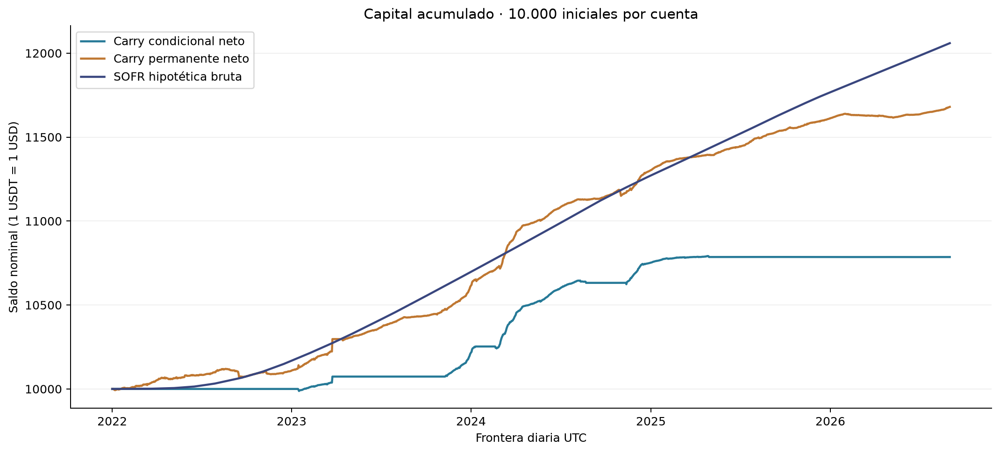
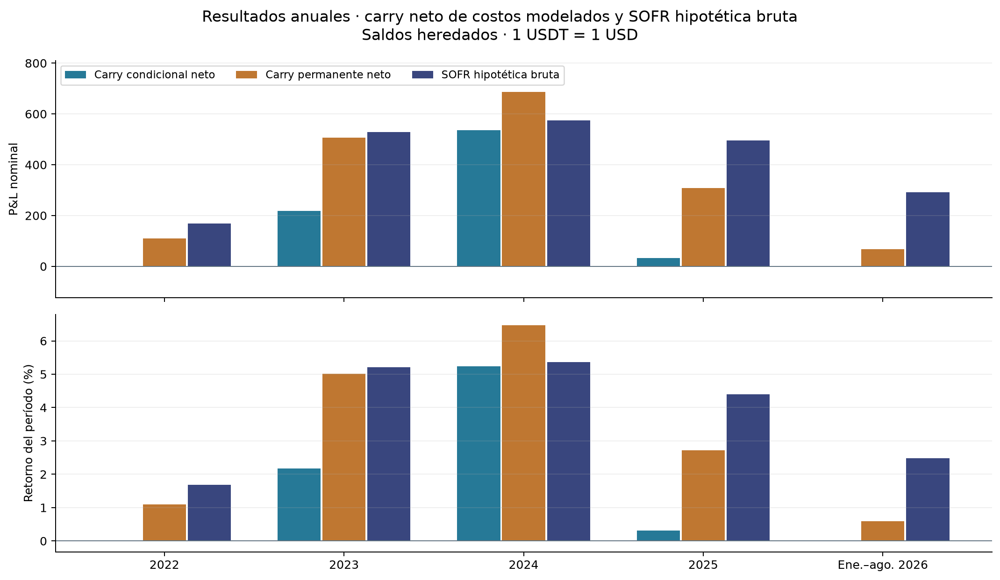
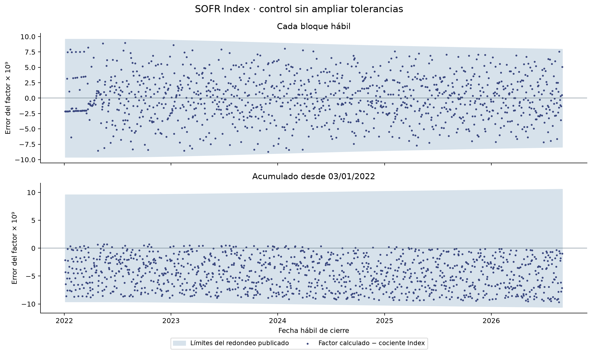

# Carry y cuenta SOFR hipotética bruta

Comparación aprobada sobre [01/01/2022, 01/09/2026) UTC: 1.704 días, con 10.000 iniciales en cada cuenta independiente. Las cifras carry son netas de los costos modelados y están expresadas en USDT. La cuenta SOFR es hipotética bruta en USD. La comparación nominal supone 1 USDT = 1 USD durante toda la muestra.

[Aprobación](documentos/aprobacion.md) · [Protocolo](documentos/protocolo.md) · [Fuentes y lectura](documentos/mapa_fuentes.md) · [Verificación y reproducción](README.md)

## Resultado de la cuenta completa

SOFR termina en **12.059,50 USD**, con intereses de **2.059,50 USD**, retorno **20,595%** y CAGR365 **4,093%**. Estos resultados se interpretan después de validar el calendario, el comienzo inhábil y los contrastes con el Index. No se reinicia el capital al comenzar un año.

| Período | Cuenta | Saldo inicial | Saldo final | P&L | Retorno | CAGR365 |
| --- | --- | --- | --- | --- | --- | --- |
| Muestra completa | Carry condicional neto | 10.000,00 | 10.785,76 | 785,76 | 7,858% | 1,633% |
| Muestra completa | Carry permanente neto | 10.000,00 | 11.680,07 | 1.680,07 | 16,801% | 3,382% |
| Muestra completa | SOFR hipotética bruta | 10.000,00 | 12.059,50 | 2.059,50 | 20,595% | 4,093% |

La diferencia de P&L carry menos SOFR es -1.273,74 para la condicional y -379,43 para la permanente, en unidades nominales comparadas. Son diferencias descriptivas entre cuentas completas. No miden un beneficio causal recuperable remunerando caja, ni rendimiento por unidad de riesgo o de capital desplegado.

## Años y saldos heredados

Los saldos iniciales son los efectivamente heredados por cada cuenta. 2026 abarca sólo enero–agosto (243 días); 2024 tiene 366 días. Las sumas de P&L anuales reconcilian con el total; los retornos anuales no se suman. Los P&L de años posteriores usan bases de capital distintas.

| Período | Cuenta | Saldo inicial | Saldo final | P&L | Retorno | CAGR365 |
| --- | --- | --- | --- | --- | --- | --- |
| 2022 | Carry condicional neto | 10.000,00 | 10.000,00 | 0,00 | 0,000% | 0,000% |
| 2022 | Carry permanente neto | 10.000,00 | 10.109,16 | 109,16 | 1,092% | 1,092% |
| 2022 | SOFR hipotética bruta | 10.000,00 | 10.168,34 | 168,34 | 1,683% | 1,683% |
| 2023 | Carry condicional neto | 10.000,00 | 10.217,44 | 217,44 | 2,174% | 2,174% |
| 2023 | Carry permanente neto | 10.109,16 | 10.616,66 | 507,50 | 5,020% | 5,020% |
| 2023 | SOFR hipotética bruta | 10.168,34 | 10.697,72 | 529,38 | 5,206% | 5,206% |
| 2024 | Carry condicional neto | 10.217,44 | 10.752,57 | 535,13 | 5,237% | 5,223% |
| 2024 | Carry permanente neto | 10.616,66 | 11.303,46 | 686,80 | 6,469% | 6,451% |
| 2024 | SOFR hipotética bruta | 10.697,72 | 11.271,81 | 574,09 | 5,366% | 5,351% |
| 2025 | Carry condicional neto | 10.752,57 | 10.785,85 | 33,28 | 0,310% | 0,310% |
| 2025 | Carry permanente neto | 11.303,46 | 11.611,60 | 308,14 | 2,726% | 2,726% |
| 2025 | SOFR hipotética bruta | 11.271,81 | 11.767,09 | 495,28 | 4,394% | 4,394% |
| Ene.–ago. 2026 | Carry condicional neto | 10.785,85 | 10.785,76 | -0,09 | -0,001% | -0,001% |
| Ene.–ago. 2026 | Carry permanente neto | 11.611,60 | 11.680,07 | 68,46 | 0,590% | 0,887% |
| Ene.–ago. 2026 | SOFR hipotética bruta | 11.767,09 | 12.059,50 | 292,41 | 2,485% | 3,756% |

En esta muestra, la permanente supera el retorno SOFR en 2024; el resto de sus años queda por debajo. La condicional queda por debajo en los cinco cortes anuales. Es una descripción histórica bajo las convenciones aprobadas, sin extrapolación ni garantía.

## Cortes ya utilizados por el estudio

| Período | Cuenta | Saldo inicial | Saldo final | P&L | Retorno | CAGR365 |
| --- | --- | --- | --- | --- | --- | --- |
| 2022-2023 | Carry condicional neto | 10.000,00 | 10.217,44 | 217,44 | 2,174% | 1,081% |
| 2022-2023 | Carry permanente neto | 10.000,00 | 10.616,66 | 616,66 | 6,167% | 3,037% |
| 2022-2023 | SOFR hipotética bruta | 10.000,00 | 10.697,72 | 697,72 | 6,977% | 3,430% |
| 2024–ago. 2026 | Carry condicional neto | 10.217,44 | 10.785,76 | 568,32 | 5,562% | 2,049% |
| 2024–ago. 2026 | Carry permanente neto | 10.616,66 | 11.680,07 | 1.063,41 | 10,016% | 3,642% |
| 2024–ago. 2026 | SOFR hipotética bruta | 10.697,72 | 12.059,50 | 1.361,78 | 12,730% | 4,593% |

Se conservan los mismos cortes de H3 como ventanas de comparación. El saldo al 01/01/2024 cae dentro de un bloque inhábil y conserva principal e interés pendiente. Ese corte no capitaliza antes del próximo hábil y no modifica H3 ni sus hipótesis.

## Capital utilizado y H2: resultados vigentes reutilizados

| Período | Carry neto | Capital desplegado medio (USDT) | Utilización media diaria | Tiempo activo sin polvo |
| --- | --- | --- | --- | --- |
| 2022 | Carry condicional neto | 0,00 | 0,000% | 0,000% |
| 2022 | Carry permanente neto | 7.901,45 | 78,473% | 98,279% |
| 2023 | Carry condicional neto | 2.102,08 | 20,844% | 32,945% |
| 2023 | Carry permanente neto | 8.724,06 | 84,235% | 94,315% |
| 2024 | Carry condicional neto | 5.896,77 | 55,975% | 67,017% |
| 2024 | Carry permanente neto | 9.684,18 | 87,877% | 99,045% |
| 2025 | Carry condicional neto | 1.669,93 | 15,492% | 32,056% |
| 2025 | Carry permanente neto | 9.912,43 | 86,482% | 100,000% |
| Ene.–ago. 2026 | Carry condicional neto | 0,64 | 0,006% | 0,000% |
| Ene.–ago. 2026 | Carry permanente neto | 8.467,79 | 72,780% | 100,000% |

En toda la muestra, la utilización media diaria vigente es 19,807% en la condicional y 82,631% en la permanente. Se transcriben las cifras de la corrección vigente: no se vuelve a calcular exposición ni restricciones. El capital utilizado es informativo y no reemplaza al patrimonio como denominador del retorno de cartera.

[Métricas carry originales](reutilizado/metricas_reutilizadas.csv), [diarios originales](reutilizado/diario_reutilizado.csv) y [H2 original](reutilizado/h2_reutilizado.csv) son copias byte a byte del paquete previo. La permanente sigue siendo el comparador de H2; el Sharpe carry mantiene RF=0. El Sharpe condicional de 2022 sigue ND por volatilidad muestral cero. No se calcula Sharpe para esta cuenta SOFR ni se infiere riesgo nulo de su suavidad contable.

## Verificaciones del calendario y la composición

Se verificaron 1166 fechas hábiles observadas entre 30/12/2021 y 01/09/2026 contra 1707 fechas calendario. Las 53 ausencias de días de semana corresponden a 51 cierres completos SIFMA y dos excepciones NY Fed. No quedaron faltantes hábiles inexplicados, duplicados ni observaciones en inhábiles. Un faltante detiene el cálculo y no se arrastra automáticamente una tasa.

Se distinguen el [archivo histórico SIFMA](https://www.sifma.org/resources/general/us-holiday-archive) y su [calendario 2026](https://www.sifma.org/resources/general/holiday-schedule). Los cierres tempranos conservan SOFR salvo aviso específico. El NY Fed exceptuó [07/04/2023](https://www.newyorkfed.org/markets/opolicy/operating_policy_230308a) y [03/04/2026](https://www.newyorkfed.org/markets/opolicy/operating_policy_260312a), y mantuvo publicación para [09/01/2025](https://www.newyorkfed.org/markets/opolicy/operating_policy_250102). 31/12/2021 fue cierre temprano, por lo que su tasa es una observación válida.

El tramo inicial usa exactamente 0,05% anual del 31/12 sólo durante 01/01–03/01: 10.000 × (0,05/100) × 2/360 = **1/36 USD**. El bloque fuente abarca tres días; la cuenta sólo participa en dos. El primer cierre devenga 1/72 USD. No hay índice oficial inventado para el sábado ni cociente de tres días aplicado a ese tramo.

Los 1164 bloques se delimitan por hábiles consecutivos, aunque tengan igual tasa. Los 2326 contrastes posteriores al 03/01/2022 incluyen cada bloque y cada acumulación desde ese anclaje hasta 01/09/2026. Todos son compatibles con los intervalos derivados de los ocho decimales publicados del [SOFR Index oficial](https://markets.newyorkfed.org/api/rates/secured/sofrai/search.json?startDate=2021-12-30&endDate=2026-09-01). No se ampliaron tolerancias para lograr coincidencia. La tabla guarda factor calculado, cociente publicado, error y ambos límites para cada control.

## Convenciones, alcance y límites

**ACT/360 devenga intereses; CAGR365 anualiza rendimientos.** Un bloque de n días usa 1 + r×n/360 y capitaliza al siguiente hábil; dentro del bloque el interés es simple. CAGR = (saldo final/saldo inicial)^(365/días) − 1. Se cuentan días reales, incluido 29 de febrero. La [metodología NY Fed](https://www.newyorkfed.org/markets/reference-rates/additional-information-about-reference-rates) sustenta el devengamiento; el mapeo de fechas económicas a días UTC es una convención explícita del estudio. No se afirma liquidación real a medianoche UTC.

Cada cierre carry a 23:59:59.999999999 se empareja con el saldo SOFR al término de ese día. No se agrega un día de interés. Se usa la tasa efectiva 31/08 hasta 01/09; la tasa efectiva 01/09 queda fuera. Las tasas realizadas se usan retrospectivamente. La publicación esperada es el siguiente hábil, no la fecha económica; los originales conservan revisionIndicator, pero no acreditan vintages disponibles en tiempo real.

SOFR es una referencia hipotética bruta, sin costos añadidos de conversión, custodia, intermediación, spread o impuestos. No acredita cuenta remunerada accesible, contrato, mínimo comercial ni producto del NY Fed o Binance. La paridad USDT/USD es un supuesto nominal, no convertibilidad garantizada ni equivalencia de riesgos. La trayectoria no mide precios de liquidación ni riesgo de contraparte o liquidez.

El carry conserva sus resultados netos de costos modelados. No se remunera su caja ni sus garantías, no se transfieren fondos y no se ejecutan backtests nuevos. Los diagnósticos de concentración, entrada, exposición y riesgo permanecen en el paquete anterior, enlazado por hash. Esta comparación no los repite ni valida de nuevo el motor. El verificador recalcula sólo este postprocesamiento SOFR; comparte código con el constructor, complementado por fixtures exactos y el contraste Index externo.

[Todos los períodos](tablas/comparacion_periodos.csv) · [Diferencias](tablas/diferencias_periodos.csv) · [Cuenta diaria](tablas/cartera_sofr_diaria.csv) · [Bloques](tablas/bloques_sofr.csv) · [Calendario por fecha](tablas/calendario_verificado.csv) · [53 ausencias justificadas](tablas/dias_semana_sin_observacion.csv) · [Control inicial](tablas/control_bloque_inicial.csv) · [Controles Index](tablas/control_sofr_index.csv)
