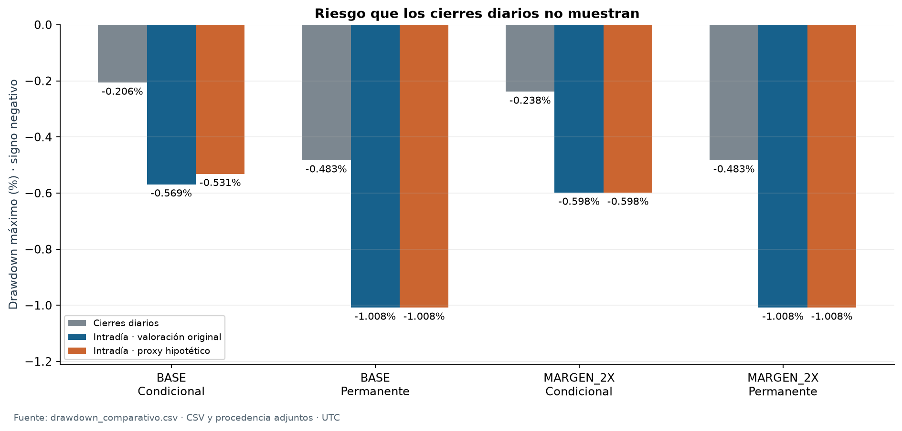
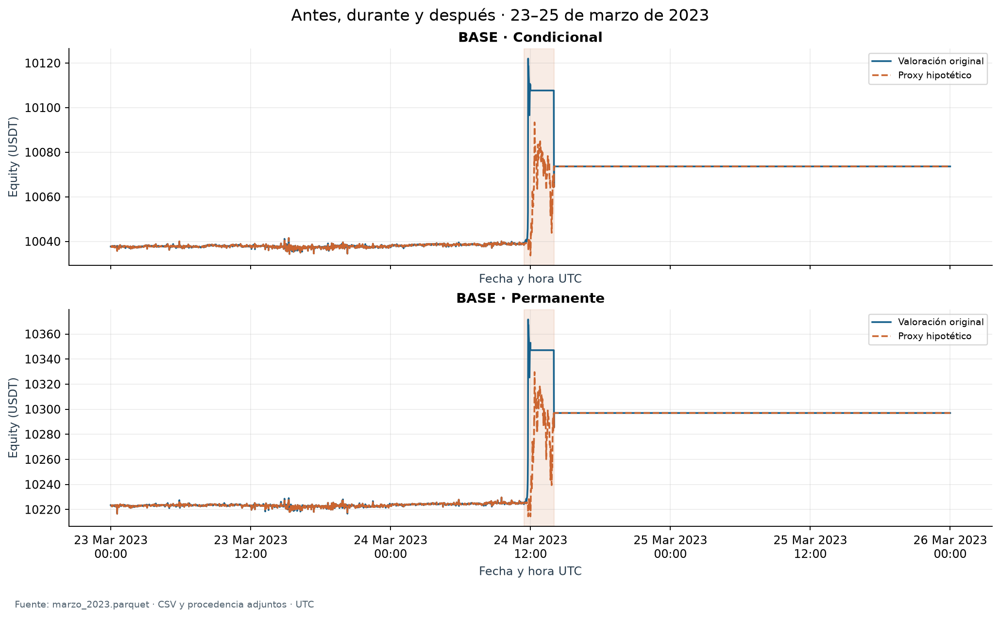
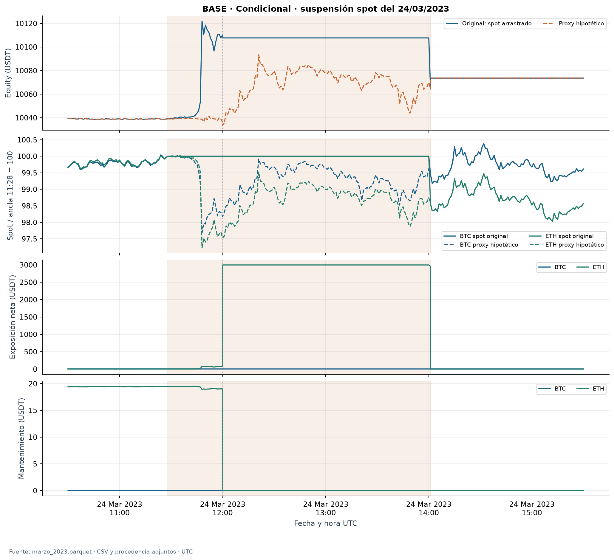
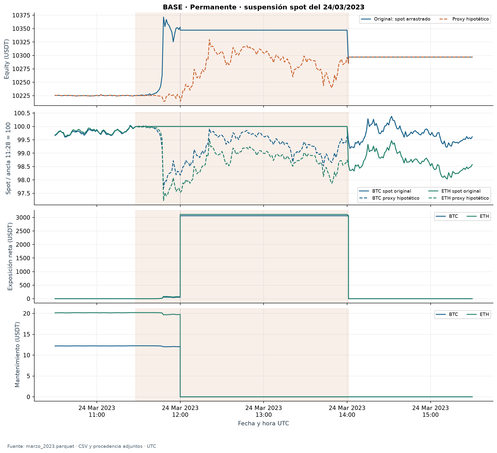
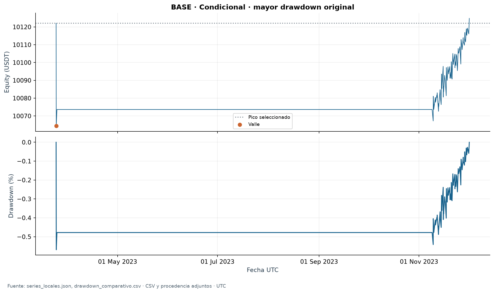
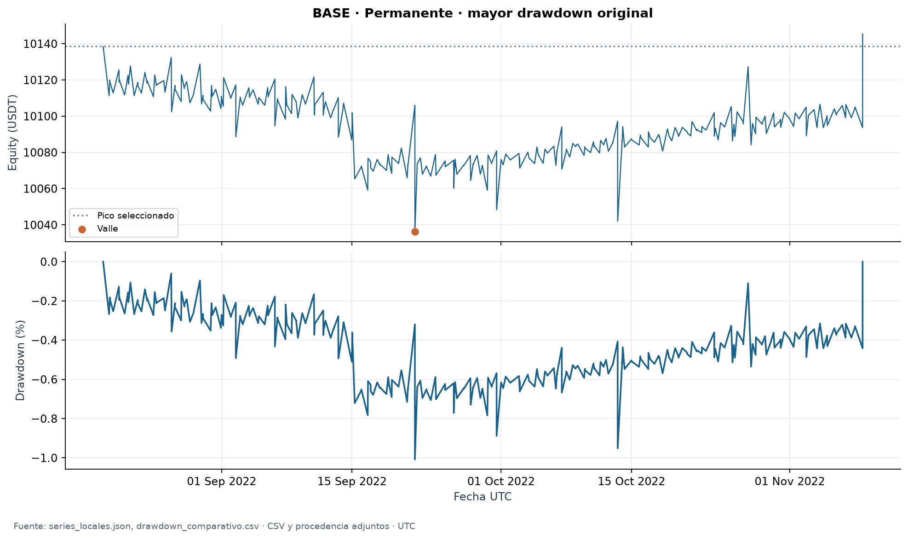
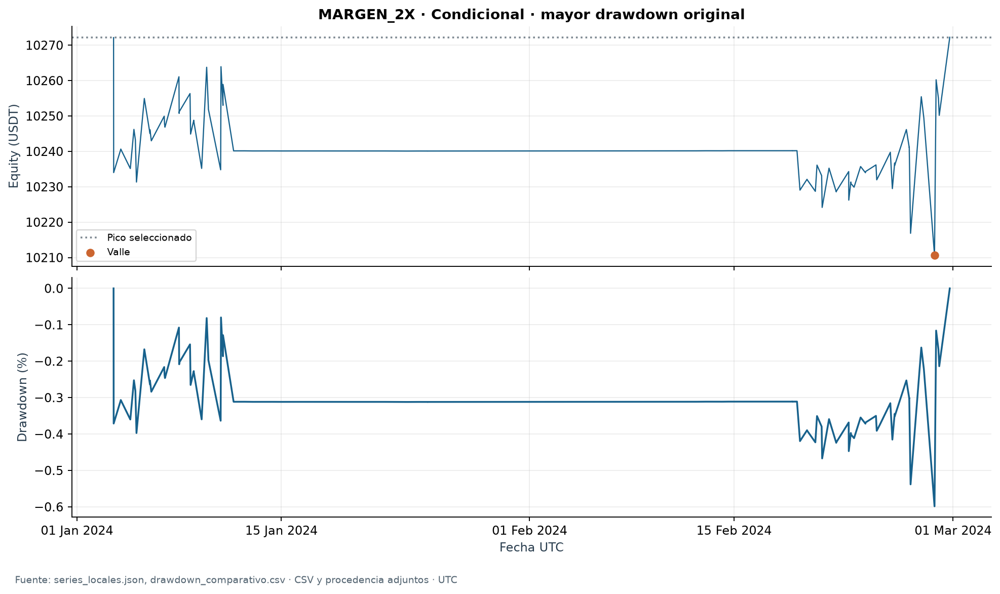
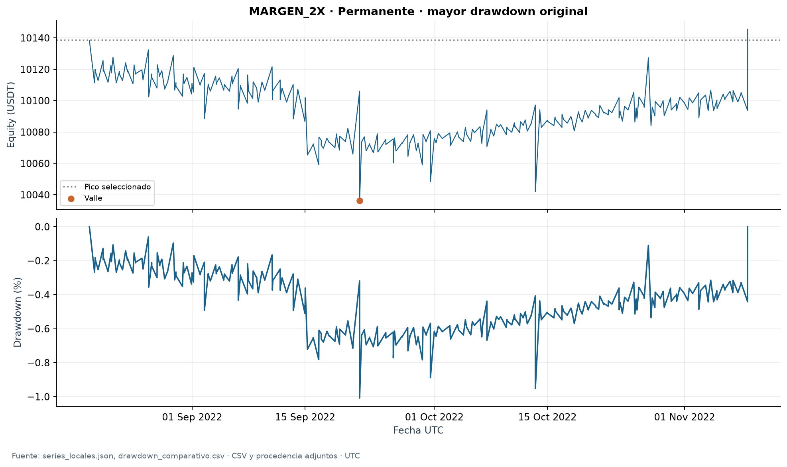
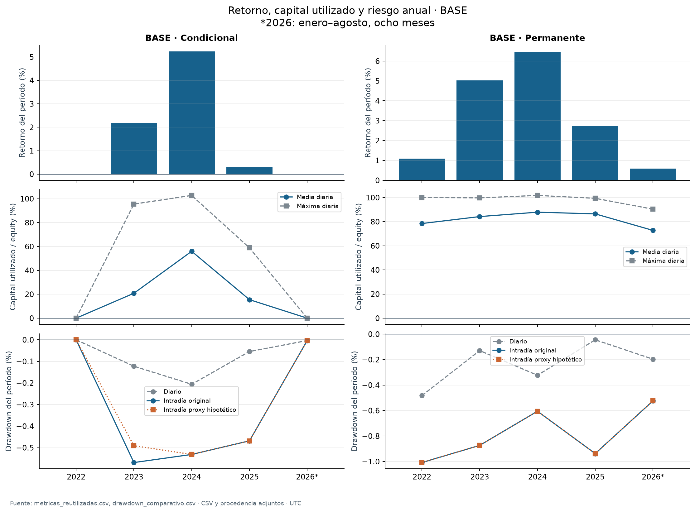

# Riesgo intradía, incidentes y garantías

Informe técnico preliminar · Entrega 4 · Construcción y conciliación ejecutadas. Muestra continua del 1 de enero de 2022 al 31 de agosto de 2026 · UTC. Posprocesamiento de cuatro carteras publicadas; no se ejecutó un nuevo backtest. El sello se verifica con los comandos del paquete; los resultados finales se conservan en la carpeta de ejecución.

Este bloque responde a la devolución recibida sobre pérdidas transitorias y garantías. Conserva la desagregación anual y el vínculo entre retorno y capital utilizado. La comparación remunerada y las nuevas trayectorias hipotéticas siguen pendientes; no completa toda la Entrega 4.

Documentos de alcance: [Feedback literal](documentos/feedback_e3.md) · [Protocolo previo](documentos/protocolo.md) · [Matriz de cobertura](documentos/matriz_cobertura_feedback.csv)

## Hallazgos principales

BASE · Condicional: el drawdown máximo pasa de -0,2062% diario a -0,5689% en la unión de minutos y eventos, una diferencia de 0,3627 puntos porcentuales. El diagnóstico separado con proxy alcanza -0,5313%. La menor holgura aislada observada es 486,21 USDT; el máximo déficit conjunto de mantenimiento es 0,00 USDT y la necesidad preventiva conjunta llega a un ínfimo de 18,94 USDT.

BASE · Permanente: el drawdown máximo pasa de -0,4827% diario a -1,0081% en la unión de minutos y eventos, una diferencia de 0,5253 puntos porcentuales. El diagnóstico separado con proxy alcanza -1,0081%. La menor holgura aislada observada es 501,93 USDT; el máximo déficit conjunto de mantenimiento es 0,00 USDT y la necesidad preventiva conjunta llega a un ínfimo de 15,10 USDT.

Se conciliaron 6816 cierres diarios, con residuo monetario máximo 3.64e-12 USDT, frente a la tolerancia original de 1E-8 USDT. La conciliación valida la contabilidad bajo la convención original; no convierte un spot antiguo en una observación contemporánea.

Durante la suspensión spot del 24/03/2023 hay 152 minutos sin un cierre spot nuevo: 72 velas de volumen cero y 80 registros ausentes. La referencia original conserva su último valor. El proxy conserva la relación spot/perpetuo del ancla y cambia exclusivamente la valoración. La diferencia no es un beneficio realizable ni una venta que hubiera sido posible durante la suspensión.

En BASE condicional, el peor drawdown de valoración original parte de un pico durante la suspensión: el spot antiguo permanece fijo mientras se mueve el mark del corto. Ese pico contable puede exagerar la caída posterior cuando vuelve un spot negociado. Por ello, la medida original se conserva para conciliar, pero no se interpreta como una pérdida de riqueza ejecutable observada desde un máximo de mercado igualmente negociable. El proxy presenta por separado la sensibilidad a ese problema de valoración.

Figura 1. Drawdown de la muestra completa, incluyendo 10.000 USDT iniciales. La valoración proxy es hipotética y se mantiene separada del resultado original reconstruido.
[Datos de la figura](figuras/fuentes/drawdown_muestra_completa.csv) · [SVG](figuras/drawdown_muestra_completa.svg)

## Identidad, valoración y alcance verificable

| Cartera | run_id original | Estado |
| --- | --- | --- |
| BASE · Condicional | run_ad71d751b20623006c195ff3 | Reconstruido por posprocesamiento |
| BASE · Permanente | run_dfea4b7ac1475668d5968c97 | Reconstruido por posprocesamiento |
| MARGEN_2X · Condicional | run_70383794701c4f0fc157b2ed | Reconstruido por posprocesamiento |
| MARGEN_2X · Permanente | run_3f5d9cce8ff1c2ba5447e3b6 | Reconstruido por posprocesamiento |

La permanente omite sólo el filtro de funding de entrada y renovación; conserva basis y controles operativos. MARGEN_2X duplica el importe de mantenimiento, incluida la deducción del tramo, y mantiene el apalancamiento elegido. No se repiten las variantes de costos.

La trayectoria es la unión de cierres de un minuto disponibles, instantes financieros necesarios y cierres diarios originales; no es tick-by-tick. Spot utiliza el último cierre con volumen positivo disponible; futuros se valúa al mark de riesgo. Un cierre de vela se conoce en su límite exclusivo. El cierre diario 23:59:59.999999999 utiliza normalmente la vela abierta a las 23:58, disponible a las 23:59; nunca anticipa la vela de las 23:59.

Se conservan el funding_time exacto y los milisegundos originales: funding sobre el corto anterior a fills simultáneos, fills comprometidos y controles posteriores. Los estados pre/post tienen duración cero y pueden cambiar necesidades instantáneas. Los 15 marks futures_scaled aprobados son distintos de los settlement marks de funding tratados como previous_closed_1m. Ambos conservan su procedencia.

Equity = caja spot + caja futuros + garantías + valor spot + P&L no realizado de futuros − deuda. Las transferencias y movimientos de garantía no crean equity. Funding, comisiones y slippage no se duplican. El polvo conserva su riesgo de precio, aunque se distingue de una posición activa.

Evidencia de reconstrucción: [Metadatos y conciliación](reconstruccion.json) · [Todos los residuos diarios](tablas/conciliaciones_diarias.csv) · [Dependencia de la serie local completa](series_locales.json)

## Drawdown comparable: muestra, años y cortes

DD(t) = equity(t) / máximo hasta t − 1, incluyendo el capital inicial y la observación actual. La política period_reset reinicia sólo el máximo de referencia en el saldo real de entrada del corte. full_trajectory_peak conserva el pico anterior de la trayectoria respectiva. No se reinician caja ni posiciones. Cada comparación utiliza el mismo período y política; los cierres diarios forman un subconjunto conciliado de la trayectoria intradía.

### Pico reiniciado al saldo real de entrada

| Cartera | Período | Valoración | DD diario | DD intradía | Diferencia (pp) |
| --- | --- | --- | --- | --- | --- |
| BASE · Condicional | Muestra completa | Original reconstruida | -0,2062% | -0,5689% | 0,3627 |
| BASE · Condicional | Muestra completa | Proxy hipotético de suspensión | -0,2062% | -0,5313% | 0,3251 |
| BASE · Condicional | 2022-2023 | Original reconstruida | -0,1224% | -0,5689% | 0,4465 |
| BASE · Condicional | 2022-2023 | Proxy hipotético de suspensión | -0,1224% | -0,4908% | 0,3684 |
| BASE · Condicional | 2024–ago. 2026 | Original reconstruida | -0,2062% | -0,5313% | 0,3251 |
| BASE · Condicional | 2024–ago. 2026 | Proxy hipotético de suspensión | -0,2062% | -0,5313% | 0,3251 |
| BASE · Condicional | 2022 | Original reconstruida | 0,0000% | 0,0000% | 0,0000 |
| BASE · Condicional | 2022 | Proxy hipotético de suspensión | 0,0000% | 0,0000% | 0,0000 |
| BASE · Condicional | 2023 | Original reconstruida | -0,1224% | -0,5689% | 0,4465 |
| BASE · Condicional | 2023 | Proxy hipotético de suspensión | -0,1224% | -0,4908% | 0,3684 |
| BASE · Condicional | 2024 | Original reconstruida | -0,2062% | -0,5313% | 0,3251 |
| BASE · Condicional | 2024 | Proxy hipotético de suspensión | -0,2062% | -0,5313% | 0,3251 |
| BASE · Condicional | 2025 | Original reconstruida | -0,0543% | -0,4682% | 0,4139 |
| BASE · Condicional | 2025 | Proxy hipotético de suspensión | -0,0543% | -0,4682% | 0,4139 |
| BASE · Condicional | Ene.–ago. 2026 | Original reconstruida | -0,0034% | -0,0035% | 0,0001 |
| BASE · Condicional | Ene.–ago. 2026 | Proxy hipotético de suspensión | -0,0034% | -0,0035% | 0,0001 |
| BASE · Permanente | Muestra completa | Original reconstruida | -0,4827% | -1,0081% | 0,5253 |
| BASE · Permanente | Muestra completa | Proxy hipotético de suspensión | -0,4827% | -1,0081% | 0,5253 |
| BASE · Permanente | 2022-2023 | Original reconstruida | -0,4827% | -1,0081% | 0,5253 |
| BASE · Permanente | 2022-2023 | Proxy hipotético de suspensión | -0,4827% | -1,0081% | 0,5253 |
| BASE · Permanente | 2024–ago. 2026 | Original reconstruida | -0,3232% | -0,9376% | 0,6144 |
| BASE · Permanente | 2024–ago. 2026 | Proxy hipotético de suspensión | -0,3232% | -0,9376% | 0,6144 |
| BASE · Permanente | 2022 | Original reconstruida | -0,4827% | -1,0081% | 0,5253 |
| BASE · Permanente | 2022 | Proxy hipotético de suspensión | -0,4827% | -1,0081% | 0,5253 |
| BASE · Permanente | 2023 | Original reconstruida | -0,1293% | -0,8735% | 0,7442 |
| BASE · Permanente | 2023 | Proxy hipotético de suspensión | -0,1293% | -0,8730% | 0,7437 |
| BASE · Permanente | 2024 | Original reconstruida | -0,3232% | -0,6053% | 0,2821 |
| BASE · Permanente | 2024 | Proxy hipotético de suspensión | -0,3232% | -0,6053% | 0,2821 |
| BASE · Permanente | 2025 | Original reconstruida | -0,0449% | -0,9376% | 0,8927 |
| BASE · Permanente | 2025 | Proxy hipotético de suspensión | -0,0449% | -0,9376% | 0,8927 |
| BASE · Permanente | Ene.–ago. 2026 | Original reconstruida | -0,1968% | -0,5236% | 0,3268 |
| BASE · Permanente | Ene.–ago. 2026 | Proxy hipotético de suspensión | -0,1968% | -0,5236% | 0,3268 |
| MARGEN_2X · Condicional | Muestra completa | Original reconstruida | -0,2383% | -0,5985% | 0,3602 |
| MARGEN_2X · Condicional | Muestra completa | Proxy hipotético de suspensión | -0,2383% | -0,5985% | 0,3602 |
| MARGEN_2X · Condicional | 2022-2023 | Original reconstruida | -0,1224% | -0,5689% | 0,4465 |
| MARGEN_2X · Condicional | 2022-2023 | Proxy hipotético de suspensión | -0,1224% | -0,4908% | 0,3684 |
| MARGEN_2X · Condicional | 2024–ago. 2026 | Original reconstruida | -0,2383% | -0,5985% | 0,3602 |
| MARGEN_2X · Condicional | 2024–ago. 2026 | Proxy hipotético de suspensión | -0,2383% | -0,5985% | 0,3602 |
| MARGEN_2X · Condicional | 2022 | Original reconstruida | 0,0000% | 0,0000% | 0,0000 |
| MARGEN_2X · Condicional | 2022 | Proxy hipotético de suspensión | 0,0000% | 0,0000% | 0,0000 |
| MARGEN_2X · Condicional | 2023 | Original reconstruida | -0,1224% | -0,5689% | 0,4465 |
| MARGEN_2X · Condicional | 2023 | Proxy hipotético de suspensión | -0,1224% | -0,4908% | 0,3684 |
| MARGEN_2X · Condicional | 2024 | Original reconstruida | -0,2383% | -0,5985% | 0,3602 |
| MARGEN_2X · Condicional | 2024 | Proxy hipotético de suspensión | -0,2383% | -0,5985% | 0,3602 |
| MARGEN_2X · Condicional | 2025 | Original reconstruida | -0,0015% | -0,0017% | 0,0002 |
| MARGEN_2X · Condicional | 2025 | Proxy hipotético de suspensión | -0,0015% | -0,0017% | 0,0002 |
| MARGEN_2X · Condicional | Ene.–ago. 2026 | Original reconstruida | -0,0015% | -0,0015% | 0,0001 |
| MARGEN_2X · Condicional | Ene.–ago. 2026 | Proxy hipotético de suspensión | -0,0015% | -0,0015% | 0,0001 |
| MARGEN_2X · Permanente | Muestra completa | Original reconstruida | -0,4827% | -1,0081% | 0,5253 |
| MARGEN_2X · Permanente | Muestra completa | Proxy hipotético de suspensión | -0,4827% | -1,0081% | 0,5253 |
| MARGEN_2X · Permanente | 2022-2023 | Original reconstruida | -0,4827% | -1,0081% | 0,5253 |
| MARGEN_2X · Permanente | 2022-2023 | Proxy hipotético de suspensión | -0,4827% | -1,0081% | 0,5253 |
| MARGEN_2X · Permanente | 2024–ago. 2026 | Original reconstruida | -0,3121% | -0,9448% | 0,6328 |
| MARGEN_2X · Permanente | 2024–ago. 2026 | Proxy hipotético de suspensión | -0,3121% | -0,9448% | 0,6328 |
| MARGEN_2X · Permanente | 2022 | Original reconstruida | -0,4827% | -1,0081% | 0,5253 |
| MARGEN_2X · Permanente | 2022 | Proxy hipotético de suspensión | -0,4827% | -1,0081% | 0,5253 |
| MARGEN_2X · Permanente | 2023 | Original reconstruida | -0,1293% | -0,8735% | 0,7442 |
| MARGEN_2X · Permanente | 2023 | Proxy hipotético de suspensión | -0,1293% | -0,8730% | 0,7437 |
| MARGEN_2X · Permanente | 2024 | Original reconstruida | -0,3121% | -0,5927% | 0,2807 |
| MARGEN_2X · Permanente | 2024 | Proxy hipotético de suspensión | -0,3121% | -0,5927% | 0,2807 |
| MARGEN_2X · Permanente | 2025 | Original reconstruida | -0,0511% | -0,9448% | 0,8937 |
| MARGEN_2X · Permanente | 2025 | Proxy hipotético de suspensión | -0,0511% | -0,9448% | 0,8937 |
| MARGEN_2X · Permanente | Ene.–ago. 2026 | Original reconstruida | -0,1957% | -0,5194% | 0,3237 |
| MARGEN_2X · Permanente | Ene.–ago. 2026 | Proxy hipotético de suspensión | -0,1957% | -0,5194% | 0,3237 |

### Pico acumulado de toda la trayectoria

| Cartera | Período | Valoración | DD diario | DD intradía | Diferencia (pp) |
| --- | --- | --- | --- | --- | --- |
| BASE · Condicional | Muestra completa | Original reconstruida | -0,2062% | -0,5689% | 0,3627 |
| BASE · Condicional | Muestra completa | Proxy hipotético de suspensión | -0,2062% | -0,5313% | 0,3251 |
| BASE · Condicional | 2022-2023 | Original reconstruida | -0,1224% | -0,5689% | 0,4465 |
| BASE · Condicional | 2022-2023 | Proxy hipotético de suspensión | -0,1224% | -0,4908% | 0,3684 |
| BASE · Condicional | 2024–ago. 2026 | Original reconstruida | -0,2062% | -0,5313% | 0,3251 |
| BASE · Condicional | 2024–ago. 2026 | Proxy hipotético de suspensión | -0,2062% | -0,5313% | 0,3251 |
| BASE · Condicional | 2022 | Original reconstruida | 0,0000% | 0,0000% | 0,0000 |
| BASE · Condicional | 2022 | Proxy hipotético de suspensión | 0,0000% | 0,0000% | 0,0000 |
| BASE · Condicional | 2023 | Original reconstruida | -0,1224% | -0,5689% | 0,4465 |
| BASE · Condicional | 2023 | Proxy hipotético de suspensión | -0,1224% | -0,4908% | 0,3684 |
| BASE · Condicional | 2024 | Original reconstruida | -0,2062% | -0,5313% | 0,3251 |
| BASE · Condicional | 2024 | Proxy hipotético de suspensión | -0,2062% | -0,5313% | 0,3251 |
| BASE · Condicional | 2025 | Original reconstruida | -0,0543% | -0,4682% | 0,4139 |
| BASE · Condicional | 2025 | Proxy hipotético de suspensión | -0,0543% | -0,4682% | 0,4139 |
| BASE · Condicional | Ene.–ago. 2026 | Original reconstruida | -0,0566% | -0,1537% | 0,0971 |
| BASE · Condicional | Ene.–ago. 2026 | Proxy hipotético de suspensión | -0,0566% | -0,1537% | 0,0971 |
| BASE · Permanente | Muestra completa | Original reconstruida | -0,4827% | -1,0081% | 0,5253 |
| BASE · Permanente | Muestra completa | Proxy hipotético de suspensión | -0,4827% | -1,0081% | 0,5253 |
| BASE · Permanente | 2022-2023 | Original reconstruida | -0,4827% | -1,0081% | 0,5253 |
| BASE · Permanente | 2022-2023 | Proxy hipotético de suspensión | -0,4827% | -1,0081% | 0,5253 |
| BASE · Permanente | 2024–ago. 2026 | Original reconstruida | -0,3232% | -0,9376% | 0,6144 |
| BASE · Permanente | 2024–ago. 2026 | Proxy hipotético de suspensión | -0,3232% | -0,9376% | 0,6144 |
| BASE · Permanente | 2022 | Original reconstruida | -0,4827% | -1,0081% | 0,5253 |
| BASE · Permanente | 2022 | Proxy hipotético de suspensión | -0,4827% | -1,0081% | 0,5253 |
| BASE · Permanente | 2023 | Original reconstruida | -0,1293% | -0,8735% | 0,7442 |
| BASE · Permanente | 2023 | Proxy hipotético de suspensión | -0,1293% | -0,8730% | 0,7437 |
| BASE · Permanente | 2024 | Original reconstruida | -0,3232% | -0,6053% | 0,2821 |
| BASE · Permanente | 2024 | Proxy hipotético de suspensión | -0,3232% | -0,6053% | 0,2821 |
| BASE · Permanente | 2025 | Original reconstruida | -0,0449% | -0,9376% | 0,8927 |
| BASE · Permanente | 2025 | Proxy hipotético de suspensión | -0,0449% | -0,9376% | 0,8927 |
| BASE · Permanente | Ene.–ago. 2026 | Original reconstruida | -0,1968% | -0,5236% | 0,3268 |
| BASE · Permanente | Ene.–ago. 2026 | Proxy hipotético de suspensión | -0,1968% | -0,5236% | 0,3268 |
| MARGEN_2X · Condicional | Muestra completa | Original reconstruida | -0,2383% | -0,5985% | 0,3602 |
| MARGEN_2X · Condicional | Muestra completa | Proxy hipotético de suspensión | -0,2383% | -0,5985% | 0,3602 |
| MARGEN_2X · Condicional | 2022-2023 | Original reconstruida | -0,1224% | -0,5689% | 0,4465 |
| MARGEN_2X · Condicional | 2022-2023 | Proxy hipotético de suspensión | -0,1224% | -0,4908% | 0,3684 |
| MARGEN_2X · Condicional | 2024–ago. 2026 | Original reconstruida | -0,2383% | -0,5985% | 0,3602 |
| MARGEN_2X · Condicional | 2024–ago. 2026 | Proxy hipotético de suspensión | -0,2383% | -0,5985% | 0,3602 |
| MARGEN_2X · Condicional | 2022 | Original reconstruida | 0,0000% | 0,0000% | 0,0000 |
| MARGEN_2X · Condicional | 2022 | Proxy hipotético de suspensión | 0,0000% | 0,0000% | 0,0000 |
| MARGEN_2X · Condicional | 2023 | Original reconstruida | -0,1224% | -0,5689% | 0,4465 |
| MARGEN_2X · Condicional | 2023 | Proxy hipotético de suspensión | -0,1224% | -0,4908% | 0,3684 |
| MARGEN_2X · Condicional | 2024 | Original reconstruida | -0,2383% | -0,5985% | 0,3602 |
| MARGEN_2X · Condicional | 2024 | Proxy hipotético de suspensión | -0,2383% | -0,5985% | 0,3602 |
| MARGEN_2X · Condicional | 2025 | Original reconstruida | -0,2026% | -0,3258% | 0,1232 |
| MARGEN_2X · Condicional | 2025 | Proxy hipotético de suspensión | -0,2026% | -0,3258% | 0,1232 |
| MARGEN_2X · Condicional | Ene.–ago. 2026 | Original reconstruida | -0,2030% | -0,3262% | 0,1232 |
| MARGEN_2X · Condicional | Ene.–ago. 2026 | Proxy hipotético de suspensión | -0,2030% | -0,3262% | 0,1232 |
| MARGEN_2X · Permanente | Muestra completa | Original reconstruida | -0,4827% | -1,0081% | 0,5253 |
| MARGEN_2X · Permanente | Muestra completa | Proxy hipotético de suspensión | -0,4827% | -1,0081% | 0,5253 |
| MARGEN_2X · Permanente | 2022-2023 | Original reconstruida | -0,4827% | -1,0081% | 0,5253 |
| MARGEN_2X · Permanente | 2022-2023 | Proxy hipotético de suspensión | -0,4827% | -1,0081% | 0,5253 |
| MARGEN_2X · Permanente | 2024–ago. 2026 | Original reconstruida | -0,3121% | -0,9448% | 0,6328 |
| MARGEN_2X · Permanente | 2024–ago. 2026 | Proxy hipotético de suspensión | -0,3121% | -0,9448% | 0,6328 |
| MARGEN_2X · Permanente | 2022 | Original reconstruida | -0,4827% | -1,0081% | 0,5253 |
| MARGEN_2X · Permanente | 2022 | Proxy hipotético de suspensión | -0,4827% | -1,0081% | 0,5253 |
| MARGEN_2X · Permanente | 2023 | Original reconstruida | -0,1293% | -0,8735% | 0,7442 |
| MARGEN_2X · Permanente | 2023 | Proxy hipotético de suspensión | -0,1293% | -0,8730% | 0,7437 |
| MARGEN_2X · Permanente | 2024 | Original reconstruida | -0,3121% | -0,5927% | 0,2807 |
| MARGEN_2X · Permanente | 2024 | Proxy hipotético de suspensión | -0,3121% | -0,5927% | 0,2807 |
| MARGEN_2X · Permanente | 2025 | Original reconstruida | -0,0511% | -0,9448% | 0,8937 |
| MARGEN_2X · Permanente | 2025 | Proxy hipotético de suspensión | -0,0511% | -0,9448% | 0,8937 |
| MARGEN_2X · Permanente | Ene.–ago. 2026 | Original reconstruida | -0,1957% | -0,5194% | 0,3237 |
| MARGEN_2X · Permanente | Ene.–ago. 2026 | Proxy hipotético de suspensión | -0,1957% | -0,5194% | 0,3237 |

La diferencia monetaria entre pérdidas pico–valle se conserva en el CSV y puede corresponder a picos y valles distintos; no es un P&L incremental causado por pasar a frecuencia intradía. No se divide por drawdown diario cero. Los máximos describen la valoración observada bajo sus arrastres y aproximaciones, no un máximo de riesgo de mercado conocido durante una suspensión.

Tabla de precisión completa, picos, valles y recuperación: [drawdown_comparativo.csv](tablas/drawdown_comparativo.csv)

### Caída desde apertura de jornada y desde máximo intradiario

| Cartera | Peor caída desde inicio del día (USDT) | Peor pérdida desde pico del día (USDT) |
| --- | --- | --- |
| BASE · Condicional | 43,77 | 57,58 |
| BASE · Permanente | 63,60 | 101,89 |
| MARGEN_2X · Condicional | 38,74 | 57,58 |
| MARGEN_2X · Permanente | 63,60 | 101,51 |

Estas dos pérdidas reinician su referencia dentro de cada jornada y no se llaman indistintamente drawdown máximo de la muestra. Los timestamps y todos los días permanecen en riesgo_diario.csv.

## Suspensión spot: antes, durante y después

La ventana publicada cubre 23–25 de marzo de 2023. La última vela spot/perpetuo alineada se abrió a las 11:27 del 24/03 y estuvo disponible a las 11:28: BTC 28.080/28.070 y ETH 1.789,52/1.788,54. El ancla queda fija; S_proxy(t)=S(s)×F(t)/F(s). La primera vela válida de reapertura se abre a las 14:00 y se conoce a las 14:01. Allí se retoma spot observado. El supuesto conserva la relación del ancla; no recupera el precio real durante el hueco ni demuestra convergencia del basis.

| Cartera | Activo | Inicio UTC | Fin UTC | Minutos | Mayor corto durante episodio | Cambio cartera (USDT) | Cambio activo (USDT) |
| --- | --- | --- | --- | --- | --- | --- | --- |
| BASE · Condicional | ETHUSDT | 2023-03-24T12:00:00.000000000Z | 2023-03-24T14:01:00.000000000Z | 121 | 0,000000 | -34,05 | -34,05 |
| BASE · Permanente | BTCUSDT | 2023-03-24T12:00:00.000000000Z | 2023-03-24T14:01:00.000000000Z | 121 | 0,000000 | -50,11 | -14,77 |
| BASE · Permanente | ETHUSDT | 2023-03-24T12:00:00.000000000Z | 2023-03-24T14:01:00.000000000Z | 121 | 0,000000 | -50,11 | -35,34 |

Los 121 minutos de exposición activa descubierta se controlan por unión de cartera, sin sumar BTC y ETH simultáneos. En ese tramo los futuros afectados ya están cerrados: no se les asigna mantenimiento por llamarse incidente operativo. La garantía se analiza antes del cierre y el riesgo posterior corresponde al inventario spot. La constancia de su precio original no demuestra ausencia de pérdida intradía.

Controles de exposición ejecutados: [Duraciones por cartera y activos](tablas/controles_exposicion.csv) · [Resultado de controles](controles_exposicion.json)

| Cartera | Mayor reducción de equity al usar proxy (USDT) | Instante UTC | Interpretación |
| --- | --- | --- | --- |
| BASE · Condicional | 83,14 | 2023-03-24 11:48:00 UTC | Diferencia de valoración; posiciones originales |
| BASE · Permanente | 157,06 | 2023-03-24 11:48:00 UTC | Diferencia de valoración; posiciones originales |

La comparación anterior incluye todo el intervalo de suspensión, también antes de que el futuro fuera cerrado. No debe confundirse con la peor pérdida dentro de los 121 minutos descubiertos. En la reapertura, el spot observado supera al proxy del mismo instante en 22,653057 USDT por BTC y 3,626131 USDT por ETH; se incorpora ese cambio de referencia, sin inventar una ejecución.

Figura 3. Ventana completa de tres días. El área sombreada identifica el tramo sin un nuevo cierre spot disponible.
[Datos de la figura](figuras/fuentes/marzo_tres_dias.csv) · [SVG](figuras/marzo_tres_dias.svg)

Detalle intradiario de BASE · Condicional: valoración, referencia spot, exposición neta y mantenimiento. La línea vertical de las 12:00 facilita localizar el tramo descubierto.
[Datos de la figura](figuras/fuentes/marzo_detalle_conditional.csv) · [SVG](figuras/marzo_detalle_conditional.svg)

Detalle intradiario de BASE · Permanente: valoración, referencia spot, exposición neta y mantenimiento. La línea vertical de las 12:00 facilita localizar el tramo descubierto.
[Datos de la figura](figuras/fuentes/marzo_detalle_permanent.csv) · [SVG](figuras/marzo_detalle_permanent.svg)

Evidencia íntegra del detalle: [marzo_2023.parquet](evidencia/marzo_2023.parquet) · [Catálogo de incidentes](tablas/catalogo_incidentes.csv)

## Catálogo completo y selección de episodios

| Cartera | Episodios por activo | Tiempo descubierto de cartera (s) | Criterio de agregación |
| --- | --- | --- | --- |
| BASE · Condicional | 68 | 11.340 | Unión temporal; episodios por activo y ciclo |
| BASE · Permanente | 165 | 16.440 | Unión temporal; episodios por activo y ciclo |
| MARGEN_2X · Condicional | 55 | 10.440 | Unión temporal; episodios por activo y ciclo |
| MARGEN_2X · Permanente | 161 | 16.260 | Unión temporal; episodios por activo y ciclo |

El catálogo conserva secuencias normales, parciales/desarmes, correcciones, cierres demorados e interrupciones documentadas. Una espera normal entre patas no se describe automáticamente como incidente extraordinario. Se conservan ciclos, órdenes, estados y causas registradas; el P&L contemporáneo de cartera y la contribución del activo son distintos de un efecto causal del incidente.

| Cartera | Episodio de mayor caída desde su inicio | Clase | Duración (min) | Peor cambio cartera (USDT) | Cambio final cartera (USDT) | Peor cambio activo (USDT) |
| --- | --- | --- | --- | --- | --- | --- |
| BASE · Condicional | run_ad71d751b20623006c195ff3_ETHUSDT_009 | documented_spot_interruption | 121,00 | -43,27 | -34,05 | -43,27 |
| BASE · Permanente | run_dfea4b7ac1475668d5968c97_BTCUSDT_042 | documented_spot_interruption | 121,00 | -61,72 | -50,11 | -16,83 |
| MARGEN_2X · Condicional | run_70383794701c4f0fc157b2ed_ETHUSDT_009 | documented_spot_interruption | 121,00 | -43,27 | -34,05 | -43,27 |
| MARGEN_2X · Permanente | run_3f5d9cce8ff1c2ba5447e3b6_BTCUSDT_042 | documented_spot_interruption | 121,00 | -61,72 | -50,11 | -16,83 |

El peor estado transitorio y el resultado final del episodio no son la misma magnitud. La malla conserva el estado PRE de la primera operación y cada estado POST del ledger, ordenados por secuencia, aunque compartan hora y tengan duración cronológica cero. En la reapertura de marzo, la valoración PRE incorpora el primer spot nuevo antes de vender; el POST incorpora el precio VWAP, efectivo y comisiones de la ejecución original. Así puede observarse una pérdida transitoria mayor que la pérdida final sin que exista una contradicción contable. Estos estados no se convierten en minutos adicionales de exposición.

Todos los episodios, incluidos los que finalizan con ganancia: [Catálogo legible completo](catalogo_completo.html) · [CSV de precisión completa](tablas/catalogo_incidentes.csv) · [Estados de cada episodio](evidencia/episodios.parquet)

## Garantías, prevención y liquidez

Con corto abierto, saldo de margen B = garantía + q×(precio medio−mark); mantenimiento M(n) = nocional×tasa del tramo−deducción, con el multiplicador efectivo de cada corrida. Holgura = B−M. Un saldo no positivo se trata como señal de riesgo; ratio y distancia no son tranquilizadores ni se reemplazan por cero. Sin corto, mantenimiento es cero y ratio/distancia no aplican.

| Cartera | Menor holgura (USDT) | Mayor ratio | Menor distancia | Máx. déficit mantenimiento conjunto (USDT) | Máx. necesidad preventiva conjunta: ínfimo (USDT) | Faltante externo preventivo: cotas del máximo (USDT) |
| --- | --- | --- | --- | --- | --- | --- |
| BASE · Condicional | 486,21 | 4,148% | 14,463% | 0,00 | 18,94 | 0,00 a 18,94 |
| BASE · Permanente | 501,93 | 4,207% | 14,569% | 0,00 | 15,10 | 0,00 a 15,10 |
| MARGEN_2X · Condicional | 491,07 | 7,916% | 14,685% | 0,00 | 11,10 | 0,00 a 11,10 |
| MARGEN_2X · Permanente | 504,79 | 7,993% | 14,368% | 0,00 | 22,19 | 0,00 a 22,19 |

Tres preguntas se separan: mantenimiento exigido; déficit para llegar a la frontera, max(0,M−B); y necesidad de conservar ambos umbrales preventivos. Una transferencia hipotética x debe cumplir x≥0, x>M(qm)/0,50−B y x≥qm×0,15+M(qm×1,15)−B. Se informa el ínfimo y una bandera de frontera estricta. Cuando el ínfimo coincide con la condición estricta no es un mínimo suficiente: hace falta superarlo, sin inventar un quantum ni sumar un centavo arbitrario.

Las necesidades se suman entre contratos sólo en el mismo instante y se comparan una sola vez con la caja común acreditada. No se reutiliza garantía ajena, ni se cuenta spot no vendido como efectivo, ni se suman máximos de activos ocurridos en fechas distintas. Transferir caja libre a garantía conserva equity. Tampoco se suman déficits de minutos consecutivos como aportes realizados.

| Cartera | Tiempo con disponibilidad neta no acreditable (s) | Tratamiento |
| --- | --- | --- |
| BASE · Condicional | 2.580,000 | Caja neta y faltante exacto ND; cotas con caja bruta y reserva desconocida |
| BASE · Permanente | 13.020,000 | Caja neta y faltante exacto ND; cotas con caja bruta y reserva desconocida |
| MARGEN_2X · Condicional | 2.040,000 | Caja neta y faltante exacto ND; cotas con caja bruta y reserva desconocida |
| MARGEN_2X · Permanente | 12.900,000 | Caja neta y faltante exacto ND; cotas con caja bruta y reserva desconocida |

Las cotas no declaran que toda la caja bruta estuviera libre: la cota inferior resta como máximo esa caja y la superior conserva la necesidad cuando la reserva no es acreditable. Son cotas del máximo instantáneo, no una trayectoria de aportes. Si la necesidad es cero, el déficit correspondiente puede ser cero aun cuando falte precisión sobre la disponibilidad. La igualdad de mantenimiento no acredita evitar todo cargo, liquidación o salida preventiva.

Detalle por período, día y contrato: [Garantías por período](tablas/garantias_periodo.csv) · [Garantías diarias por activo](tablas/garantias_diarias_activo.csv) · [Puntos extremos](tablas/puntos_extremos.csv)

## Peor drawdown y menor holgura de cada cartera

La selección sigue los criterios fijados en el protocolo, sin omitir resultados favorables o adversos: peor drawdown de la trayectoria original y menor holgura mientras existe corto. Pueden corresponder a episodios distintos. Los gráficos extensos utilizan una envolvente diaria que conserva extremos en su orden temporal; las cifras proceden de las tablas calculadas sobre la serie completa.

### BASE · Condicional

| Pico UTC | Valle UTC | Recuperación UTC | Pérdida pico–valle (USDT) | DD original |
| --- | --- | --- | --- | --- |
| 2023-03-24T11:48:00.000000000Z | 2023-03-24T14:01:00.000000000Z | 2023-12-01T16:40:00.000000000Z | 57,58 | -0,5689% |

| Activo | Cantidad spot | Cantidad corta | Precio spot (USDT) | Mark (USDT) |
| --- | --- | --- | --- | --- |
| BTCUSDT | 0,00000000 | 0,00000000 | 27.925,590000 | 27.908,301973 |
| ETHUSDT | 1,67500900 | 0,00000000 | 1.763,690000 | 1.763,005773 |

Estado del valle: PRE de la primera operación, secuencia 0; equity 10.064,426487 USDT y caja bruta 7.110,229864 USDT. Fuente: puntos_extremos.csv, con cantidades y precios de la misma observación.

Este valle es anterior al primer fill de reapertura, con ETH spot todavía en cartera y el corto ya cerrado. El máximo que inicia el drawdown original ocurre durante el carry del precio spot. La figura conserva esa valoración para conciliar; el proxy y el cambio final del episodio se muestran por separado.

Menor holgura: BTCUSDT, 2024-03-04T23:04:00.000000000Z, cantidad corta 0,048000, garantía 1.256,97 USDT, saldo de margen 499,30 USDT, mantenimiento 13,09 USDT y holgura 486,21 USDT. El estado incluye fase y secuencia originales en puntos_extremos.csv.

Envolvente diaria: primero, último, mínimo y máximo en su orden temporal; las métricas proceden de la tabla completa. Estado: reconstruido; valoración original.
[Datos de la figura](figuras/fuentes/peor_drawdown_run_ad71d751b20623006c195ff3.csv) · [SVG](figuras/peor_drawdown_run_ad71d751b20623006c195ff3.svg)

Tres días calendario UTC: día anterior, día del mínimo y día posterior. Intervalo solicitado inclusivo: 2024-03-03 00:00:00 UTC a 2024-03-05 23:59:59.999999999 UTC. Sin truncamiento por límites de la muestra. Sólo se muestran métricas contractuales con corto abierto. Caja neta desconocida permanece como hueco.
[Datos de la figura](figuras/fuentes/menor_holgura_run_ad71d751b20623006c195ff3.csv) · [SVG](figuras/menor_holgura_run_ad71d751b20623006c195ff3.svg)

### BASE · Permanente

| Pico UTC | Valle UTC | Recuperación UTC | Pérdida pico–valle (USDT) | DD original |
| --- | --- | --- | --- | --- |
| 2022-08-19T06:40:00.000000000Z | 2022-09-21T18:01:00.000000000Z | 2022-11-08T19:35:00.000000000Z | 102,20 | -1,0081% |

| Activo | Cantidad spot | Cantidad corta | Precio spot (USDT) | Mark (USDT) |
| --- | --- | --- | --- | --- |
| BTCUSDT | 0,15000473 | 0,15000000 | 18.773,040000 | 18.933,503253 |
| ETHUSDT | 1,72108770 | 1,72100000 | 1.329,670000 | 1.335,870000 |

Estado del valle: regular, secuencia 0; equity 10.036,260594 USDT y caja bruta 28,374168 USDT. Fuente: puntos_extremos.csv, con cantidades y precios de la misma observación.

En este valle, las cantidades spot y cortas están casi igualadas para ambos activos. La pérdida máxima de equity no identifica por sí sola una exposición extraordinaria sin cobertura: el estado observado conserva diferencias entre spot y mark con posiciones cubiertas. Es contexto de valoración y convergencia, no una atribución causal de toda la pérdida pico–valle a la diferencia de precios de este instante.

Menor holgura: BTCUSDT, 2024-11-20T13:17:00.000000000Z, cantidad corta 0,036000, garantía 1.302,88 USDT, saldo de margen 515,50 USDT, mantenimiento 13,57 USDT y holgura 501,93 USDT. El estado incluye fase y secuencia originales en puntos_extremos.csv.

Envolvente diaria: primero, último, mínimo y máximo en su orden temporal; las métricas proceden de la tabla completa. Estado: reconstruido; valoración original.
[Datos de la figura](figuras/fuentes/peor_drawdown_run_dfea4b7ac1475668d5968c97.csv) · [SVG](figuras/peor_drawdown_run_dfea4b7ac1475668d5968c97.svg)

Tres días calendario UTC: día anterior, día del mínimo y día posterior. Intervalo solicitado inclusivo: 2024-11-19 00:00:00 UTC a 2024-11-21 23:59:59.999999999 UTC. Sin truncamiento por límites de la muestra. Sólo se muestran métricas contractuales con corto abierto. Caja neta desconocida permanece como hueco.
[Datos de la figura](figuras/fuentes/menor_holgura_run_dfea4b7ac1475668d5968c97.csv) · [SVG](figuras/menor_holgura_run_dfea4b7ac1475668d5968c97.svg)

### MARGEN_2X · Condicional

| Pico UTC | Valle UTC | Recuperación UTC | Pérdida pico–valle (USDT) | DD original |
| --- | --- | --- | --- | --- |
| 2024-01-03T12:10:00.000000000Z | 2024-02-28T17:32:00.000000000Z | 2024-02-29T18:36:00.000000000Z | 61,48 | -0,5985% |

| Activo | Cantidad spot | Cantidad corta | Precio spot (USDT) | Mark (USDT) |
| --- | --- | --- | --- | --- |
| BTCUSDT | 0,05800785 | 0,05800000 | 59.580,590000 | 60.124,800000 |
| ETHUSDT | 0,94801050 | 0,94800000 | 3.196,720000 | 3.216,234044 |

Estado del valle: regular, secuencia 0; equity 10.210,657201 USDT y caja bruta 1.418,151841 USDT. Fuente: puntos_extremos.csv, con cantidades y precios de la misma observación.

En este valle, las cantidades spot y cortas están casi igualadas para ambos activos. La pérdida máxima de equity no identifica por sí sola una exposición extraordinaria sin cobertura: el estado observado conserva diferencias entre spot y mark con posiciones cubiertas. Es contexto de valoración y convergencia, no una atribución causal de toda la pérdida pico–valle a la diferencia de precios de este instante.

Menor holgura: BTCUSDT, 2024-03-04T20:40:00.000000000Z, cantidad corta 0,048000, garantía 1.256,97 USDT, saldo de margen 517,10 USDT, mantenimiento 26,03 USDT y holgura 491,07 USDT. El estado incluye fase y secuencia originales en puntos_extremos.csv.

Envolvente diaria: primero, último, mínimo y máximo en su orden temporal; las métricas proceden de la tabla completa. Estado: reconstruido; valoración original.
[Datos de la figura](figuras/fuentes/peor_drawdown_run_70383794701c4f0fc157b2ed.csv) · [SVG](figuras/peor_drawdown_run_70383794701c4f0fc157b2ed.svg)

Tres días calendario UTC: día anterior, día del mínimo y día posterior. Intervalo solicitado inclusivo: 2024-03-03 00:00:00 UTC a 2024-03-05 23:59:59.999999999 UTC. Sin truncamiento por límites de la muestra. Sólo se muestran métricas contractuales con corto abierto. Caja neta desconocida permanece como hueco.
[Datos de la figura](figuras/fuentes/menor_holgura_run_70383794701c4f0fc157b2ed.csv) · [SVG](figuras/menor_holgura_run_70383794701c4f0fc157b2ed.svg)

### MARGEN_2X · Permanente

| Pico UTC | Valle UTC | Recuperación UTC | Pérdida pico–valle (USDT) | DD original |
| --- | --- | --- | --- | --- |
| 2022-08-19T06:40:00.000000000Z | 2022-09-21T18:01:00.000000000Z | 2022-11-08T19:35:00.000000000Z | 102,20 | -1,0081% |

| Activo | Cantidad spot | Cantidad corta | Precio spot (USDT) | Mark (USDT) |
| --- | --- | --- | --- | --- |
| BTCUSDT | 0,15000473 | 0,15000000 | 18.773,040000 | 18.933,503253 |
| ETHUSDT | 1,72108770 | 1,72100000 | 1.329,670000 | 1.335,870000 |

Estado del valle: regular, secuencia 0; equity 10.036,260594 USDT y caja bruta 28,374168 USDT. Fuente: puntos_extremos.csv, con cantidades y precios de la misma observación.

En este valle, las cantidades spot y cortas están casi igualadas para ambos activos. La pérdida máxima de equity no identifica por sí sola una exposición extraordinaria sin cobertura: el estado observado conserva diferencias entre spot y mark con posiciones cubiertas. Es contexto de valoración y convergencia, no una atribución causal de toda la pérdida pico–valle a la diferencia de precios de este instante.

Menor holgura: BTCUSDT, 2024-01-11T14:42:00.000000000Z, cantidad corta 0,072000, garantía 1.339,32 USDT, saldo de margen 532,67 USDT, mantenimiento 27,88 USDT y holgura 504,79 USDT. El estado incluye fase y secuencia originales en puntos_extremos.csv.

Envolvente diaria: primero, último, mínimo y máximo en su orden temporal; las métricas proceden de la tabla completa. Estado: reconstruido; valoración original.
[Datos de la figura](figuras/fuentes/peor_drawdown_run_3f5d9cce8ff1c2ba5447e3b6.csv) · [SVG](figuras/peor_drawdown_run_3f5d9cce8ff1c2ba5447e3b6.svg)

Tres días calendario UTC: día anterior, día del mínimo y día posterior. Intervalo solicitado inclusivo: 2024-01-10 00:00:00 UTC a 2024-01-12 23:59:59.999999999 UTC. Sin truncamiento por límites de la muestra. Sólo se muestran métricas contractuales con corto abierto. Caja neta desconocida permanece como hueco.
[Datos de la figura](figuras/fuentes/menor_holgura_run_3f5d9cce8ff1c2ba5447e3b6.csv) · [SVG](figuras/menor_holgura_run_3f5d9cce8ff1c2ba5447e3b6.svg)

## Resultados anuales y capital utilizado

Los P&L, retornos, CAGR, Sharpe y utilización proceden de la corrección verificada, sin resimulación ni cambios en H1/H2/H3. CAGR anualiza el período indicado usando su duración; no convierte enero–agosto de 2026 en doce meses observados. Tiempo activo excluye polvo. Capital utilizado, garantía, caja libre y equity se mantienen como conceptos distintos. No se divide CAGR por utilización media para fabricar un retorno comparable.

### BASE · Condicional

| Período | P&L (USDT) | Retorno | CAGR anualizado | DD diario | DD intradía | Tiempo activo | Utiliz. media diaria | Utiliz. máx. diaria | Holgura mín. (USDT) | Necesidad preventiva máx.: ínfimo (USDT) |
| --- | --- | --- | --- | --- | --- | --- | --- | --- | --- | --- |
| 2022 | 0,00 | 0,00% | 0,00% | 0,0000% | 0,0000% | 0,00% | 0,00% | 0,00% | ND | 0,00 |
| 2023 | 217,44 | 2,17% | 2,17% | -0,1224% | -0,5689% | 32,94% | 20,84% | 95,49% | 771,02 | 0,00 |
| 2024 | 535,13 | 5,24% | 5,22% | -0,2062% | -0,5313% | 67,02% | 55,98% | 102,74% | 486,21 | 18,94 |
| 2025 | 33,28 | 0,31% | 0,31% | -0,0543% | -0,4682% | 32,06% | 15,49% | 58,86% | 922,23 | 0,00 |
| Ene.–ago. 2026 | -0,09 | -0,00% | -0,00% | -0,0034% | -0,0035% | 0,00% | 0,01% | 0,01% | ND | 0,00 |

Lectura de los años recientes: retorno 5,24% en 2024, 0,31% en 2025 y -0,00% en enero–agosto de 2026. El promedio del corte 2024+ no reemplaza esta trayectoria anual ni la información sobre capital efectivamente utilizado.

### BASE · Permanente

| Período | P&L (USDT) | Retorno | CAGR anualizado | DD diario | DD intradía | Tiempo activo | Utiliz. media diaria | Utiliz. máx. diaria | Holgura mín. (USDT) | Necesidad preventiva máx.: ínfimo (USDT) |
| --- | --- | --- | --- | --- | --- | --- | --- | --- | --- | --- |
| 2022 | 109,16 | 1,09% | 1,09% | -0,4827% | -1,0081% | 98,28% | 78,47% | 100,06% | 572,73 | 0,00 |
| 2023 | 507,50 | 5,02% | 5,02% | -0,1293% | -0,8735% | 94,31% | 84,24% | 99,74% | 606,31 | 0,00 |
| 2024 | 686,80 | 6,47% | 6,45% | -0,3232% | -0,6053% | 99,04% | 87,88% | 101,78% | 501,93 | 15,10 |
| 2025 | 308,14 | 2,73% | 2,73% | -0,0449% | -0,9376% | 100,00% | 86,48% | 99,39% | 574,27 | 0,69 |
| Ene.–ago. 2026 | 68,46 | 0,59% | 0,89% | -0,1968% | -0,5236% | 100,00% | 72,78% | 90,35% | 1.635,86 | 0,00 |

Lectura de los años recientes: retorno 6,47% en 2024, 2,73% en 2025 y 0,59% en enero–agosto de 2026. El promedio del corte 2024+ no reemplaza esta trayectoria anual ni la información sobre capital efectivamente utilizado.

### MARGEN_2X · Condicional

| Período | P&L (USDT) | Retorno | CAGR anualizado | DD diario | DD intradía | Tiempo activo | Utiliz. media diaria | Utiliz. máx. diaria | Holgura mín. (USDT) | Necesidad preventiva máx.: ínfimo (USDT) |
| --- | --- | --- | --- | --- | --- | --- | --- | --- | --- | --- |
| 2022 | 0,00 | 0,00% | 0,00% | 0,0000% | 0,0000% | 0,00% | 0,00% | 0,00% | ND | 0,00 |
| 2023 | 217,44 | 2,17% | 2,17% | -0,1224% | -0,5689% | 32,94% | 20,84% | 95,49% | 750,89 | 0,00 |
| 2024 | 480,04 | 4,70% | 4,69% | -0,2383% | -0,5985% | 62,86% | 53,91% | 103,57% | 491,07 | 11,10 |
| 2025 | -0,03 | -0,00% | -0,00% | -0,0015% | -0,0017% | 0,00% | 0,00% | 0,00% | ND | 0,00 |
| Ene.–ago. 2026 | -0,04 | -0,00% | -0,00% | -0,0015% | -0,0015% | 0,00% | 0,00% | 0,00% | ND | 0,00 |

Lectura de los años recientes: retorno 4,70% en 2024, -0,00% en 2025 y -0,00% en enero–agosto de 2026. El promedio del corte 2024+ no reemplaza esta trayectoria anual ni la información sobre capital efectivamente utilizado.

### MARGEN_2X · Permanente

| Período | P&L (USDT) | Retorno | CAGR anualizado | DD diario | DD intradía | Tiempo activo | Utiliz. media diaria | Utiliz. máx. diaria | Holgura mín. (USDT) | Necesidad preventiva máx.: ínfimo (USDT) |
| --- | --- | --- | --- | --- | --- | --- | --- | --- | --- | --- |
| 2022 | 109,16 | 1,09% | 1,09% | -0,4827% | -1,0081% | 98,28% | 78,47% | 100,06% | 552,97 | 0,00 |
| 2023 | 507,50 | 5,02% | 5,02% | -0,1293% | -0,8735% | 94,31% | 84,24% | 99,74% | 592,33 | 0,00 |
| 2024 | 636,63 | 6,00% | 5,98% | -0,3121% | -0,5927% | 98,98% | 77,72% | 102,07% | 504,79 | 22,19 |
| 2025 | 307,05 | 2,73% | 2,73% | -0,0511% | -0,9448% | 100,00% | 86,32% | 98,02% | 562,66 | 7,91 |
| Ene.–ago. 2026 | 67,90 | 0,59% | 0,88% | -0,1957% | -0,5194% | 100,00% | 72,62% | 90,13% | 1.659,22 | 0,00 |

Lectura de los años recientes: retorno 6,00% en 2024, 2,73% en 2025 y 0,59% en enero–agosto de 2026. El promedio del corte 2024+ no reemplaza esta trayectoria anual ni la información sobre capital efectivamente utilizado.

Retorno, utilización y drawdown anual BASE. Los drawdowns del gráfico reinician el pico al saldo real de entrada; la evidencia conserva además el pico acumulado.
[Datos de la figura](figuras/fuentes/resumen_anual_base.csv) · [SVG](figuras/resumen_anual_base.svg)

### H1, H2 y H3 conservadas

| Escenario | Período | H2 publicada | Razón publicada | Sharpe condicional | Sharpe permanente |
| --- | --- | --- | --- | --- | --- |
| BASE_E3 | 2022-2023 | no_favorable | sharpe_not_superior | 3,337 | 4,617 |
| BASE_E3 | 2024–ago. 2026 | no_favorable | sharpe_not_superior | 6,181 | 9,613 |
| BASE_E3 | Muestra completa | no_favorable | sharpe_not_superior | 4,962 | 6,534 |
| MARGEN_2X | 2022-2023 | no_favorable | sharpe_not_superior | 3,337 | 4,617 |
| MARGEN_2X | 2024–ago. 2026 | no_favorable | sharpe_not_superior | 4,860 | 9,415 |
| MARGEN_2X | Muestra completa | no_favorable | sharpe_not_superior | 4,234 | 6,399 |

H1 conserva pronósticos y ponderaciones; H2 conserva su criterio corregido y el Sharpe diario publicado, incluido ND cuando no existe volatilidad muestral; H3 conserva los cortes originales y su lectura descriptiva. Los nuevos indicadores intradía no cambian retrospectivamente esos contrastes.

Tablas originales reutilizadas: [H1](tablas/h1_resumen.csv) · [Invariancia H1](tablas/h1_invariancia.csv) · [H2](tablas/h2.csv) · [H3](tablas/h3_regimen.csv) · [Invariancia H3](tablas/h3_invariancia.csv) · [Métricas financieras completas](tablas/metricas_reutilizadas.csv)

## Bloque siguiente: propuestas todavía no ejecutadas

Para dar escala a los escenarios, el catálogo BASE contiene 233 episodios por activo, con mediana de duración 1,00 minutos, percentil 90 1,00 minutos y máximo 121,00 minutos. Estas estadísticas son descriptivas del catálogo y no probabilidades de eventos futuros; no se suman entre activos como duración de cartera.

| Activo | Valoración | Episodios | Sin caída de precio | Mediana caída spot | P90 caída spot | Máxima caída spot |
| --- | --- | --- | --- | --- | --- | --- |
| BTCUSDT | Original reconstruida | 100 | 48 | 0,0024% | 0,0994% | 0,5499% |
| BTCUSDT | Proxy hipotético de suspensión | 100 | 49 | 0,0014% | 0,0907% | 0,2559% |
| ETHUSDT | Original reconstruida | 133 | 51 | 0,0164% | 0,1214% | 1,4434% |
| ETHUSDT | Proxy hipotético de suspensión | 133 | 53 | 0,0140% | 0,1140% | 0,3572% |

La escala anterior mide max(0,1−mínimo spot/precio spot inicial) dentro de cada episodio activo, desde inicio post hasta fin pre, conservando ceros. Usa precios observados o, separadamente, el proxy de valoración; no es P&L de cartera. Los episodios tienen distinta duración y pueden compartir observaciones de mercado entre carteras: no son ensayos independientes, tasas por minuto ni probabilidades. Se propone usar P90 y máximo de la valoración original como dos magnitudes de caída spot y mostrar la sensibilidad de calibrarlas con el proxy por separado.

Cálculos descriptivos de la escala propuesta: [Cada episodio](figuras/fuentes/calibracion_episodios.csv) · [Percentiles y máximos](figuras/fuentes/calibracion_escenarios_pendientes.csv)

| Tanda pequeña pendiente | Comparador y magnitud | Justificación | Nueva trayectoria requerida |
| --- | --- | --- | --- |
| Demoras adicionales de cierre | Referencia original frente a +1, +5 y +15 minutos en episodios previamente catalogados | 1 minuto coincide con la resolución; 5 y 15 exploran retrasos operativos mayores sin elegir sólo episodios rentables | Sí: nuevas ventanas elegibles, fills, funding y controles; preservar reglas y datos |
| Movimientos adversos con exposición | Dos niveles por activo: P90 y máximo de caída spot del episodio completo, medidos en la tabla anterior; escenarios separados de las tres demoras | Aplicarlos a todos los episodios comparables con observación spot válida; shock al inicio descubierto y persistente hasta cierre, sin inferir probabilidades ni combinar extremos de mark | Sí: la trayectoria de precio hipotética cambia valoración, ejecución y controles. Durante una suspensión seguirá sin autorizar ventas; el contrafactual de reapertura es otro experimento |
| Contrafactual sin interrupción | Comparar la cartera original con una trayectoria que explicite qué mercado y liquidez habrían existido | Compromiso previo distinto del proxy de valoración | Sí; el proxy con posiciones fijas no lo resuelve |
| Alternativa remunerada: todo el capital | Benchmark en la misma moneda y período con datos históricos verificables | Es una alternativa al capital completo | Definir disponibilidad, costos, riesgos, reinversión y garantías antes de elegir tasa o producto |
| Remuneración sólo de efectivo libre | Aplicar remuneración únicamente a caja acreditada disponible, con calendario de entradas/salidas | Experimento distinto; respeta órdenes pendientes y garantías no redistribuibles | Requiere trayectoria de caja y reglas de disponibilidad; no sumar interés al P&L base actual |

Estas propuestas no se ejecutaron. La tanda inicial comprende tres demoras y dos niveles de movimiento adverso, sin cruzar una matriz general; la referencia mantiene los precios y decisiones originales. Las magnitudes medidas justifican la escala de estrés, no una probabilidad. No se selecciona ahora moneda alternativa, tasa, producto ni regla de reinversión. El Sharpe de H2 permanece intacto.

## Límites y reproducción

La reconstrucción local contiene 9.851.104 observaciones en 224 particiones; los archivos de serie suman 2,935 GB decimales comprimidos. El registro de reconstrucción informa 237,07 segundos de ejecución. Estos datos describen esa ejecución, no incluyen necesariamente auditorías, exportación y generación del reporte.

La serie completa comprimida permanece local en la ruta indicada por --series-root, con hashes en series_locales.json. El paquete compacto conserva tablas, estados financieros y ventanas de episodios y marzo; evita duplicar millones de registros. El verificador compacto puede comprobar identidad, aritmética y evidencia exportada, pero no recalcular independientemente el máximo de toda la muestra sin acceder a la serie completa y a las fuentes locales. La verificación completa exige esas rutas y sus precios/estados originales.

Persisten incertidumbre del precio spot durante la interrupción, las excepciones de marks y funding declaradas, disponibilidad neta ND en estados con compromisos no acreditables y ausencia de trayectoria intravela. No se combinan mínimos spot y máximos mark de una vela como si fueran simultáneos. No se afirma haber leído un PDF E3 ausente. Este reporte no sustituye un contrafactual de ejecución ni una comparación remunerada.

Archivos para reproducir y revisar: [Procedencia de tablas](tablas_procedencia.json) · [Índice de figuras](figuras/indice_figuras.csv) · [Comando y procedencia del reporte](generacion_reporte.json)
