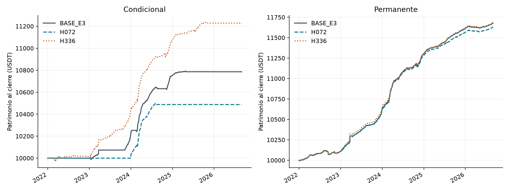
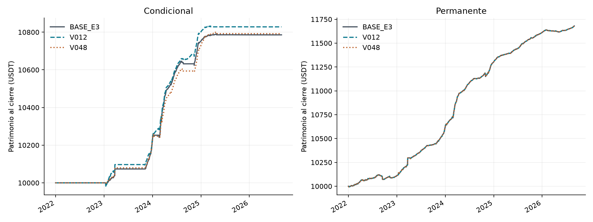
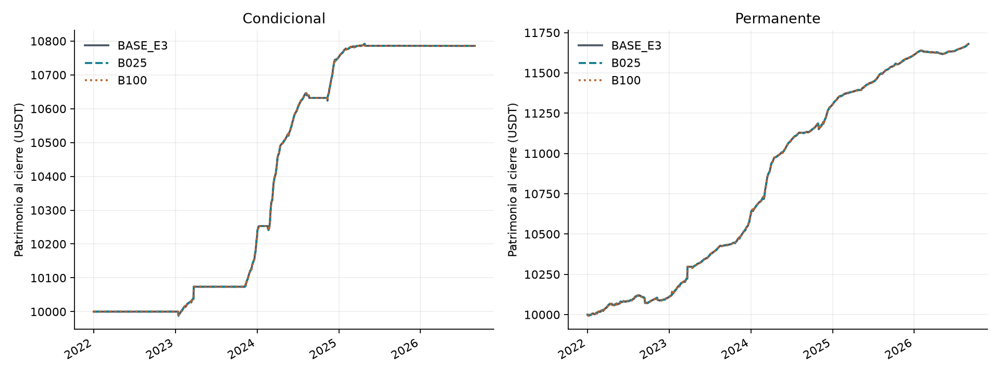
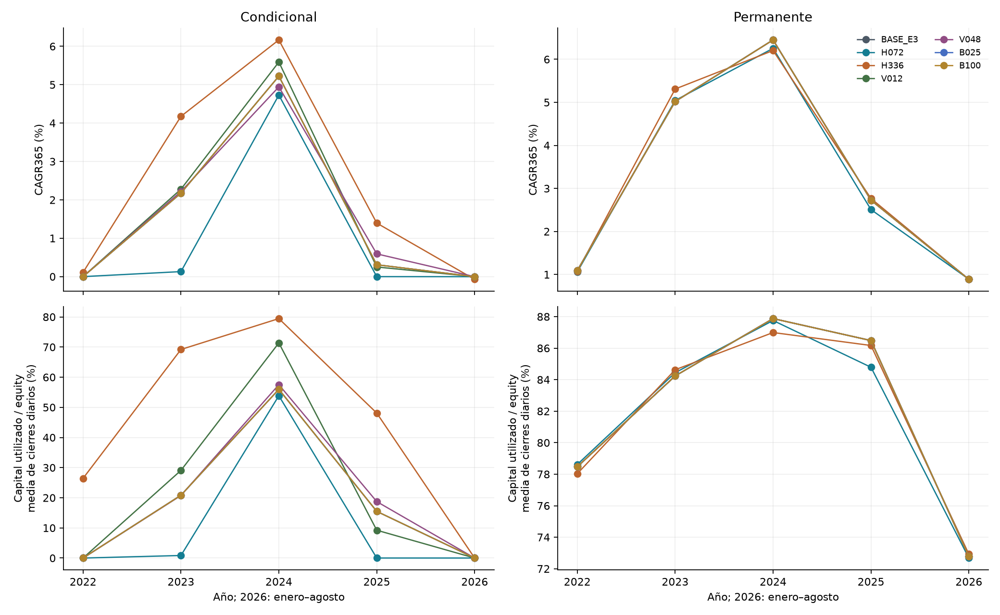

# Bloque 2: señal y selección de entradas

Entrega 4 técnica preliminar. Sensibilidad exploratoria de historia ya observada: doce carteras nuevas, seis variantes sin cruces y dos referencias BASE reutilizadas con sus run_id. El feedback de E3 ya fue recibido. Este bloque no reemplaza las hipótesis/cifras de E3 ni completa toda E4.

## Síntesis

Muestra UTC [2022-01-01,2026-09-01), 10.000 USDT por cartera, BTCUSDT y ETHUSDT, sin reinicios. Se conservan window=336 h, precarga=360 h, disponibilidad de funding=60 s, costo de ciclo=34 pb, ejecución next_minute_vwap/joint_quantity y participación 1%. No hubo cambios del código económico en este bloque.

En la muestra completa, H2 de las seis variantes: {'no_favorable': 6}. H2 requiere CAGR condicional positivo y Sharpe superior a la permanente del mismo escenario; no exige un CAGR superior a ella ni un Sharpe positivo. ND conserva su motivo.

| Escenario | Cartera | Equity final USDT | P&L USDT | Retorno | CAGR365 | Sharpe RF0 | Activo sin polvo | Capital medio USDT | Uso medio diario |
|---|---|---|---|---|---|---|---|---|---|
| BASE_E3 | conditional | 10785.76 | 785.76 | 7.8576% | 1.6335% | 4.9624 | 28.3178% | 2074.62 | 19.8068% |
| BASE_E3 | permanent | 11680.07 | 1680.07 | 16.8007% | 3.3825% | 6.5336 | 98.2083% | 8972.08 | 82.6309% |
| H072 | conditional | 10487.80 | 487.80 | 4.8780% | 1.0254% | 4.3364 | 13.4238% | 1209.89 | 11.7509% |
| H072 | permanent | 11633.10 | 1633.10 | 16.3310% | 3.2933% | 6.2325 | 98.2082% | 8919.46 | 82.3031% |
| H336 | conditional | 11223.15 | 1223.15 | 12.2315% | 2.5025% | 5.8568 | 66.9234% | 5073.57 | 47.8552% |
| H336 | permanent | 11687.45 | 1687.45 | 16.8745% | 3.3965% | 6.0137 | 98.2378% | 8951.23 | 82.3841% |
| V012 | conditional | 10828.25 | 828.25 | 8.2825% | 1.7191% | 4.8206 | 32.6176% | 2460.44 | 23.5398% |
| V012 | permanent | 11680.07 | 1680.07 | 16.8007% | 3.3825% | 6.5336 | 98.2083% | 8972.08 | 82.6309% |
| V048 | conditional | 10791.99 | 791.99 | 7.9199% | 1.6460% | 4.6143 | 27.9117% | 2179.97 | 20.8138% |
| V048 | permanent | 11680.07 | 1680.07 | 16.8007% | 3.3825% | 6.5336 | 98.2083% | 8972.08 | 82.6309% |
| B025 | conditional | 10785.76 | 785.76 | 7.8576% | 1.6335% | 4.9624 | 28.3178% | 2074.62 | 19.8068% |
| B025 | permanent | 11680.07 | 1680.07 | 16.8007% | 3.3825% | 6.5336 | 98.2083% | 8972.08 | 82.6309% |
| B100 | conditional | 10785.76 | 785.76 | 7.8576% | 1.6335% | 4.9624 | 28.3178% | 2074.62 | 19.8068% |
| B100 | permanent | 11680.07 | 1680.07 | 16.8007% | 3.3825% | 6.5336 | 98.2083% | 8972.08 | 82.6309% |

Las medias/máximos de capital y garantías se miden en cierres diarios. Tiempo activo es la unión temporal BTC/ETH después de clasificar la trayectoria completa y excluir polvo de la actividad; el polvo conserva su valor/riesgo en equity. No se divide CAGR por utilización.

## Horizonte y tenencia

Cambia conjuntamente horizonte del forecast, objetivo realizado de H1 y reloj de tenencia/renovación. El costo sigue siendo 34 pb por ciclo y la renovación condicional exige sólo forecast >0. Es una dimensión económica compuesta. El final financiero permanece fijo; las exclusiones H1 no provocan cierres ficticios ni recortan entradas cerca del final.

**H072**: P&L condicional 487.80 USDT (delta BASE -297.97); permanente 1633.10 (delta -46.97). Actividad condicional 13.4238%, capital medio 1209.89 USDT. H2 completo: no_favorable. Economía idéntica a BASE: condicional=False, permanente=False.

En la condicional, CAGR 2022–2023 / 2024–agosto 2026: 0.0653% / 1.7510%; uso medio diario del capital: 0.4234% / 20.2407%. P&L anual 2022, 2023, 2024, 2025 y enero–agosto 2026 (USDT): 0.00, 13.07, 474.93, -0.08, -0.12. Targets H1 iguales a BASE=False; no-change igual=False; H3 diario igual=False.

**H336**: P&L condicional 1223.15 USDT (delta BASE 437.38); permanente 1687.45 (delta 7.38). Actividad condicional 66.9234%, capital medio 5073.57 USDT. H2 completo: no_favorable. Economía idéntica a BASE: condicional=False, permanente=False.

En la condicional, CAGR 2022–2023 / 2024–agosto 2026: 2.1229% / 2.7880%; uso medio diario del capital: 47.8183% / 47.8829%. P&L anual 2022, 2023, 2024, 2025 y enero–agosto 2026 (USDT): 11.11, 417.97, 644.96, 154.47, -5.36. Targets H1 iguales a BASE=False; no-change igual=False; H3 diario igual=False.

## Vida media EWMA

Cambia sólo el peso de observaciones dentro de la ventana de 336 h. Horizonte/tenencia=168 h; targets y no-change se comparan por igualdad de inputs. La permanente omite los filtros de funding para entrar y renovar; la igualdad de su economía se comprueba sobre trayectorias y operaciones.

**V012**: P&L condicional 828.25 USDT (delta BASE 42.49); permanente 1680.07 (delta 0.00). Actividad condicional 32.6176%, capital medio 2460.44 USDT. H2 completo: no_favorable. Economía idéntica a BASE: condicional=False, permanente=True.

En la condicional, CAGR 2022–2023 / 2024–agosto 2026: 1.1327% / 2.1608%; uso medio diario del capital: 14.5418% / 30.2836%. P&L anual 2022, 2023, 2024, 2025 y enero–agosto 2026 (USDT): 0.00, 227.82, 573.39, 27.11, -0.08. Targets H1 iguales a BASE=True; no-change igual=True; H3 diario igual=False.

**V048**: P&L condicional 791.99 USDT (delta BASE 6.23); permanente 1680.07 (delta 0.00). Actividad condicional 27.9117%, capital medio 2179.97 USDT. H2 completo: no_favorable. Economía idéntica a BASE: condicional=False, permanente=True.

En la condicional, CAGR 2022–2023 / 2024–agosto 2026: 1.1028% / 2.0551%; uso medio diario del capital: 10.3777% / 28.6355%. P&L anual 2022, 2023, 2024, 2025 y enero–agosto 2026 (USDT): 0.00, 221.77, 506.72, 63.59, -0.10. Targets H1 iguales a BASE=True; no-change igual=True; H3 diario igual=False.

## Techo del basis de entrada

Se conserva el piso cero y los extremos inclusivos; los techos son 0,0025 y 0,01. No cambia el stop de ampliación ni se impone basis de entrada a renovaciones. Decisiones de entrada, economía y todos los minutos H3 son poblaciones distintas.

**B025**: P&L condicional 785.76 USDT (delta BASE 0.00); permanente 1680.07 (delta 0.00). Actividad condicional 28.3178%, capital medio 2074.62 USDT. H2 completo: no_favorable. Economía idéntica a BASE: condicional=True, permanente=True.

En la condicional, CAGR 2022–2023 / 2024–agosto 2026: 1.0814% / 2.0492%; uso medio diario del capital: 10.4220% / 26.8406%. P&L anual 2022, 2023, 2024, 2025 y enero–agosto 2026 (USDT): 0.00, 217.44, 535.13, 33.28, -0.09. Targets H1 iguales a BASE=True; no-change igual=True; H3 diario igual=False.

**B100**: P&L condicional 785.76 USDT (delta BASE 0.00); permanente 1680.07 (delta 0.00). Actividad condicional 28.3178%, capital medio 2074.62 USDT. H2 completo: no_favorable. Economía idéntica a BASE: condicional=True, permanente=True.

En la condicional, CAGR 2022–2023 / 2024–agosto 2026: 1.0814% / 2.0492%; uso medio diario del capital: 10.4220% / 26.8406%. P&L anual 2022, 2023, 2024, 2025 y enero–agosto 2026 (USDT): 0.00, 217.44, 535.13, 33.28, -0.09. Targets H1 iguales a BASE=True; no-change igual=True; H3 diario igual=False.

## H1: capacidad predictiva

Todos los pronósticos elegibles, independientemente de entrada/posición/caja. EWMA y no-change usan las mismas observaciones dentro de cada escenario; MAE por activo y promedio 50/50. El target suma funding real en (señal,señal+H], con calendario acreditado y fin global exclusivo. Se conservan inválidos y motivos. La habilidad 1−MAE_EWMA/MAE_no_change es descriptiva, con denominador positivo, y no es rentabilidad. Un MAE menor con 72 h no demuestra mejor modelo que con 168/336 h.

Los períodos H1 se asignan por fecha de la señal. Un target puede cruzar enero o el corte de 2024; esa realización futura sirve para evaluar, no para decidir ni entrenar antes de tiempo.

| Escenario | Unidad | Válidas | Excluidas | MAE EWMA | MAE no-change | Habilidad |
|---|---|---|---|---|---|---|
| BASE_E3 | pb/168 h | 10180 | 44 | 6.298978 | 8.703322 | 0.2763 |
| H072 | pb/72 h | 10204 | 20 | 2.594311 | 3.444331 | 0.2468 |
| H336 | pb/336 h | 10138 | 86 | 13.998192 | 18.884736 | 0.2588 |
| V012 | pb/168 h | 10180 | 44 | 6.745373 | 8.703322 | 0.2250 |
| V048 | pb/168 h | 10180 | 44 | 6.170673 | 8.703322 | 0.2910 |
| B025 | pb/168 h | 10180 | 44 | 6.298978 | 8.703322 | 0.2763 |
| B100 | pb/168 h | 10180 | 44 | 6.298978 | 8.703322 | 0.2763 |

H1 se calculó desde funding consumido y señales guardadas para cada configuración. Ambas estrategias se contrastaron por igualdad de inputs; se publica una población común por escenario, sin duplicarla como observaciones independientes. Los horizontes solapados tampoco son observaciones independientes.

## H2 y H3

| Escenario | H2 full | Motivo H2 | H3 | Oportunidad 2022–23 | Oportunidad 2024–ago26 | Unidad |
|---|---|---|---|---|---|---|
| BASE_E3 | no_favorable | sharpe_not_superior | contraria | 1.340415 | 4.019674 | pb/168 h |
| H072 | no_favorable | sharpe_not_superior | contraria | 0.101257 | 0.763546 | pb/72 h |
| H336 | no_favorable | sharpe_not_superior | contraria | 6.417066 | 11.960302 | pb/336 h |
| V012 | no_favorable | sharpe_not_superior | contraria | 1.512034 | 4.029508 | pb/168 h |
| V048 | no_favorable | sharpe_not_superior | contraria | 1.137950 | 4.078573 | pb/168 h |
| B025 | no_favorable | sharpe_not_superior | contraria | 1.340370 | 4.013582 | pb/168 h |
| B100 | no_favorable | sharpe_not_superior | contraria | 1.340415 | 4.019958 | pb/168 h |

H3 usa todos los minutos, independientemente de posiciones. Forecast completo si pasa costo, basis y operatividad; cero para fallas conocidas, desconocido no es cero. Se promedian 1.440 minutos por activo/día y después BTC/ETH 50/50. Se mantiene la publicación real, incluidos milisegundos, y la interrupción documentada. H3 es favorable sólo si bajan oportunidad media y CAGR condicional entre los cortes; contraria si ambos suben; mixta en los demás casos evaluables. Los resultados H072/H336 son sensibilidades en su propia unidad, no nuevos valores de H3 original de 168 h. No se resta el costo al indicador.

En la tabla H3, el veredicto compara siempre 2022–2023 con 2024–agosto 2026; los años son desgloses del indicador y del CAGR, no hipótesis temporales nuevas.

## Años, saldos heredados y capital

El tramo 2026 incluye enero–agosto. CAGR se anualiza con 365 días, mientras retorno y P&L corresponden al tramo observado. No se suman retornos anuales. Las tablas completas también incluyen volatilidad, drawdown diario, ND/motivos, componentes P&L y ambos cortes H3.

| Escenario | Cartera | Año | Inicio USDT | P&L USDT | Retorno | CAGR | Sharpe | Uso medio diario | Activo |
|---|---|---|---|---|---|---|---|---|---|
| BASE_E3 | conditional | 2022 | 10000.00 | 0.00 | 0.0000% | 0.0000% | ND | 0.0000% | 0.0000% |
| BASE_E3 | conditional | 2023 | 10000.00 | 217.44 | 2.1744% | 2.1744% | 4.7904 | 20.8441% | 32.9448% |
| BASE_E3 | conditional | 2024 | 10217.44 | 535.13 | 5.2374% | 5.2227% | 10.4588 | 55.9750% | 67.0171% |
| BASE_E3 | conditional | 2025 | 10752.57 | 33.28 | 0.3096% | 0.3096% | 3.2918 | 15.4917% | 32.0561% |
| BASE_E3 | conditional | 2026 | 10785.85 | -0.09 | -0.0008% | -0.0012% | -0.4358 | 0.0059% | 0.0000% |
| BASE_E3 | permanent | 2022 | 10000.00 | 109.16 | 1.0916% | 1.0916% | 2.6217 | 78.4727% | 98.2787% |
| BASE_E3 | permanent | 2023 | 10109.16 | 507.50 | 5.0202% | 5.0202% | 6.0766 | 84.2354% | 94.3147% |
| BASE_E3 | permanent | 2024 | 10616.66 | 686.80 | 6.4691% | 6.4509% | 11.7600 | 87.8768% | 99.0449% |
| BASE_E3 | permanent | 2025 | 11303.46 | 308.14 | 2.7261% | 2.7261% | 13.6610 | 86.4822% | 100.0000% |
| BASE_E3 | permanent | 2026 | 11611.60 | 68.46 | 0.5896% | 0.8870% | 6.3525 | 72.7804% | 100.0000% |
| H072 | conditional | 2022 | 10000.00 | 0.00 | 0.0000% | 0.0000% | ND | 0.0000% | 0.0000% |
| H072 | conditional | 2023 | 10000.00 | 13.07 | 0.1307% | 0.1307% | 1.3509 | 0.8468% | 1.0042% |
| H072 | conditional | 2024 | 10013.07 | 474.93 | 4.7431% | 4.7299% | 10.2451 | 53.8485% | 61.4963% |
| H072 | conditional | 2025 | 10488.00 | -0.08 | -0.0008% | -0.0008% | -0.1590 | 0.0109% | 0.0000% |
| H072 | conditional | 2026 | 10487.92 | -0.12 | -0.0012% | -0.0017% | -0.4539 | 0.0078% | 0.0000% |
| H072 | permanent | 2022 | 10000.00 | 106.03 | 1.0603% | 1.0603% | 2.5050 | 78.6186% | 98.2787% |
| H072 | permanent | 2023 | 10106.03 | 509.77 | 5.0442% | 5.0442% | 5.9848 | 84.4429% | 94.3147% |
| H072 | permanent | 2024 | 10615.80 | 665.90 | 6.2728% | 6.2551% | 11.0621 | 87.7562% | 99.0441% |
| H072 | permanent | 2025 | 11281.71 | 282.99 | 2.5084% | 2.5084% | 12.1182 | 84.7880% | 100.0000% |
| H072 | permanent | 2026 | 11564.69 | 68.41 | 0.5916% | 0.8899% | 6.4230 | 72.6777% | 100.0000% |
| H336 | conditional | 2022 | 10000.00 | 11.11 | 0.1111% | 0.1111% | 0.3988 | 26.4387% | 42.0263% |
| H336 | conditional | 2023 | 10011.11 | 417.97 | 4.1751% | 4.1751% | 6.9803 | 69.1979% | 91.0339% |
| H336 | conditional | 2024 | 10429.08 | 644.96 | 6.1842% | 6.1668% | 11.0726 | 79.4491% | 99.0439% |
| H336 | conditional | 2025 | 11074.04 | 154.47 | 1.3949% | 1.3949% | 6.5064 | 48.1037% | 80.0557% |
| H336 | conditional | 2026 | 11228.51 | -5.36 | -0.0477% | -0.0717% | -1.2490 | 0.0070% | 0.0003% |
| H336 | permanent | 2022 | 10000.00 | 107.17 | 1.0717% | 1.0717% | 2.5132 | 78.0319% | 98.2787% |
| H336 | permanent | 2023 | 10107.17 | 536.71 | 5.3102% | 5.3102% | 6.0872 | 84.6298% | 94.3147% |
| H336 | permanent | 2024 | 10643.89 | 662.22 | 6.2216% | 6.2041% | 9.1333 | 86.9919% | 99.1818% |
| H336 | permanent | 2025 | 11306.11 | 312.75 | 2.7662% | 2.7662% | 14.2614 | 86.1694% | 100.0000% |
| H336 | permanent | 2026 | 11618.85 | 68.60 | 0.5904% | 0.8881% | 6.3220 | 72.9227% | 100.0000% |
| V012 | conditional | 2022 | 10000.00 | 0.00 | 0.0000% | 0.0000% | ND | 0.0000% | 0.0000% |
| V012 | conditional | 2023 | 10000.00 | 227.82 | 2.2782% | 2.2782% | 4.3662 | 29.0836% | 35.0453% |
| V012 | conditional | 2024 | 10227.82 | 573.39 | 5.6062% | 5.5905% | 10.8265 | 71.3760% | 96.5077% |
| V012 | conditional | 2025 | 10801.22 | 27.11 | 0.2510% | 0.2510% | 2.9693 | 9.2371% | 20.4578% |
| V012 | conditional | 2026 | 10828.33 | -0.08 | -0.0007% | -0.0011% | -0.4745 | 0.0045% | 0.0000% |
| V012 | permanent | 2022 | 10000.00 | 109.16 | 1.0916% | 1.0916% | 2.6217 | 78.4727% | 98.2787% |
| V012 | permanent | 2023 | 10109.16 | 507.50 | 5.0202% | 5.0202% | 6.0766 | 84.2354% | 94.3147% |
| V012 | permanent | 2024 | 10616.66 | 686.80 | 6.4691% | 6.4509% | 11.7600 | 87.8768% | 99.0449% |
| V012 | permanent | 2025 | 11303.46 | 308.14 | 2.7261% | 2.7261% | 13.6610 | 86.4822% | 100.0000% |
| V012 | permanent | 2026 | 11611.60 | 68.46 | 0.5896% | 0.8870% | 6.3525 | 72.7804% | 100.0000% |
| V048 | conditional | 2022 | 10000.00 | 0.00 | 0.0000% | 0.0000% | ND | 0.0000% | 0.0000% |
| V048 | conditional | 2023 | 10000.00 | 221.77 | 2.2177% | 2.2177% | 4.9292 | 20.7555% | 33.2186% |
| V048 | conditional | 2024 | 10221.77 | 506.72 | 4.9573% | 4.9434% | 8.4411 | 57.5186% | 64.5799% |
| V048 | conditional | 2025 | 10728.50 | 63.59 | 0.5927% | 0.5927% | 4.6925 | 18.7335% | 32.3301% |
| V048 | conditional | 2026 | 10792.09 | -0.10 | -0.0009% | -0.0014% | -0.4735 | 0.0058% | 0.0000% |
| V048 | permanent | 2022 | 10000.00 | 109.16 | 1.0916% | 1.0916% | 2.6217 | 78.4727% | 98.2787% |
| V048 | permanent | 2023 | 10109.16 | 507.50 | 5.0202% | 5.0202% | 6.0766 | 84.2354% | 94.3147% |
| V048 | permanent | 2024 | 10616.66 | 686.80 | 6.4691% | 6.4509% | 11.7600 | 87.8768% | 99.0449% |
| V048 | permanent | 2025 | 11303.46 | 308.14 | 2.7261% | 2.7261% | 13.6610 | 86.4822% | 100.0000% |
| V048 | permanent | 2026 | 11611.60 | 68.46 | 0.5896% | 0.8870% | 6.3525 | 72.7804% | 100.0000% |
| B025 | conditional | 2022 | 10000.00 | 0.00 | 0.0000% | 0.0000% | ND | 0.0000% | 0.0000% |
| B025 | conditional | 2023 | 10000.00 | 217.44 | 2.1744% | 2.1744% | 4.7904 | 20.8441% | 32.9448% |
| B025 | conditional | 2024 | 10217.44 | 535.13 | 5.2374% | 5.2227% | 10.4588 | 55.9750% | 67.0171% |
| B025 | conditional | 2025 | 10752.57 | 33.28 | 0.3096% | 0.3096% | 3.2918 | 15.4917% | 32.0561% |
| B025 | conditional | 2026 | 10785.85 | -0.09 | -0.0008% | -0.0012% | -0.4358 | 0.0059% | 0.0000% |
| B025 | permanent | 2022 | 10000.00 | 109.16 | 1.0916% | 1.0916% | 2.6217 | 78.4727% | 98.2787% |
| B025 | permanent | 2023 | 10109.16 | 507.50 | 5.0202% | 5.0202% | 6.0766 | 84.2354% | 94.3147% |
| B025 | permanent | 2024 | 10616.66 | 686.80 | 6.4691% | 6.4509% | 11.7600 | 87.8768% | 99.0449% |
| B025 | permanent | 2025 | 11303.46 | 308.14 | 2.7261% | 2.7261% | 13.6610 | 86.4822% | 100.0000% |
| B025 | permanent | 2026 | 11611.60 | 68.46 | 0.5896% | 0.8870% | 6.3525 | 72.7804% | 100.0000% |
| B100 | conditional | 2022 | 10000.00 | 0.00 | 0.0000% | 0.0000% | ND | 0.0000% | 0.0000% |
| B100 | conditional | 2023 | 10000.00 | 217.44 | 2.1744% | 2.1744% | 4.7904 | 20.8441% | 32.9448% |
| B100 | conditional | 2024 | 10217.44 | 535.13 | 5.2374% | 5.2227% | 10.4588 | 55.9750% | 67.0171% |
| B100 | conditional | 2025 | 10752.57 | 33.28 | 0.3096% | 0.3096% | 3.2918 | 15.4917% | 32.0561% |
| B100 | conditional | 2026 | 10785.85 | -0.09 | -0.0008% | -0.0012% | -0.4358 | 0.0059% | 0.0000% |
| B100 | permanent | 2022 | 10000.00 | 109.16 | 1.0916% | 1.0916% | 2.6217 | 78.4727% | 98.2787% |
| B100 | permanent | 2023 | 10109.16 | 507.50 | 5.0202% | 5.0202% | 6.0766 | 84.2354% | 94.3147% |
| B100 | permanent | 2024 | 10616.66 | 686.80 | 6.4691% | 6.4509% | 11.7600 | 87.8768% | 99.0449% |
| B100 | permanent | 2025 | 11303.46 | 308.14 | 2.7261% | 2.7261% | 13.6610 | 86.4822% | 100.0000% |
| B100 | permanent | 2026 | 11611.60 | 68.46 | 0.5896% | 0.8870% | 6.3525 | 72.7804% | 100.0000% |

## Entradas, ciclos, exposición y conciliación

Se conservan evaluaciones excluyentes funding/basis, no evaluables, primer bloqueo, motivos simultáneos y acciones enlazadas. Un fallo de funding en la permanente es descriptivo y no un rechazo aplicado. Las renovaciones tienen su tabla y su condición de funding cero. Intentos de órdenes no son ciclos; renovar no crea un ciclo. Las tablas distinguen aperturas completas, parciales, fallas, ciclos heredados/abiertos y motivos de cierre.

| Escenario | Cartera | Intentos de ciclo | Aperturas completas | Renovaciones | Fills parciales | Ciclos fallidos | Minutos sin cobertura (unión) |
|---|---|---|---|---|---|---|---|
| BASE_E3 | conditional | 10 | 9 | 100 | 3 | 1 | 189.00 |
| BASE_E3 | permanent | 20 | 17 | 458 | 4 | 3 | 274.00 |
| H072 | conditional | 4 | 4 | 146 | 0 | 0 | 40.00 |
| H072 | permanent | 20 | 17 | 1079 | 5 | 3 | 341.00 |
| H336 | conditional | 31 | 26 | 112 | 8 | 5 | 246.00 |
| H336 | permanent | 19 | 17 | 228 | 1 | 2 | 227.00 |
| V012 | conditional | 13 | 11 | 120 | 2 | 2 | 203.00 |
| V012 | permanent | 20 | 17 | 458 | 4 | 3 | 274.00 |
| V048 | conditional | 9 | 9 | 106 | 1 | 0 | 184.00 |
| V048 | permanent | 20 | 17 | 458 | 4 | 3 | 274.00 |
| B025 | conditional | 10 | 9 | 100 | 3 | 1 | 189.00 |
| B025 | permanent | 20 | 17 | 458 | 4 | 3 | 274.00 |
| B100 | conditional | 10 | 9 | 100 | 3 | 1 | 189.00 |
| B100 | permanent | 20 | 17 | 458 | 4 | 3 | 274.00 |

Cada cierre y cada período se concilian con patrimonio y componentes a 1E-8 USDT. Transferencias/colateral no son P&L; slippage ya integra precios y no se resta dos veces. Las posiciones abiertas al final se valúan sin venta ni fee ficticio. El polvo no se descuenta de equity. Los eventos de margen/liquidación/deuda disponibles están en eventos, ledger y margen_cierre_diario; los extremos de esta última tabla son exclusivamente de cierres diarios.

## Lectura y límites

H2 completo conserva el resultado BASE (no_favorable) en H072, H336, V012, V048, B025, B100; cambia en ninguna. H3 conserva el veredicto BASE (contraria) en H072, H336, V012, V048, B025, B100; cambia en ninguna.

En años y cortes, los cambios de veredicto H2 frente al mismo período BASE son: H336/2022: no_favorable; H336/2023: favorable; H336/2024: favorable. El agregado no sustituye este desglose.

La sensibilidad al horizonte combina predicción y tenencia. En la condicional, H072: P&L 487.80 USDT, actividad 13.4238%, uso medio diario 11.7509%; BASE_E3: P&L 785.76 USDT, actividad 28.3178%, uso medio diario 19.8068%; H336: P&L 1223.15 USDT, actividad 66.9234%, uso medio diario 47.8552%. Estos cambios se leen conjuntamente con el capital utilizado; los MAE de 72/168/336 h evalúan objetivos distintos y no ordenan la calidad de un único target.

V012, con target común de 168 h: MAE EWMA 6.745373 frente a 6.298978 pb/168 h de BASE; P&L condicional 828.25 USDT, actividad 32.6176% y uso medio diario 23.5398%. Economía permanente igual a BASE=True. La relación entre error, actividad y resultado no establece causalidad ni un parámetro óptimo.

V048, con target común de 168 h: MAE EWMA 6.170673 frente a 6.298978 pb/168 h de BASE; P&L condicional 791.99 USDT, actividad 27.9117% y uso medio diario 20.8138%. Economía permanente igual a BASE=True. La relación entre error, actividad y resultado no establece causalidad ni un parámetro óptimo.

B025: economía igual a BASE en condicional=True y permanente=True; H3 diario igual=False, delta de oportunidad media completa -0.003502 pb/168 h. La igualdad de operaciones no se extiende automáticamente a los minutos de mercado de H3.

B100: economía igual a BASE en condicional=True y permanente=True; H3 diario igual=False, delta de oportunidad media completa 0.000162 pb/168 h. La igualdad de operaciones no se extiende automáticamente a los minutos de mercado de H3.

Las diferencias describen simultáneamente predicción, actividad, capital y resultado. No se atribuye causalmente toda variación de P&L a un contador de entradas. Una invariancia comprobada es un resultado y no motiva cambiar el experimento. Seis sensibilidades no establecen robustez universal, significancia ni un parámetro óptimo. Los años complementan el agregado y permiten observar cambios que éste oculta.

La tabla de [deltas de hipótesis](tablas/deltas_hipotesis.csv) compara vidas medias y basis con BASE. En H072/H336 no calcula diferencias de MAE ni tasa de oportunidad entre horizontes distintos. Mantiene valores, unidad/horizonte y el motivo de no comparabilidad. La habilidad contra no-change sólo describe cada target; no selecciona un horizonte ganador.

Se mantienen las tarifas/reglas prescritas, 15 marks futures_scaled y tratamiento original de precios de funding. No se certifica una reconstrucción histórica completa de reglas ni liquidez ejecutable real. Los drawdowns nuevos son diarios. No se recalcularon concentración, riesgo intradía, SOFR ni remuneración de caja/garantía. SOFR no sustituye RF=0 ni la permanente en H2. La ficha SOFR pendiente conservada en un paquete antiguo es histórica: la versión posterior aprobada se conserva sólo como contexto terminado.

## Evidencia y reproducción

[Índice de corridas](indice_corridas.json), [métricas de los ocho períodos](tablas/metricas.csv), [deltas sin redondear](tablas/deltas.csv), [invariancias](tablas/invariancias.csv), [H2 completo](tablas/h2.csv), [H3 por período](tablas/h3_resumen.csv), [fuentes exactas](fuentes/archivos_originales.csv) y [matriz de requisitos](matriz_requisitos.csv). Las observaciones H1, agregados H3 por activo, grupos de disponibilidad y muestra fija de minutos están en hipotesis/<escenario>/. Las fuentes de figuras están en figuras/fuentes/.

Verificación y alcance: [README](README.md). El verificador recalcula desde evidencia persistida; con --data-root contrasta H3 contra los minutos locales. Constructor y verificador comparten algunos helpers: no se afirma independencia total ni se ejecuta un nuevo replay al verificar. No hubo commit, push ni modificación del índice del usuario.

El [control histórico de limpieza del repositorio](documentos/control_historico_general.json) no pasó: espera un hash anterior de src/crypto_carry/config.py. El archivo actual coincide con el registrado antes de este bloque; no se modificó ese manifiesto para forzar su pase. Los controles de este bloque tienen alcance propio y no certifican todo el motor ni todas las versiones históricas del repositorio.
